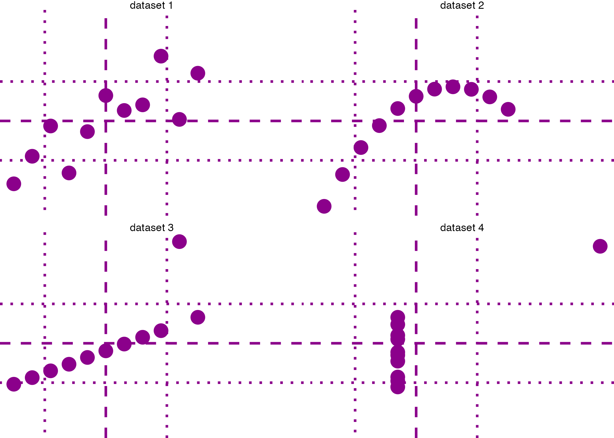

```{r setup, include=FALSE}
knitr::opts_chunk$set(echo = TRUE)
```


```{r anscombe}
library(tidyverse)
datasets::anscombe %>%
  pivot_longer(cols = 1:8) %>%
  mutate(group = str_extract(name, "\\d")) %>%
  mutate(var = str_extract(name, "\\w")) %>% 
  select(-name) %>% 
  pivot_wider(names_from = var, 
              values_from = value) %>% 
  unnest() ->
tidy_anscombe
```


```{r anscombe_plot}
tidy_anscombe %>% 
  ggplot() + 
  aes(x = x, y = y) + 
  geom_point(size= 5, color = "darkmagenta") + 
  # aes(color = group) + 
  facet_wrap(facets = vars(paste("dataset", group))) + 
  # mean of x
  ggxmean::geom_x_mean(linetype = "dashed", lwd = 1, color = "darkmagenta") + 
  ggxmean::geom_y_mean(linetype = "dashed",lwd = 1, color = "darkmagenta") + 
  # mean of y
  ggxmean:::geom_x1sd(linetype = "dotted", lwd = 1, color = "darkmagenta") + 
  ggxmean:::geom_y1sd(linetype = "dotted",lwd = 1, color = "darkmagenta") + 
  # linear model
  # ggxmean::geom_lm(lwd = 1) + 
  # ggxmean::geom_lm_formula() + 
  # Pearson correlation
  # ggxmean:::geom_corrlabel() + 
  theme_void() +
  theme(legend.position = "none") +
  NULL

ggsave("ggxmean_plots.png",
       plot = last_plot())


```


```{r}
library(ggstamp)

ggcanvas() + 
  stamp_png(png = "ggxmean_plots.png", reduce = 100) + 
  stamp_wash(fill = "linen", alpha = .6) + 
  stamp_text( y = -0, x = 0, size = 5,
             label = "ggxmean",
             color = "lightblue4") + 
    # coord_equal(xlim = c(-3,3), ylim = c(-2.3, 2.3)) + 
  stamp_text(angle = 30, label = "github.com/...",
             x = 0, y = -1.45, size = 1.8, 
             color = "brown") + 
    stamp_polygon(radius = .7,
                alpha = 0, size = 7,
                color = alpha("rosybrown4", .9)) +
    stamp_polygon_inverse(radius = .7, radius_outer = Inf, 
                        fill = "white", color = "red"
                         ) +
  theme_void_fill(fill = "white") +
  NULL

```

