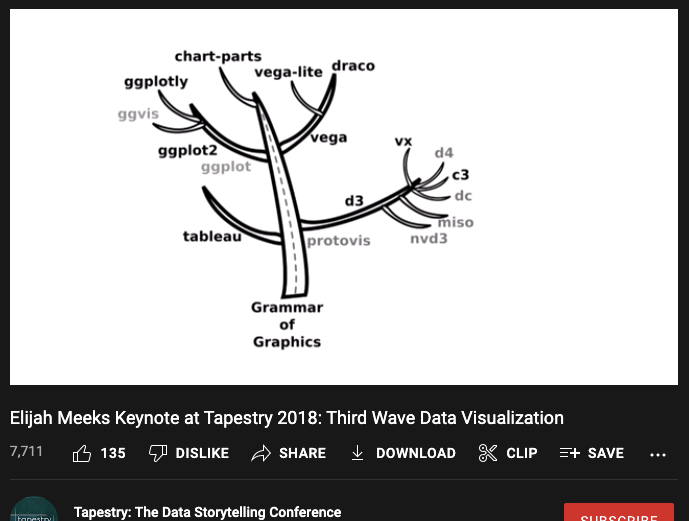
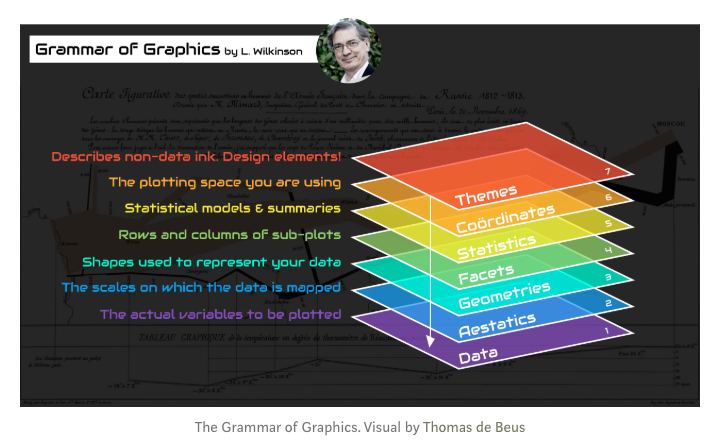
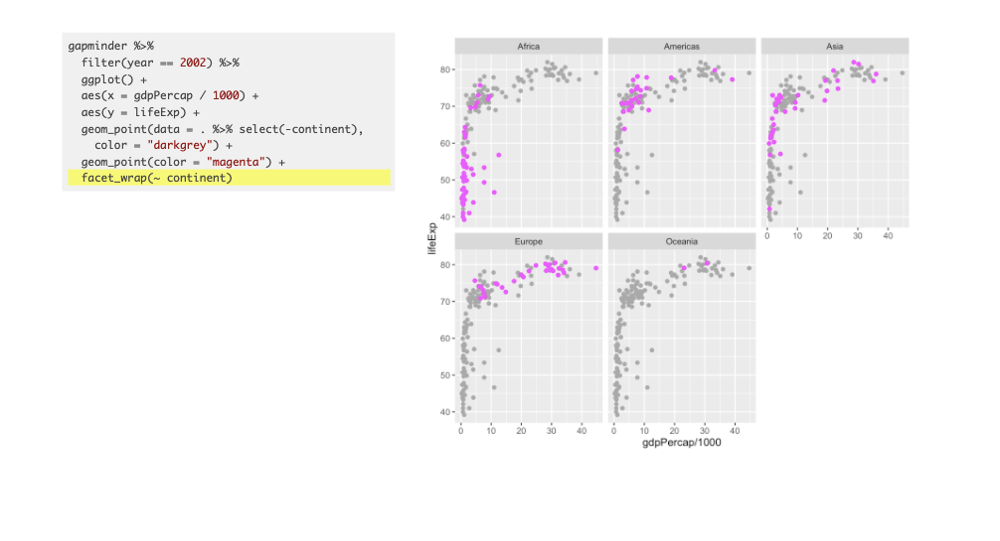

class: inverse, left, bottom
background-image: url(https://images.unsplash.com/photo-1543286386-713bdd548da4?ixlib=rb-1.2.1&ixid=MnwxMjA3fDB8MHxwaG90by1wYWdlfHx8fGVufDB8fHx8&auto=format&fit=crop&w=1470&q=80)
background-size: cover

# .Large[Speaking ggplot2]

## .small[Some ideas]
#### .tiny[Dr. Evangeline Reynolds | 2022-04-26 |Image credit: William Iven, Upsplash]


???

Title slide


```{r, include = F}
# This is the recommended set up for flipbooks
# you might think about setting cache to TRUE as you gain practice --- building flipbooks from scratch can be time consuming
knitr::opts_chunk$set(fig.width = 6, fig.height = 4.5, message = FALSE, warning = FALSE, comment = "", cache = F)
library(flipbookr)
library(tidyverse)
```


```{r xaringan-themer, include = FALSE}
library(xaringanthemer)


xaringanthemer::mono_light(
  base_color = "#4c5253",
  header_font_google = google_font("Josefin Sans"),
  text_font_google   = google_font("Montserrat", "200", "200i"),
  code_font_google   = google_font("Droid Mono"),
  text_font_size = ".85cm",
  code_font_size = ".35cm")
  
```

---
class: middle, inverse, center

# So ggplot2...

--
#               ... what's the fuss? 

---
class: inverse, center, middle


# But wait.

--
## First one step back. 

--
# Data viz ...

--

# ... what's the fuss?

---


#  Function of Data Viz:

> # The simple graph has brought more information to the data analyst's mind than any other device - Tukey


---

# Use *visual channels* to represent/communicate information

## *"pre-attentive processing"* - Cleveland and McGill, 1984


---

### Visual channels for aesthetic mapping:


```{r, echo = F}
knitr::include_graphics("https://clauswilke.com/dataviz/aesthetic_mapping_files/figure-html/common-aesthetics-1.png")
```

from Claus Wilke's fundamentals of data visualization https://clauswilke.com/dataviz/

---

##  *Patterns* are identified with visual 'pre-attentive processing' 

--

## Uber-fast identification of relationships that you might never see in tabular form

--

# Fast pattern discovery

--

# Fast pattern communication

---

# Back to ggplot2. What's the fuss?

--
Hadley Wickham, ggplot2 author on it's motivation:

> ### And, you know, I'd get a dataset. And, *in my head I could very clearly kind of picture*, I want to put this on the x-axis. Let's put this on the y-axis, draw a line, put some points here, break it up by this variable. 

--

> ### And then, like, getting that vision out of my head, and into reality, it's just really, really hard. Just, like, felt harder than it should be. Like, there's a lot of custom programming involved, 

---

> ### where I just felt, like, to me, I just wanted to say, like, you know, *this is what I'm thinking, this is how I'm picturing this plot. Like you're the computer 'Go and do it'.* 

--

> ### ... and I'd also been reading about the Grammar of Graphics by Leland Wilkinson, I got to meet him a couple of times and ... I was, like, this book has been, like, written for me. 

https://www.trifacta.com/podcast/tidy-data-with-hadley-wickham/

---
# So what's the promise of ggplot2?

--

## Getting the plot form you picture in your head ...

--

## ... into reality...

--

## ... by describing it.

---

# ggplot2 is called a 'declarative' graphing system.

--

# It lets you *'speak your plot into existance'*. (Thomas Lin Pederson?) 

--

### This is fast. Because most of us, like Hadley Wickham, can **picture** the form of the plot we're going after rather clearly (i.e. what the horizontal position should represent, what color should represent, what 'marks' (points, lines) are going to appear on the plot).  
--
'Getting' our plot made becomes a matter of describing what we're already picturing!


---

# The "Grammar of Graphics" (1999)

```{r, out.width="40%", echo = F}
knitr::include_graphics("images/wilkinson_grammar_of_graphics.png")
```

---
## Sidebar/related...

### A 'grammar of graphics' also ... flexibility and creative freedom!...

### When Wilkinson describes grammar of graphics, he sells it arguing that this grammar of graphics implementations would allow "drawing every statistical graphic"

???
The grammar of graphics framework, proposed by Leland Wilkinson in 1999, that identified 'seven orthogonal components' in the creation of data visualizations.\
Wilkinson asserted that if data visualization packages were created using a separation of concerns approach -- dividing decision making surrounding these components --- the packages would be able to "draw every statistical graphic". The grammar of graphic principles were incredibly powerful and gave rise to a number of visualization platforms including Tableau, vega-lite, and ggplot2.


--

But the focus of this talk is ... 'speaking your plot into existance'

---
class: center, middle
# Maybe you've seen data viz luminary Hans Rosling 'speaking a plot into existence'?

--

# Let's watch.

---

# Hans Rosling

<iframe width="767" height="431" src="https://www.youtube.com/embed/jbkSRLYSojo?list=PL6F8D7054D12E7C5A" frameborder="0" allow="accelerometer; autoplay; encrypted-media; gyroscope; picture-in-picture" allowfullscreen></iframe>

https://www.youtube.com/embed/jbkSRLYSojo?list=PL6F8D7054D12E7C5A


---
background-image: url(images/paste-A8314E33.png)
background-size: cover


---
background-image: url(images/paste-D46A77DF.png)
background-size: cover

---
background-image: url(images/paste-CAD8C893.png)
background-size: cover

---
background-image: url(images/paste-DC46E991.png)
background-size: cover

---


Also, see Garr Reynolds 'presentation zen': https://policyviz.com/podcast/episode-62-garr-reynolds/

???

'Making the simple complicated is commonplace; making the complicated simple, awesomely simple, that's creativity.'

— Charles Mingus

'Cognitive scientists have discovered three important features of the human information processing system that are particularly relevant for PowerPoint users: dual-channels, that is, people have separate information processing channels for visual material and verbal material; limited capacity, that is, people can pay attention to only a few pieces of information in each channel at a time; and active processing, that is, people understand the presented material when they pay attention to the relevant material, organize it into a coherent mental structure, and integrate it with their prior knowledge.'

— Rich Mayer, in an interview with Sociable Media, Inc. 

---

## What tech does Hans Rosling (2010) use to 'Speak his chart into existence? 

--

### ...help from BBC/Adobe After Effects/data viz Team

---


## How can we 'speak our chart into existance?'

--

### ggplot2!  

---

### (or another implementation of the grammar of graphics...)

--

### Tableau 

### Polaris -> Tableau - Acquired for 15.7 Billion dollars (salesforce)

--

### Vega Lite... (dynamic, interactive data visualizations in web browsers)


--

### plot9
(python's ggplot2)


--

### altair (python declarative newcomer) https://youtu.be/FytuB8nFHPQ?t=1382

---



Third wave data visualization, Meeks: https://www.youtube.com/watch?v=itChfcTx7aos


---

## We're doing ggplot2 - R programming language, coded implementation

--

## we need to learning the grammar/syntax to 'speak our charts into reality'

---

### 'I remember in my English/Arabic/Spanish/German/Chinese classes, that Grammar lessons just suck!'

--

> #### Grammar makes language expressive. A language consisting of words and no grammar (statement = word) expresses only as many ideas as there are words. By specifying how words are combined in statements, a grammar expands a language's scope.

– Wilkinson, 2005, The Grammar of Graphics, 2nd edition

--

### 'we wait'

--

### vs 'we waited'

???

just this little change puts us in a totally frame of mind!

---

# definition of a data visualization...

---


# A data visualization is made up of ...

--

### .left[... geometric objects ...]

--

### .center[...that take on aesthetics (color, line width, x-position) ...]

--

### .center[...which represent variables ...]

--

### .right[...from a dataset (dataframe)]


---

## Elements of the Grammar of Graphics (choices)

```{r, echo = F}

```

---

### A series of 'grammatical' choices:

--

- declarative mood: Declare data

--

- interrogative mood: ask for representation choose aesthetic mapping (what aesthetics (color, size, position) will represent what variables)

--

- nouns: geometric objects, 'geoms' or 'marks' (tableau's vocabulary) that take on the visual attributes

--

- modifiers (adjectives, adverbs): change defaults

  - labels
  - aesthetic scales
  - coordinate system
  
--

- conditional mood: 

  - change data, aesthetic mapping, or defaults for specific geom layer
  
--

- punctuation: make decision to facet or not, breaking up your ideas
    
--

- interjections: annotation

--

- greetings: theme (plot look and feel)


---
class: center, middle, inverse

# In your head, think 'Hans Rosling'!

---
class: center, middle, inverse

# Go slow.  

---
class: center, middle, inverse


# Give full voice to the decisions that you are making as you learn/teach/create your plot!


---
class: center, middle, inverse


# You're writing 'graphical poems' ...

--

... The paper concludes by discussing some perceptual issues, and thinking about how we can build on the grammar to learn how to create graphical ''poems''. -- Hadley Wickham Hadley Wickham, 2010 'A layered grammar of graphics.'  Journal of Computational and Graphical Statistics

--

# ... think poetry slam!

---


# Placeholder slide with claims about language learning needing repetition and 'out loud' practice. 

---


# What do I mean in ggplot2?

- try to decompose the plot as much as possible
- each decision gets a (+)
- don't worry about being repetitive
- name your parameters

--

At least when learning/teaching.

--

And maybe all the time.


---

`r chunk_reveal("dataprep", title = "# DEMO PREP, PROVIDED")`

```{r dataprep, include = F}
library(tidyverse) 
library(gapminder) 

gapminder %>% # data from package 
  filter(year == 2002) -> # filtering 
gapminder_2002 # saving subset object 

gapminder_2002 %>% 
  filter(continent == "Europe") -> 
gapminder_2002_europe 

gapminder %>% 
  select(country, continent) %>% 
  distinct() %>% 
  group_by(continent) %>% 
  summarise(country_count = n()) -> 
continent_aggregate 
```

---

`r chunk_reveal("scatter", title = "# LIVE DEMO Our scatter practice")`

```{r scatter, include = F}
ggplot(data = gapminder_2002) +
  aes(y = lifeExp) +
  aes(x = gdpPercap) +
  geom_point() + 
  aes(size = pop) +
  aes(color = continent) +
  aes(shape = continent) +
  labs(x = "GDP per capita (US$)") +
  labs(alpha = "GDP per cap") +
  labs(shape = NULL) +
  labs(color = NULL) +
  labs(title = "hi") +
  labs(subtitle = "hello") +
  labs(caption = "hi again") +
  labs(tag = "plot1") +
  scale_x_log10() +
  scale_y_reverse() +
  scale_color_viridis_d() +
  coord_flip() +
  facet_wrap(facets = vars(continent))
```

---

`r chunk_reveal("column", title = '# LIVE DEMO: our column')`


```{r column, include = F}
continent_aggregate %>% 
  ggplot() +
  aes(x = continent) +
  aes(y = country_count) +
  geom_col() +
  aes(color = continent) +
  aes(fill = continent) +
  aes(linetype = continent) +
  aes(alpha = country_count)
```

---

`r chunk_reveal("conditional", title = "## LIVE DEMO 'local' declarations")`

```{r conditional, include = F}
ggplot(data = gapminder_2002) +
  aes(x = gdpPercap / 1000) +
  aes(y = lifeExp) +
  geom_point() +
  geom_point(data = gapminder_2002_europe,
             aes(size = gdpPercap),
             color = "red") +
  annotate(geom = "text", 
           x = c(10, 20),
           y = 45,
           label = "My annotation") +
  theme_minimal()
```


---

### 'I'm already pro, I came for tricks and tips...'


Lots of annotation strategies (still grammatical!), that feels tricky; people love faceting with shadow data of full data...  https://evamaerey.github.io/ggplot2_grammar_guide/about




---

## Last slide: ggplot2::last_plot()

### "Here we go..."

```{r}
ggplot(data = gapminder_2002) + 
  NULL
```


---

## Last slide: ggplot2::last_plot()

### "On the y axis life expectancy..."

```{r}
ggplot(data = gapminder_2002) +
  aes(y = lifeExp)
```

---

## Last slide: ggplot2::last_plot()

### "On the x axis gdp per capita..."


```{r}
last_plot() + 
  aes(x = gdpPercap)
```

---

## Last slide: ggplot2::last_plot()

### "Africa red, Americas yellow, Asia green..."

```{r}
last_plot() + 
  geom_point() + aes(color = continent)
```


---

## Last slide: ggplot2::last_plot()

### The size of the country bubble shows the size of the population.


```{r}
last_plot() + 
  aes(size = pop)
```

---

# Epilogue... 

## grudgingly, the animation 

--

## ... I think this is kind of a distraction from the many other reasons Hans Rosling's talk is so awesome... the animation is cool ... but there's so much more!

---

`r flipbookr::chunk_reveal("grumpy")`

```{r grumpy, include = F}
options(gganimate.nframes = 50)  
library(tidyverse)  
library(gapminder)  
ggplot(data = gapminder) +  
  facet_wrap(facets = vars(year)) + 
  aes(x = gdpPercap) +  
  aes(y = lifeExp) +  
  geom_point() +  
  aes(color = continent) +  
  aes(size = pop) +  
  scale_x_log10() +  
  facet_null() +
  aes(group = country) + # needed for connecting between years   
  gganimate::transition_reveal(along = year)
```


---
class: inverse, center, middle

# End

---

`r chunk_reveal("custom", title = "## LIVE DEMO Time permitting, What's this plot called where area is gdp? It doesn't matter if we know or not, we can still imagine and build it")``

```{r custom, include = F}
gapminder_2002_europe %>% 
  ggplot() + 
  aes(x = pop) + 
  aes(y = gdpPercap) + 
  geom_point() +
  geom_rect(aes(xmin = 0, xmax = pop,
                ymin = 0, ymax = gdpPercap),
            alpha = .5) +
  facet_wrap(facets = vars(country))
```


<!-- adjust font size in this css code chunk, currently 80 -->

```{css, eval = TRUE, echo = FALSE}
.remark-code{line-height: 1.5; font-size: 100%}

@media print {
  .has-continuation {
    display: block;
  }
}

code.r.hljs.remark-code{
  position: relative;
  overflow-x: hidden;
}


code.r.hljs.remark-code:hover{
  overflow-x:visible;
  width: 500px;
  border-style: solid;
}
```

