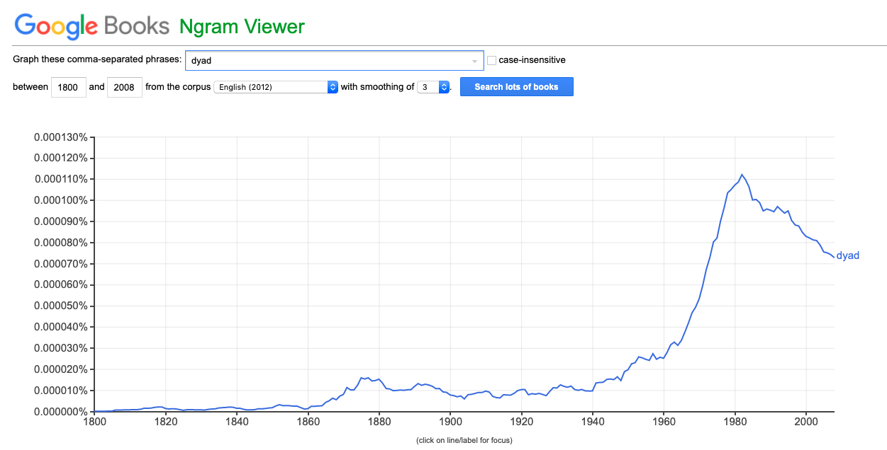
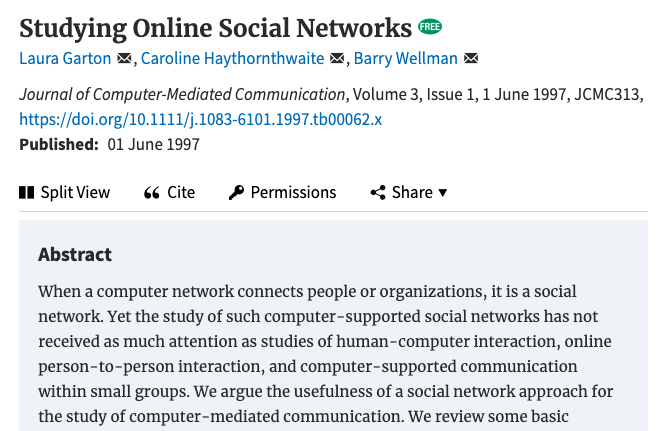

class: left, top, inverse
background-image: url(https://images.unsplash.com/photo-1495592822108-9e6261896da8?ixlib=rb-1.2.1&ixid=eyJhcHBfaWQiOjEyMDd9&auto=format&fit=crop&w=1050&q=80)
background-size: 170%


# .right.large[Intro to Network Analysis/Visualization]
### .right.large[Korbel School of International Studies<br>Evangeline 'Gina' Reynolds<br>2020-05-11]
<br>
<br>
<br>
<br>
<br>
<br>
<br>
<br>
<br>
<br>
<br>


#### Photo Credit: Pietro Jeng

```{r setup, include = F}
# This is the recommended set up for flipbooks
# you might think about setting cache to TRUE as you gain practice --- building flipbooks from scracth can be time consuming
knitr::opts_chunk$set(fig.width = 6, message = FALSE, warning = FALSE, comment = "", cache = T, fig.retina = 3)
library(flipbookr)
library(tidyverse)
```


---

## School of *Inter*national Studies


--

## International *Relations*

--

## *Social* Science

--

## PhD reading group 2019:  Networks analysis

---


---


---

## *The promise of network analysis is the placement of significance on the relationships between actors, rather than seeing actors as isolated entities.* &ndash; Jesse Sadler


--

## *Show me your company and I'll tell you who you are.* &ndash; A proverb quoted in Cervantes' Don Quixote

---


`r chunk_reveal("data_prep0")`


```{r data_prep0, include = F}
library(ggraph)
library(tidygraph)
tidygraph::create_notable(name = 
                            'zachary') %>%  
  mutate(id = 1:n()) ->
dat_minimal
```

---

## An article about computational science in a scientific publication is not the scholarship itself, it is merely advertising of the scholarship. The actual scholarship is ... complete set of instructions which generated the figures. &ndash; Buckheit and Donoho, 1995, Stanford statisticians 

---


# Questions to ask:

### Is my network cohesive? Is it "dense"?

--

###  Are there important individuals within the network?

--

###  Are there communities within the network?

--

###  If I see fissure in the network, along what lines might I expect to see that?


---
class: inverse

# Density

--

### Number of connections out of total possible


```{r}
choose(34, 2)
```

--

$$ \frac{n!}{(n-k)!k!} $$ 


--

```{r}
# Density
78/562
```


---
class: inverse, middle, center

# Visualizing networks


---

`r chunk_reveal("plot_karate0")`

```{r plot_karate0, include = F}
set.seed(9823)
dat_minimal %>%   
  ggraph(layout = "randomly") +
  geom_node_point() +
  geom_edge_link(color = "orange") +
  geom_node_point() +
  geom_node_point(size = 8,
                  shape = 21,
                  fill = "steelblue") + 
  geom_node_text(size = 2,
                 color = "grey97",
                 aes(label = id)
                 ) + 
  theme(plot.margin = margin(.5, .5, .5, .5, "cm"))
```


---
class: inverse, middle, center

# Layout

---

`r chunk_reveal("layout", break_type = "rotate")`

```{r layout, eval = F, echo = F}
dat_minimal %>%   
  ggraph(layout = "randomly") + #ROTATE
  ggraph(layout = "circle") + #ROTATE
  ggraph(layout = "sphere") + #ROTATE
  ggraph(layout = "kk") + #ROTATE
  ggraph(layout = "fr") + #ROTATE
  geom_edge_link(color = "orange") +
  geom_node_point() +
  geom_node_point(size = 8,
                  shape = 21,
                  fill = "steelblue") + 
  geom_node_text(size = 2,
                 color = "grey97",
                 aes(label = id)
                 ) + 
  scale_fill_viridis(discrete = T, option = 2) +
  labs(fill = NULL, color = NULL) +
  theme(plot.margin = margin(.5, .5, .5, .5, "cm"))
```


---

`r chunk_reveal("spread", break_type = "rotate")`

```{r spread, eval = F, echo = F}
set.seed(0417)
igraph::sample_pa(100, directed = T)  %>% 
  ggraph(layout = "kk") + #ROTATE
  ggraph(layout = "fr") + #ROTATE
  geom_edge_link(color = "orange") +  
  geom_node_point(size = 5,
                  color = "steelblue",
                  alpha = .8)
```

---

### "Mapping Networks of Terrorist Cells" Valdis E. Krebs

### *This paper looks at the difficulty in mapping covert networks. Analyzing networks after an event is fairly easy for prosecution purposes. Mapping covert networks to prevent criminal activity is much more difficult. We examine the network surrounding the tragic events of September 11th, 2001. Through public data we are able to map a portion of the network centered around the 19 dead hijackers. *


http://ecsocman.hse.ru/data/517/132/1231/mappingterroristnetworks.pdf

---


# Krebs Questions...

--

### What type of layout does it seem like Krebs is using? Is it force directed, or some geometric layout like circle or sphere?

--

### Also look at Table 3.  What has been calculated in this table?  What do you think these calculations try to measure/capture about the individuals?

---


```{r, out.width=c("45%", "45%"), echo = F}
knitr::include_graphics(c("images_for_lecture/eyeballing_centrality copy.png",
                        "images_for_lecture/elliott_morris_data_journalist copy.png"))
```


---


---
class: center, middle, inverse


# Centrality

--

## Degree

--

## Betweenness

--

## Closeness


---

## Degree Centrality

--

### "Incidence upon"

--

### Who do you have immediate contact with?


---

## Closeness Centrality

--

### "The reciprocal of the farness" Bavelas (1950)

--

#### for a node 1, count the number of edges that must be traversed (shortest path) to get to node 2, to node 3, to node 4, etc...

--

#### Add these.  

--

#### Take reciprocal

--


$$ C_c(x) = \frac{1}{\sum_yd(y,x)}   $$


---

## Betweenness Centrality

#### Betweenness centrality quantifies the number of times a node acts as a bridge along the shortest path between two other nodes.

--

#### take each pair of nodes in a network

--

#### identify the shortest path between them

--

#### for each node in the network count the number of time it is an "on-the-way" nodes

<!-- --- -->


<!-- $$ C_B(x) = \frac{\sigma_{st}(V)}{\sigma_{st}} $$ -->


---

$$ C_B(x) = \frac{total~number~of~shortest~paths~passing~ throught~node}{total~number~of~shortest~paths~in~network}   $$


---

`r chunk_reveal("calculations")`


```{r calculations, include = FALSE}
dat_minimal %>% 
  activate(nodes) %>% 
  mutate(degree = 
           centrality_degree()) %>% 
  mutate(close = centrality_closeness()) %>% 
  mutate(between = 
           centrality_betweenness()) %>% 
 mutate(clique = as.factor(group_infomap())) ->
dat_centrality_calc
```

---

# Network "Decoration"

--

#### representing features of nodes or edges with variation in aesthetics (color, size, linewidth, line type)

--

#### How might we decorate our plot with centrality measures?

---


`r chunk_reveal("centrality", break_type = "rotate")`

```{r centrality, echo = F, eval = F}
dat_centrality_calc %>% 
  ggraph() +
  geom_edge_link(color = "orange") +
  geom_node_point(aes(
    size = 5, #ROTATE
    size = degree, #ROTATE
    size = close #ROTATE
    size = between, #ROTATE
  ),
  fill = "steelblue",
  shape = 21)  + 
  geom_node_text(size = 3.5,
                 color = "grey92",
                 aes(label = id)
                 ) + 
  scale_fill_viridis(discrete = T, option = 2) +
  labs(fill = NULL, color = NULL) +
  scale_size(range = c(2,8), trans = "sqrt") +
  theme_void(base_family = "Courier",
             base_size = 20) +  
  theme(plot.margin = margin(.5, .5, .5, .5, "cm"))
```

---

# Detecting communities/cliques

---

`r chunk_reveal("community")`

```{r community, echo = F, eval = F}
dat_centrality_calc %>% 
  ggraph() +
  geom_edge_link(color = "orange") +
  geom_node_point(
    aes(fill = clique,
        size = degree),
    shape = 21)  + 
  ggforce::geom_mark_hull(aes(x = x, 
                              y = y, 
                              fill = clique)) +
  scale_fill_viridis(discrete = T, option = 2) +
  labs(fill = NULL, color = NULL) +
  scale_size(range = c(2,8), trans = "sqrt") +
  theme_void(base_family = "Courier",
             base_size = 20) +  
  theme(plot.background = 
          element_rect(fill = "steelblue4",
                       color = "grey90")) +
  theme(plot.margin = margin(.5, .5, .5, .5, "cm"))
```


---


---

# Karate Club


---

```{r data_prep, include = F}
tidygraph::create_notable(name = 
                            'zachary') %>%  
  mutate(id = 1:n()) %>% 
  mutate(leader = 
           case_when(id == 1 ~ "Mr. Hi",
                     id == 34 ~ "John A.",
                     id != 1 & id != 34 ~ 
                       "Others")) %>% 
  mutate(betweenness = centrality_betweenness()) %>% 
  mutate(leader = 
           factor(leader, 
                  levels = c("Mr. Hi", 
                             "John A.", 
                             "Others"))) ->
dat
```


---

`r chunk_reveal("plot_karate")`

```{r plot_karate, include = F}
dat %>%   
  ggraph() +
  geom_edge_link(color = "orange") +
  geom_node_point() +
  geom_node_point(aes(fill = leader,
                      size = betweenness),
                  shape = 21) + 
  scale_fill_viridis(discrete = T, option = 2) +
  labs(fill = NULL, color = NULL) +
  scale_size(range = c(2,8), trans = "sqrt") +
  theme_void(base_family = "Courier",
             base_size = 20) +  
  theme(plot.background = 
          element_rect(fill = "steelblue4",
                       color = "grey90")) +
  theme(plot.margin = margin(.5, .5, .5, .5, "cm"))
```


---

# Karate Club Club

```{r, fig.show='hold', out.width="40%", echo = F}
knitr::include_graphics(c("images_for_lecture/karate_club_club_1 copy.png",
                          "images_for_lecture/karate_club_club_2018 copy.png",
                          "images_for_lecture/karate_club_club_2017 copy.png",
                          "images_for_lecture/karate_club_club_2016 copy.png"))
```

---


---


## Another relational data paradigm


---

# Rise of the dyad



---

.pull-left[
```{r dyadic_karate, echo=T, eval= F}
dat %>% 
  as_tibble() ->
dat_node

dat %>% 
  activate(edges) %>% 
  as_tibble() ->
dat_edges


dat_edges %>% 
  right_join(
    dat_node  %>% 
  mutate(from = id))
```
]
.pull-right[
```{r dyadic_karate1, echo = F}
dat %>% 
  as_tibble() ->
dat_node

dat %>% 
  activate(edges) %>% 
  as_tibble() ->
dat_edges


dat_edges %>% 
  right_join(
    dat_node  %>% 
  mutate(from = id))
```
]


--

- unmodeled dependence
- independence of observations

---

# Emerging concerns about the use of dyads


---

{width = 80%}


---


---


---

## Networks Evolution

- Compare the COW defense alliance network of 1939 with that of 2012. How are they different?

--

- Then look at the alliance network of a single country - maybe Russia

--


- Now switch between "star" and "ego"  What do you thin an "ego network" is? 

https://evangelinereynolds.shinyapps.io/AllianceNetworkVisualization/

---

# Room for improvement?

--

Bipartite network

--

"Hairball network"


---

# Contexts for Network Analysis

---


---


---


---




---

# Complementarity to other methods/skills


---

### *Spatial* analysis


---

### dimention reduction, cluster analysis, 

- Epidemiology, public health, and networks
- connection based on strain similarity


---

`r chunk_reveal("dendro")`


```{r dendro, include = F}
datasets::mtcars %>% 
  dist() %>% 
  hclust() %>% 
  ggraph() +
  geom_edge_elbow() +
  geom_node_point(aes(filter = leaf)) +
  coord_polar(theta = "x") +
  scale_y_reverse() + 
  geom_node_text(aes(x = x*1.05, y = y*1.05, filter = leaf, 
                 angle = node_angle(x, y), label = label), 
             size = 3, hjust = 'outward') 
```


---

## Network analysis for *text analysis*

- treaty legal text commonality

---

```{r, echo = F}
knitr::include_url("images_for_lecture/federalist_widget copy.html")
```

--

### Who wrote the disputed federalist papers?  Each node is a paper, decorated by authorship.


---


# Reveiw


```{r, echo = F}
library(madlibs)
aeiou <- function(x){ str_replace_all(x, "[aeiou]", "-") }

```


#### Today we discussed `r aeiou("relational data and its analysis.")`  We was that there has been increased usage in the term `r aeiou("Network Visualization")` in `r aeiou("Google's ngram viewer")` &ndash; usage has been skyrocketing. Then we talked about network data structure, using the classic `r aeiou("Zachary's Karate Club")` data set as an example.   Raw network data is composed of about `r aeiou("edge lists")`, and `r aeiou("nodes lists")`.  

#### We also explored a number of network visualization `r aeiou("layouts")`.  A couple of `r aeiou("force-directed")` layouts were the Fructerman-Reingold and Kamada Kawai &ndash; different algorithms based on physical models that balancing `r aeiou("attractive")` and `r aeiou("rupulsive forces")` -- you might think of a the edges as a set of springs. These force-derected layouts contrast with geometric layouts like the `r aeiou("circle")` or `r aeiou("sphere")` or the `r aeiou("random")` layouts.

---

####  We then had a look at Krebs 2002, "Mapping Networks of Terrorist Cells".  His choice of layout seemed to be a `r aeiou("force-directed")` one.  He calculated centrality measures calculated and decoration on the 9-11 terrorist network. The simplest measure was *degree* centrality -- which calculates "incidence upon" -- just the number of connections to the node.  The other two were `r aeiou("closeness")` centrality and `r aeiou("betweenness")`. 

#### We actually calculated characteristics of our node too measures too &ndash; `r aeiou("centrality")` measures for our network example. 

#### Sometimes, network visualizations are `r aeiou("decorated")` with variation in `r aeiou("aesthetics")` (colors, shapes, size) that represent these characteristics (line width or line type is typical for the edge list). We had size of nodes represent centrality measures in our network visualization.  

---

####  Finally, we talked about another paradigm in analysing relational data -- the `r aeiou("dyadic")` paradigm, which has been the framework for much work coming out of the Correlates of War (COW) project.  Here we learned about the concept of `r aeiou("dyadic")` data and analysis, and that paradigm has been challanged, especially by expert of network analysis, but that dyadic structure is suited to `r aeiou("regression analysis")`.

#### Exploring the COW `r aeiou("Alliance")` data set, we saw the evolution in the set of alliances in the online app, and the star and `r aeiou("ego")` graph.  Dr. Reynolds also talked about the `r aeiou("bipartite")` networks &ndash; which capture association.  It is helpful to visualize the `r aeiou("bipartite")` --- the alliances organizations as nodes to avoid the so-called `r aeiou("hairball")` graph.  

#### Network analysis is promising as a tool for study of a wide variety of *issues areas* and is complementary to other *analysis specialization* including text and spatial analysis.

---


# Thank you! 

--

## Questions?

---


```{css, eval = TRUE, echo = FALSE}
.remark-code{line-height: 1.5; font-size: 80%}
```
