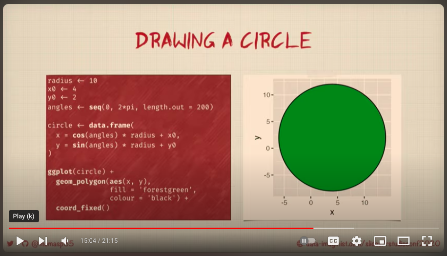
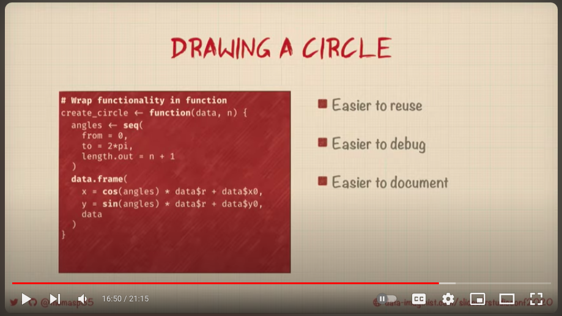
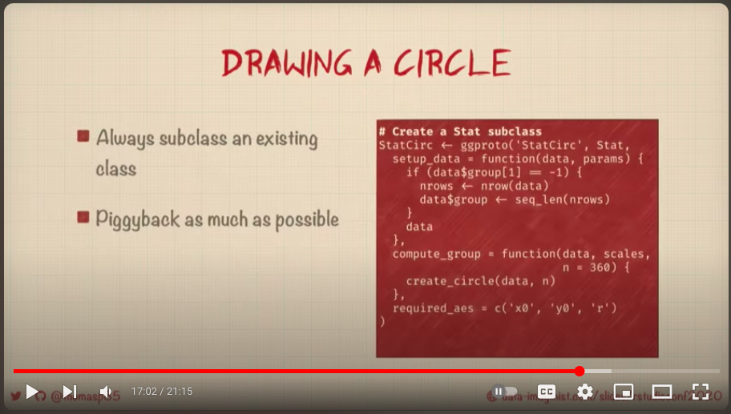

```{r setup, include=FALSE}
knitr::opts_chunk$set(echo = TRUE)
```

## R Markdown

```{r cars, eval = F}

```

```{r}
library(ggplot2)

radius <- 10
x0 <- 4
y0 <- 2
angles <- seq(0, 2*pi, length.out = 200)

circle <- data.frame(
  x = cos(angles) * radius + x0,
  y = sin(angles) * radius + y0
  
)

ggplot(circle) + 
  geom_polygon(aes(x, y),
               fill = 'forestgreen',
               colour = 'black') + 
  coord_fixed()
```

```{r}

```

```{r}
create_circle <- function(data, n){
  
  angles <- seq(from = 0, to = 2*pi,length.out = n+1)
  data.frame()
  
}


```


```{r}

```


```{r}
library(ggplot2)
library(tidyverse)

my_setup <- function(data, params){
  
  if(data$group[1] == -1){
    nrows <- nrow(data)
    data$group <- seq_len(nrows)
  }
  data
}


cars %>% 
  mutate(group = -1L) %>% # specifies 
  my_setup()


my_setup <- function(data, params)  {
    if (anyDuplicated(data$group)) {
      data$group <- paste(data$group, seq_len(nrow(data)), sep = "-")
    }
    data
  }

cars %>% 
  mutate(group = -1L) %>% 
  my_setup()

my_compute_panel <- function(data, scales, n = 5, r = 1){
  
  angles <- seq(
    from = 0,
    to = 2*pi,
    length.out = n + 1
  )
  
  nrows = nrow(data)
  
  df <- data.frame() 
  
  for(i in 1:nrows){
    
  bind_rows(df,   
  data.frame(
    x = cos(angles) * data$r[i] + data$x0[i],
    y = cos(angles) * data$r[i] + data$y0[i],
    group = i
  ) 
  ) ->
    df
  }
  
}

cars %>%
  rename(x0 = dist) %>%
  rename(y0 = speed) %>%
  mutate(r = y0/12) %>%
  my_compute_panel


StatCircle <- ggproto(`_class` = 'StatCircle',
                      `_inherit` = Stat, 
                      setup_data = my_setup,
                      compute_panel = my_compute_panel,
                      required_aes = c('x0', 'y0', 'r'))


geom_circle <- function(mapping = NULL, data = NULL, stat = "circle", 
                        position = "identity", ..., r = 1,  
                        n = 50, arrow = NULL, lineend = "butt", linejoin = "round", 
                        na.rm = FALSE, show.legend = NA, inherit.aes = TRUE) {
  layer(
    data = data, 
    mapping = mapping, 
    stat = stat, 
    geom = GeomPolygon, 
    position = position, 
    show.legend = show.legend, 
    inherit.aes = inherit.aes, 
    params = list(
      r = r, 
      n = n, 
      arrow = arrow, 
      lineend = lineend, 
      linejoin = linejoin, 
      na.rm = na.rm, 
      ...
    )
  )
}


ggplot(cars) + 
  aes(x = speed) + 
  aes(y = dist) + 
  geom_point() + 
  aes(r = dist, x0 = speed, y0 = dist) +
  geom_circle()


```


---

https://evamaerey.github.io/flipbooks/extending_ggplot2.html#86

```{r}
library(ggplot2)
library(tidyverse)
create_circle <- function(x0, y0, r = 1, n = 100){
  angels <- seq(
    from = 0,
    to = 2*pi,
    length.out = n + 1
  )
  data.frame(
    x = cos(angels) * r + x0,
    y = sin(angels) * r + y0
  )
}

the_compute_panel <- function(data, scales, r = 1, n = 50) {
    
    cols_to_keep <- setdiff(names(data), c("x0", "y0"))
    
    circles <- lapply(seq_len(nrow(data)), function(i) {
      
      circles_path <- create_circle(data$x0[i], data$y0[i], data$r[i], n)
      cbind(circles_path, unclass(data[i, cols_to_keep]))
      
    })
    
    do.call(rbind, circles)
}

cars %>% 
  .[1:2,] %>% 
  rename(x0 = speed) %>% 
  rename(y0 = dist) %>% 
  mutate(r = y0) %>% 
  mutate(group = row_number()) %>% 
  the_compute_panel(n = 5)


the_setup_data <- function(data, params) {
    if (anyDuplicated(data$group)) {
      data$group <- paste(data$group, seq_len(nrow(data)), sep = "-")
    }
    data
  }

cars %>% 
  .[1:2,] %>% 
  mutate(group = row_number()) %>% 
  the_setup_data()

StatCircle <- ggproto("StatCircle", Stat, 
  # setup_params = function(data, params) {
  #   if (is.null(params$r)) {
  #     params$r <- 1
  #   } else if (params$r == 0) {
  #     rlang::abort("Circles cannot be defined with a radius of 0")
  #   }
  #   if (is.null(params$n)) {
  #     params$n <- 50
  #   } else if (params$n <= 0) {
  #     rlang::abort("Circles must be defined with `n` greater than 0")
  #   }
  #   params
  # },
  setup_data = the_setup_data,
  compute_panel = the_compute_panel,
  required_aes = c("x0", "y0", "r")
)


geom_circle <- function(mapping = NULL, data = NULL, stat = "circle", 
                        position = "identity", ..., r = 1,  
                        n = 50, arrow = NULL, lineend = "butt", linejoin = "round", 
                        na.rm = FALSE, show.legend = NA, inherit.aes = TRUE) {
  layer(
    data = data, 
    mapping = mapping, 
    stat = stat, 
    geom = GeomPolygon, 
    position = position, 
    show.legend = show.legend, 
    inherit.aes = inherit.aes, 
    params = list(
      r = r, 
      n = n, 
      arrow = arrow, 
      lineend = lineend, 
      linejoin = linejoin, 
      na.rm = na.rm, 
      ...
    )
  )
}


set.seed(1244)
cars %>% 
  .[1:5,] %>%
  ggplot() +
  aes(x = speed, y = dist) +
  geom_point() +
  aes(x0 = speed, y0 = dist, r = dist^.5) +
  geom_circle(n = 3, alpha = .2) +
  geom_circle(n = 13, alpha = .2) +
  geom_circle(r = 2, alpha = .2) +
  geom_circle(alpha = .2)


layer_data(last_plot(), 2)

```

