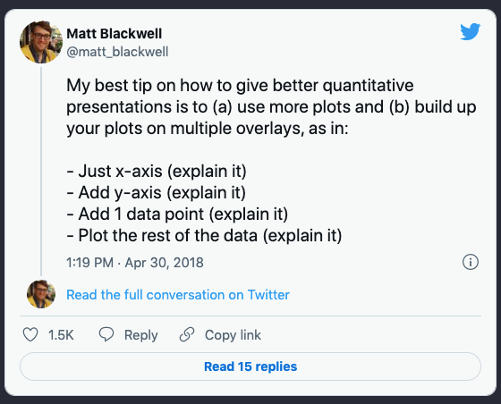
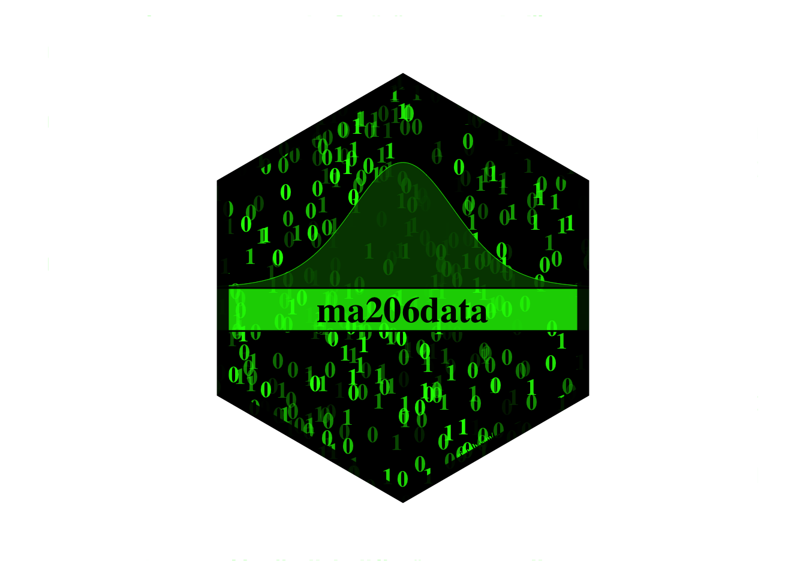

```{r setup, include=FALSE}
knitr::opts_chunk$set(echo = TRUE)
```


---

# "Let Data Tell the Story" - Tintle et all. Key idea box #1. Idea #1.


---

# Hans Rosling Master Storyteller


--

<iframe width="767" height="431" src="https://www.youtube.com/embed/jbkSRLYSojo?list=PL6F8D7054D12E7C5A" frameborder="0" allow="accelerometer; autoplay; encrypted-media; gyroscope; picture-in-picture" allowfullscreen></iframe>
https://www.youtube.com/embed/jbkSRLYSojo?list=PL6F8D7054D12E7C5A

--

Not just animation (overtime)

--

animation of graph set up!!


---

# storytelling advice that resonates.



Also, see Garr Reynolds 'presentation zen': https://policyviz.com/podcast/episode-62-garr-reynolds/
???
'Making the simple complicated is commonplace; making the complicated simple, awesomely simple, that's creativity.'
— Charles Mingus
'Cognitive scientists have discovered three important features of the human information processing system that are particularly relevant for PowerPoint users: dual-channels, that is, people have separate information processing channels for visual material and verbal material; limited capacity, that is, people can pay attention to only a few pieces of information in each channel at a time; and active processing, that is, people understand the presented material when they pay attention to the relevant material, organize it into a coherent mental structure, and integrate it with their prior knowledge.'
— Rich Mayer, in an interview with Sociable Media, Inc.

---

## ggplot2 is all about building up plots and layouts!!


---

# Baller::Reynolds MA206 2021

Let's install the gapminder package...
library(gapminder)

--

## 😣😣😣 But don't throw one more thing at us! 😣 

--

ma206data



--

`install.packages("remotes")`
`install.github("EvaMaeRey/ma206data")`


---

# Figure 2.2


```{r fig 2_2}
library(tidyverse)
library(ma206data)

prelim_NationalAnthemTimes %>% 
  ggplot() + 
  aes(x = time) + 
  geom_rug() + 
  geom_dotplot()
```


---

# Figure 2.3-6

```{r fig2_3_6}


prelim_NationalAnthemTimes %>% 
  names()

prelim_NationalAnthemTimes %>% 
  ggplot() + 
  aes(x = time) + 
  geom_rug() + 
  geom_histogram() + 
  ggxmean::geom_x_mean() + 
  ggxmean::geom_x_mean_label() + 
  ggxmean:::geom_x1sd(lty = "dashed") + 
  facet_wrap(facets = vars(sex), ncol = 1) + 
  facet_wrap(facets = vars(genre), ncol = 1) + 
  facet_grid(rows = vars(sex), cols = vars(genre)) + 
  aes(color = sex)
```


---

# 'The best solution to visual dispay of multivariate data is using small multiples' - Eduard Tufte paraphrase

--

### Small multiple:  One method Tufte encourages to allow quick visual comparison of multiple series is the small multiple, a chart with many series shown on a single pair of axes that can often be easier to read when displayed as several separate pairs of axes placed next to each other. He suggests this is particularly helpful when the series are measured on quite different vertical (y-axis) scales, but over the same range on the horizontal x-axis (usually time).

---

`remotes::install_github("EvaMaeRey/ma206data")`

---


# Figure 2.8


```{r fig2_8}

prelim_NationalAnthemTimes %>% 
  names()

prelim_NationalAnthemTimes %>% 
  ggplot() + 
  aes(x = year) + 
  aes(y = time) + 
  geom_rug() + 
  geom_point() + 
  aes(color = sex) + 
  aes(shape = sex) + 
  facet_wrap(facets = vars(sex), ncol = 1) +
  geom_smooth() # just for fun
```

---

# Fluid storytelling w/ ggplot2

--

Hadley Wickham, ggplot2 author on it's motivation:
> ### And, you know, I'd get a dataset. And, *in my head I could very clearly kind of picture*, I want to put this on the x-axis. Let's put this on the y-axis, draw a line, put some points here, break it up by this variable. 
--
> ### And then, like, getting that vision out of my head, and into reality, it's just really, really hard. Just, like, felt harder than it should be. Like, there's a lot of custom programming involved,


---

> ### where I just felt, like, to me, I just wanted to say, like, you know, *this is what I'm thinking, this is how I'm picturing this plot. Like you're the computer 'Go and do it'.* 
--
> ### ... and I'd also been reading about the Grammar of Graphics by Leland Wilkinson, I got to meet him a couple of times and ... I was, like, this book has been, like, written for me. 
https://www.trifacta.com/podcast/tidy-data-with-hadley-wickham/

---

# Promise of ggplot2?

--
## Getting the plot form you picture in your head ...
--
## ... into reality...
--
## ... by describing it.


---

# ggplot2 is called a 'declarative' graphing system.
--
# It lets you *'speak your plot into existance'*. (Thomas Lin Pederson?) 
--
### This is fast. Because most of us, like Hadley Wickham, can **picture** the form of the plot we're going after rather clearly (i.e. what the horizontal position should represent, what color should represent, what 'marks' (points, lines) are going to appear on the plot).  
--
'Getting' our plot made becomes a matter of describing what we're already picturing!


---

background-image: url(images/paste-A8314E33.png)
background-size: cover

---

background-image: url(images/paste-D46A77DF.png)
background-size: cover

---


background-image: url(images/paste-CAD8C893.png)
background-size: cover

---

background-image: url(images/paste-DC46E991.png)
background-size: cover

