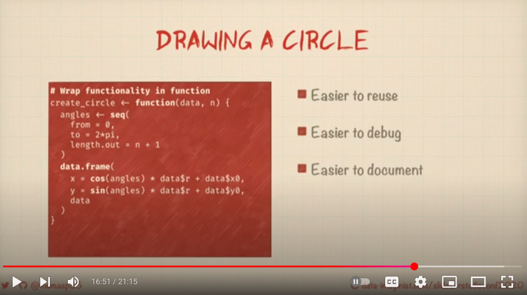

```{r setup, include=FALSE}
knitr::opts_chunk$set(echo = TRUE)
```

# Step 00: Press play on 'Extending your Ability to Extend' https://www.youtube.com/watch?v=uj7A3i2fi54


### Verbatim approach



```{r}
library(tidyverse)
create_circle <- function(data, n){

  angles <- seq(from = 0, 
                to = 2 * pi,
                length.out = n + 1)

  data.frame(
    x = cos(angles) * data$r + data$x0,
    y = sin(angles) * data$r + data$y0,
    data
  )

}

```


```{r}
StatCircle <- ggproto(`_class` = "StatCircle", 
                      `_inherit` = Stat, 
                      setup_data = function(data, params) {
  
    if (data$group[1] == -1) {
      nrows <- nrow(data)
      data$group <- seq_len(nrows)
    }
  
    data  # return data with a group variable

},
                      compute_group = function(data, scales, n = 5){create_circle(data, n = n)},
                      required_aes = c("x0", "y0", "r")
                      )


```


```{r}
circles <- data.frame(x0 = c(-5,5), y0 = c(5, -5),
                      r = c(5, 4), class = c("A", "B"))

ggplot(circles) + 
  geom_polygon(stat = StatCircle,
               aes(x0 = x0, y0 = y0, 
                   r = r, fill = class))


```


```{r}
ggplot(circles) + 
  geom_polygon(stat = StatCircle,
               aes(x0 = x0, y0 = y0, 
                   r = r, fill = class)) + 
  facet_wrap(~ class)
```


```{r}
ggplot(cars |> mutate(row = row_number())) + 
  
  aes(x0 = speed, y0 = dist, r = 5) + 
  geom_polygon(stat = StatCircle) + 
  aes(fill = speed > 15) + 
  facet_wrap(~ speed > 15)
```


```{r, warning=F}
last_plot() +
  aes(group = row) + 
  geom_point(aes(x = speed, y = dist))
```


---


```{r}
knitr::knit_exit()


```


--------


# extension


# step 1a:  write `setup_data` function

```{r cars, message=F, warning=F}
library(tidyverse)
setup_data_circle <- function(data, params) {
  
    if (data$group[1] == -1) {
      nrows <- nrow(data)
      data$group <- seq_len(nrows)
    }
  
    data  # return data with a group variable

}
```

# step 1b: test `setup_data` data function

```{r step1b}
cars %>% 
  slice(1:5) %>% 
  mutate(group = -1) %>% # no grouping neg one is default in ggplot2
  setup_data_circle() # setup makes each row defines a group

cars %>% 
  slice(5:20) %>% 
  mutate(group = 2) %>% # if a group is already defined
  setup_data_circle() # setup data does not do anything
```

---

# step 2a: write a `compute_group` function

We write a routine that will act on each group in the data (in this case each row)


---

```{r step_2a}
compute_group_circle <- function(data, scales, n = 5){

  angles <- seq(from = 0, 
                to = 2 * pi,
                length.out = n + 1)

  data.frame(
    x = cos(angles) * data$r + data$x0,
    y = sin(angles) * data$r + data$y0#,
    # data
  )

}
```


# step 2b: test `compute_group` row processing function

```{r 2a2}
cars %>%
  rename(x0 = dist, y0 = speed) %>% 
  mutate(r = x0) %>% 
  .[1,] %>% 
  compute_group_circle(n = 6)

cars %>%
  rename(x0 = dist, y0 = speed) %>% 
  mutate(r = x0) %>%
  .[5,] %>% 
  compute_group_circle(n = 6) %>% 
  ggplot() + 
  aes(x = x, y = y) +
  geom_polygon(alpha = .5) + 
  coord_equal()

```


# Step 3: use `ggproto()` to create StatCircle; `setup_data` and `compute_group` functions will be inputs

```{r}
StatCircle <- ggproto(`_class` = "StatCircle", 
                      `_inherit` = Stat, 
                      setup_data = setup_data_circle,
                      compute_group = compute_group_circle,
                      required_aes = c("x0", "y0", "r")
                      )
```


# Step 5: Enjoy! Test out `geom_circle`

```{r 5}
test_df <- data.frame(
  
  x0 = c(-5, 5),
  y0 = c(5, -5),
  r = c(5, 4),
  class = c("a", "b")
  
)


cars %>% 
  slice(1:5) %>% 
  ggplot() + 
  aes(x = speed, y = dist) +
  geom_point() +
  aes(x0 = speed, 
      y0 = dist, 
      r = speed/6) + 
  coord_equal() ->
baseplot

baseplot +
  geom_polygon(stat = StatCircle, n = 7, alpha = .2)
```

# Keep testing; second guess everything; dispare

```{r}
baseplot + 
  aes(fill = speed == 6) +
  geom_polygon(stat = StatCircle, n = 7, alpha = .2)

baseplot + 
  aes(fill = speed > 6) +
  geom_polygon(stat = StatCircle, n = 7, alpha = .2)
```


# Look at `geom_circle` from ggforce; hope renewed

```{r}
baseplot + 
  aes(fill = speed > 6) +
  ggforce::geom_circle(n = 5)
```


### Verbatim approach


```{r}
create_circle <- function(data, n){

  angles <- seq(from = 0, 
                to = 2 * pi,
                length.out = n + 1)

  data.frame(
    x = cos(angles) * data$r + data$x0,
    y = sin(angles) * data$r + data$y0,
    data
  )

}

```


```{r}
StatCircle <- ggproto(`_class` = "StatCircle", 
                      `_inherit` = Stat, 
                      setup_data = function(data, params) {
  
    if (data$group[1] == -1) {
      nrows <- nrow(data)
      data$group <- seq_len(nrows)
    }
  
    data  # return data with a group variable

},
                      compute_group = function(data, scales, n = 5){create_circle(data, n = n)},
                      required_aes = c("x0", "y0", "r")
                      )


```


```{r}
circles <- data.frame(x0 = c(-5,5), y0 = c(5, -5),
                      r = c(5, 4), class = c("A", "B"))

ggplot(circles) + 
  geom_polygon(stat = StatCircle,
               aes(x0 = x0, y0 = y0, 
                   r = r, fill = class))


```


```{r}
ggplot(circles) + 
  geom_polygon(stat = StatCircle,
               aes(x0 = x0, y0 = y0, 
                   r = r, fill = class)) + 
  facet_wrap(~ class)
```


```{r}
ggplot(cars) + 
  aes(x = speed, y = dist) + 
  geom_point() +
  aes(x0 = speed, y0 = dist, r = 1) + 
  geom_polygon(stat = StatCircle) + 
  aes(fill = speed > 15) + 
  facet_wrap(~ speed > 15)

```


---

```{r}
ggforce:::StatCircle$compute_group
ggforce:::StatCircle$compute_panel
ggforce:::StatCircle$setup_data
```


```{r}
ggforce:::arcPaths
```


# Step 6: Post Mordem using `layer_data` to look at the data frame


```{r 6}
baseplot +
  geom_polygon(stat = StatCircle, n = 7, alpha = .2) ->
p1

layer_data(p1, 2)

baseplot + 
  aes(fill = speed > 6) +
  geom_polygon(stat = StatCircle, n = 7, alpha = .2) ->
p2

layer_data(p2, 2) |>
  slice(1:5)
```


# verbatim


---
