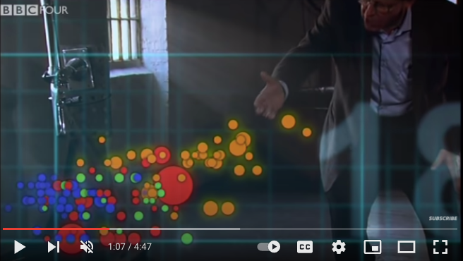
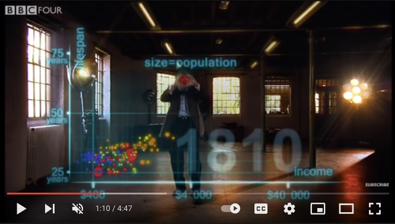

```{r setup, include=FALSE}
knitr::opts_chunk$set(echo = TRUE)
options(tidyverse.quiet = TRUE)
```


class: inverse, bottom
background-image: url(https://images.unsplash.com/photo-1559827260-dc66d52bef19?ixlib=rb-4.0.3&ixid=M3wxMjA3fDB8MHxwaG90by1wYWdlfHx8fGVufDB8fHx8fA%3D%3D&auto=format&fit=crop&w=1470&q=80)
background-size: cover

# .Large[Supporting a new wave of ggplot2 extenders]
## .small[by providing new points of entry for ggplot2 super-users]
#### .tiny[Dr. Evangeline Reynolds | 2022-04-26 |Image credit: Silas Baisch, Upsplash]


???

Title slide
```{r, include = F}
# This is the recommended set up for flipbooks
# you might think about setting cache to TRUE as you gain practice --- building flipbooks from scratch can be time consuming
knitr::opts_chunk$set(fig.width = 6, fig.height = 4.5, message = FALSE, warning = FALSE, comment = "", cache = F)
library(flipbookr)
```

---

class: inverse, bottom
background-image: url(https://images.unsplash.com/photo-1603300216540-6b77f84ee101?ixlib=rb-1.2.1&raw_url=true&q=80&fm=jpg&crop=entropy&cs=tinysrgb&ixid=MnwxMjA3fDB8MHxwaG90by1wYWdlfHx8fGVufDB8fHx8&auto=format&fit=crop&w=387)
background-size: cover

# Unlocking ggplot2 as a computational engine 
## by extending ggplot2 statistical geometries
### Dr. Evangeline 'Gina' Reynolds

### Thursday May 19, 2022, 12:15AM
#### Photo Credit: Mike Lewis HeadSmart Media


---

class: inverse, bottom
background-image: url(https://images.unsplash.com/photo-1542178432-52211bc52073?crop=entropy&cs=tinysrgb&fm=jpg&ixlib=rb-1.2.1&q=80&raw_url=true&ixid=MnwxMjA3fDB8MHxwaG90by1wYWdlfHx8fGVufDB8fHx8&auto=format&fit=crop&w=1374)
background-size: cover

# Creating new geom vocabulary for richer statistical visual stories 
## by extending ggplot2 statistical geometries
### Dr. Evangeline 'Gina' Reynolds

### Thursday May 19, 2022, 12:15AM
#### Photo Credit: Klim Sergeev


---


### 1. Why ggplot2
### 2. Limitations of base ggplot2
### 3. Promise of Extension
### 4. Un-reached talent - ggplot2 super users unrealized potential
### 5. New strategies for reaching this talent & evidence of effectiveness
### 6. Preparing for more challenges


---

class: middle, inverse, center
# So ggplot2...

--
#               ... what's the fuss?


```{r, include = F}
 knitr::opts_chunk$set(echo = F, comment = "", message = F, 
                       warning = F, cache = T, fig.retina = 3)
 library(tidyverse)
 library(flipbookr)
 library(xaringanthemer)
 xaringanthemer::mono_light(
   base_color = "#02075D",
   # header_font_google = google_font("Josefin Sans"),
   # text_font_google   = google_font("Montserrat", "200", "200i"),
   # code_font_google   = google_font("Droid Mono"),
   text_font_size = ".85cm",
   code_font_size = ".15cm")
theme_set(theme_gray(base_size = 20))
```


<!-- --- -->

<!-- # gg in ggplot2 -->

<!-- -- -->

<!-- # Grammar of Graphics -->

---
class: middle, inverse, center


# It lets you *'speak your plot into existence'*. (Thomas Lin Pederson) 

---


# Hans Rosling & BBC in 2010  


<iframe width="767" height="431" src="https://www.youtube.com/embed/jbkSRLYSojo?list=PL6F8D7054D12E7C5A" frameborder="0" allow="accelerometer; autoplay; encrypted-media; gyroscope; picture-in-picture" allowfullscreen></iframe>
https://www.youtube.com/embed/jbkSRLYSojo?list=PL6F8D7054D12E7C5A


---


## ... I know having the data is not enough. I have to show it in ways people both enjoy and understand

```{r, out.width="65%", fig.align='center'}
knitr::include_graphics("images/hans_argument.png")
```


---

# 'Here we go. Life expectancy on the y-axis'


```{r, out.width="80%"}
knitr::include_graphics("images/hans_y_axis.png")
```

---

# 'On the x-axis, '


```{r, out.width="80%"}
knitr::include_graphics("images/hans_x_axis.png")

```

---

# 'Colors represent the different continents'

```{r, out.width="80%"}


```


---

# Size represents population

```{r, out.width="80%"}

```

---
class: inverse, center, middle

#  Response to speaking plot into existence?

--

# 10 million views...

--

(also does animation at the end... which I don't show)


---
class: inverse, center, middle

# And ggplot2 also affords this build-up-your-plot-bit-by-bit experience.  

--
# i.e. 'speaking your plot into existence.' 


```{r, include = F}
library(tidyverse)
library(gapminder)
gapminder %>%  # data from package
  filter(year == 2002) ->
gapminder_2002
```

---

`r chunk_reveal("scatter", title = "# We all have Hans Rosling capabilities")`

```{r scatter, include = F}
ggplot(data = gapminder_2002) + #BREAK1
  aes(y = lifeExp) + #BREAK2
  aes(x = gdpPercap) + #BREAK3
  geom_point() +  #BREAK5
  aes(size = pop/1000000000) + #BREAK6
  aes(color = continent) #BREAK7
```

---


## We get the 'Hans Rosling' speak-it experience ...

--
## ... because ggplot2 is based on the grammar of graphics, (gg = grammar of graphics) 

--
## which breaks up the plot elements into *orthogonal* parts,

--
## and allows user to manipulate those parts bit by bit.

---
class: inverse, center, middle

> # "the Grammar of Graphics makes [building plots] easy because you've just got all these, like, little nice decomposable components" -- Hadley Wickham


---

## Orthogonal elements ... 

```{r, echo = F, eval = T}
knitr::include_graphics("https://miro.medium.com/max/1400/1*MMZuYgeC_YjXNC1r4D4sog.png")
```


---


# Skip at COWY: discussing origins of ggplot2

--

Hadley Wickham, ggplot2 author on it's motivation:

> ### And, you know, I'd get a dataset. And, *in my head I could very clearly kind of picture*, I want to put this on the x-axis. Let's put this on the y-axis, draw a line, put some points here, break it up by this variable.

--
> ### And then, like, getting that vision out of my head, and into reality, it's just really, really hard. Just, like, felt harder than it should be. Like, there's a lot of custom programming involved,

---

> ### where I just felt, like, to me, I just wanted to say, like, you know, *this is what I'm thinking, this is how I'm picturing this plot. Like you're the computer 'Go and do it'.*

--
> ### ... and I'd also been reading about the Grammar of Graphics by Leland Wilkinson, I got to meet him a couple of times and ... I was, like, this book has been, like, written for me.
https://www.trifacta.com/podcast/tidy-data-with-hadley-wickham/


---


`r chunk_reveal("scatter2", title = "# And ggplot2 gives us even more than Rosling...", break_type = 1)`

```{r scatter2, include = F}
ggplot(data = gapminder_2002) + #BREAK1
  aes(y = lifeExp) + #BREAK2
  aes(x = gdpPercap) + #BREAK3
  scale_x_log10() + #BREAK4
  geom_point() +  #BREAK5
  aes(size = pop/1000000000) + #BREAK6
  aes(color = continent) + #BREAK7
  labs(x = "GDP per capita (US$)") + #BREAK9 
  geom_smooth(method = lm) #<<
```

---


# "Create graphical 'poems'." - Hadley Wickham (2010) A Layered Grammar of Graphics, Journal of Computational and Graphical Statistics

--


# But... sometimes there are limits to what we can express


---
class: inverse, center, middle

# The problem?

--

## Sometimes we don't have the vocabulary that's needed to 'speak' fluently.

---

## Example

```{r, echo = F}
library(ggplot2)
ggplot(airquality) + 
  aes(x = Ozone) + 
  geom_rug() + 
  geom_histogram() + 
  ggxmean::geom_x_mean()
```

???
Consider for example, a the seemingly simple enterprise of adding a vertical line at the mean of x, perhaps atop a histogram or density plot.


---

`r chunk_reveal("basic", title = "### What's the *base* ggplot2 experience")`

```{r basic}
airquality %>% 
  ggplot(data = .) + 
  aes(x = Ozone) + 
  geom_rug() + 
  geom_histogram() + 
  geom_vline(
    xintercept = 
      mean(airquality$Ozone, 
           na.rm = T)
    ) ->
g
```

???
Creating this plot requires greater focus on ggplot2 *syntax*, likely detracting from discussion of *the mean* that statistical instructors desire.
It may require a discussion about dollar sign syntax and how geom_vline is actually a special geom -- an annotation -- rather than being mapped to the data. None of this is relevant to the point you as an instructor aim to make: maybe that the the mean is the balancing point of the data or maybe a comment about skewness.


---

### Adding the conditional means?

```{r cond_means_hard, echo = F}
airquality %>% 
  group_by(Month) %>% 
  summarise(
    Ozone_mean = 
      mean(Ozone, na.rm = T)
    ) ->
airquality_by_month

ggplot(airquality) + 
  aes(x = Ozone) + 
  geom_histogram() + 
  facet_grid(rows = vars(Month)) +
  geom_vline(data = airquality_by_month, 
             aes(xintercept = 
               Ozone_mean))
```

???

Further, for the case of adding a vertical line at the mean for different subsets of the data, a different approach is required. This enterprise may take instructor/analyst/student on an even larger detour -- possibly googling, and maybe landing on the following stack overflow page where 11,000 analytics souls (some repeats to be sure) have landed:

---

`r chunk_reveal("cond_means_hard", title = "#### Conditional means (may require a trip to stackoverflow!)")`


---

# Why is geom_smooth() is so easy, and my mean of x line is so hard?

--

### Like geom_smooth does a bunch of compute in the background

--

### then uses geometric primitives

- line
- ribbon

--

### geom_x_mean() doesn't exist.


--

### conceptually distinct from those components

---

## ggplot2 intentionally lean for maintenance purposes.

--

## ... but geom_x_mean() would be so nice!

---

## ggplot2 extensions system exists...

--

## thus, {ggxmean} r package https://github.com/EvaMaeRey/ggxmean, that gives us geom_x_mean(), and ~ 25 more geoms...


---

## Examples from ggxmean

---

`r flipbookr::chunk_reveal("ols")`

```{r ols, include = F}
library(tidyverse)
library(ggxmean)
#library(transformr) might help w/ animate

## basic example code
cars %>% 
  ggplot() +
  aes(x = speed,
      y = dist) +
  geom_point() + 
  ggxmean::geom_lm() +
  ggxmean::geom_lm_residuals(linetype = "dashed") +
  ggxmean::geom_lm_fitted(
    color = "goldenrod3",
    size = 3) +
  ggxmean::geom_lm_conf_int() +
  ggxmean::geom_lm_pred_int() +
  ggxmean::geom_lm_formula() +
  ggxmean::geom_lm_intercept(color = "red",
                             size = 5) +
  ggxmean::geom_lm_intercept_label(
    size = 3,
    hjust = 0)
```


---

# Thesis of the talk:

--

# Extension system is really cool.  

--

# Really powerful.

--

# Next: Saggeringly under-utilized.

---

# Under-utilized by whom? 
--
Who could find it extremely useful and could flourish in this extension space?  
--

## ggplot2 super users...
## 
## - know the grammar. 
## - know how to write functions
## - know R/ggplot2 extremely well..

---

# Evidence from a micro survey and focus group. 

--

# Nine statistics and data analytics educators. May 2023.

--

# ~ 15 question survey and 2 focus groups.

---

# Hand picked, extraordinary educators, very experienced with stats, data viz, ggplot2 and R.

---
class: inverse, middle, center

# profile of survey/focus group: 

--

# 100% R/ggplot stars!  

---


```{r, include = F}
knitr::opts_chunk$set(out.width = "90%")
```


```{r, echo = F, eval = T, out.width = "90%"}
include_graphics("https://github.com/EvaMaeRey/easy-geom-recipes/raw/main/survey_results_summary_files/figure-html/q05r_length_user-1.png")

```

---

```{r, out.width = "90%"}
include_graphics("https://github.com/EvaMaeRey/easy-geom-recipes/raw/main/survey_results_summary_files/figure-html/q06r_frequency-1.png")
```

---

```{r, out.width = "90%"}
include_graphics("https://github.com/EvaMaeRey/easy-geom-recipes/raw/main/survey_results_summary_files/figure-html/q07ggplot2_frequency-1.png")
```

---

```{r, out.width = "90%"}
include_graphics("https://github.com/EvaMaeRey/easy-geom-recipes/raw/main/survey_results_summary_files/figure-html/unnamed-chunk-7-1.png")
```

---

```{r, out.width = "90%"}
include_graphics("https://github.com/EvaMaeRey/easy-geom-recipes/raw/main/survey_results_summary_files/figure-html/q08r_frequency-1.png")
```


---
class: inverse, middle, center


# And yet, 

--

# *minimal* experience with extension.

---

```{r, out.width = "90%"}
include_graphics("https://github.com/EvaMaeRey/easy-geom-recipes/raw/main/survey_results_summary_files/figure-html/q10_previous_ext_experience-1.png")
```

---

```{r, out.width = "90%"}
include_graphics("https://github.com/EvaMaeRey/easy-geom-recipes/raw/main/survey_results_summary_files/figure-html/q11_previous_ext_attempt-1.png")
```

---


# What's the barrier?


---

## The problems for a 'new wave' (quoting ggtrace author June Choe*)... 

--

### 0) 'users aren't developers'

--

### 1) 'scary ggproto methods' (less experience with OOP) 

--

### 2) hard to reason about the big chunk of codes that defined a new ggroto object  

--

### 3) even if we master all of this, then we have to become package developers? 

--

* Extender friend, without whose support *sine qua non*, and winner of ASA Statistical Computing and Graphics student paper award: https://yjunechoe.github.io/static/papers/Choe_2022_SublayerGG.pdf 

--

June's thesis: users can use ggplot2 more powerfully and dynamically on the user side with greater knowledge of delayed aesthetic evaluation?


---


```{r out.width="80%"}
knitr::include_graphics("https://github.com/EvaMaeRey/easy-geom-recipes/raw/main/survey_results_summary_files/figure-html/q13_oop_experience-1.png")
```


---

## 0) Users are leaving too much on the table not to get into ggplot2 extensions - foregoing super-fluid ggplot2 experiences that extension affords

--

## 1) deemphasize OOP ggproto methods

--

## 2) pull computation out of ggproto method, to facilitate reasoning, debugging

--

## 3) build communities of support, and also support developer activities like package building


---


# *Easy geom recipes*: practice with `compute_group`
# Under construction: *More easy geom recipes*: practice with `compute_panel`

## multiple examples
##

Then survey results

---


# *Easy geom recipes* tutorial assessment


---

# Straight forward

```{r, out.width="80%"}
knitr::include_graphics("https://github.com/EvaMaeRey/easy-geom-recipes/raw/main/survey_results_summary_files/figure-html/q16tutorial_time_taken-1.png")
```


---


# High completion rate

```{r}
knitr::include_graphics("https://github.com/EvaMaeRey/easy-geom-recipes/raw/main/survey_results_summary_files/figure-html/q14which_completed-1.png")
```

---

# Appropriate length


```{r}
knitr::include_graphics("https://github.com/EvaMaeRey/easy-geom-recipes/raw/main/survey_results_summary_files/figure-html/q17tutorial_length-1.png")
```

---

# Accessible examples


```{r}
knitr::include_graphics("https://github.com/EvaMaeRey/easy-geom-recipes/raw/main/survey_results_summary_files/figure-html/q18example_clarity-1.png")
```

---

# Engaging

```{r}
knitr::include_graphics("https://github.com/EvaMaeRey/easy-geom-recipes/raw/main/survey_results_summary_files/figure-html/q19examples_engaging-1.png")
```

---

# Emotionally positive experience


```{r}
knitr::include_graphics("https://github.com/EvaMaeRey/easy-geom-recipes/raw/main/survey_results_summary_files/figure-html/unnamed-chunk-4-1.png")
```

---


# 7/9 could see themselves extending

```{r}
knitr::include_graphics("https://github.com/EvaMaeRey/easy-geom-recipes/raw/main/survey_results_summary_files/figure-html/unnamed-chunk-5-1.png")

```


---

# In the focus group...

--

# 'And it was that easy. And I felt empowered as a result of that....' 

--

# 'But you know, like, my problem isn't gonna be that easy.'

---

## Sometimes it might that easy

--

## Sometimes it won't...

---

## More support: ggplot2 extenders virtual micro meeting. Support group. https://github.com/teunbrand/ggplot-extension-club

---

## Another problem: once you get your extension working,

--

## you will want to share with the world.  

--
## And then you'll really be in 'scary developer territory'. 

## New workshop: ggtedious
https://github.com/EvaMaeRey/ggtedious

---

Toward literate programming in my own packages, to make package building process more transparent, collaborative and fun (and more of a narrative. )

---


