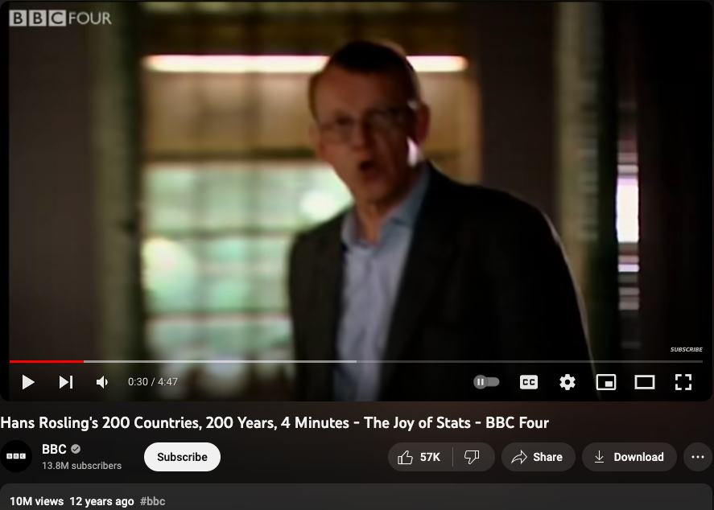
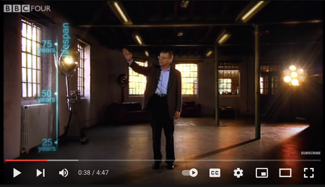
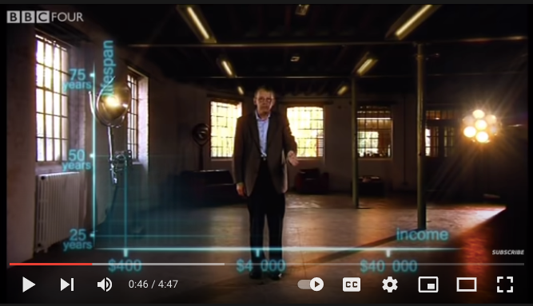
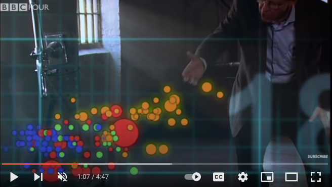
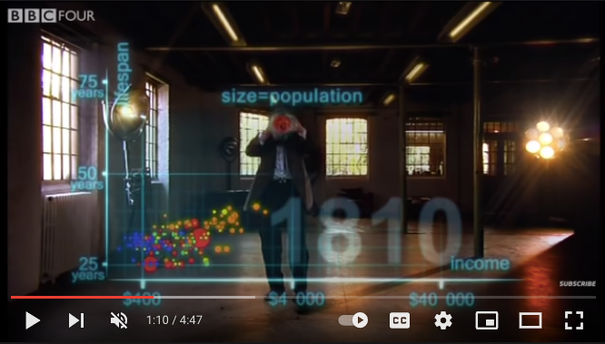

```{r setup, include=FALSE}
knitr::opts_chunk$set(echo = TRUE, cache = F, warning = F, message = F)
options(tidyverse.quiet = TRUE)
library(flipbookr)
library(tidyverse)


isi_donor_url <- "https://www.isi-stats.com/isi/data/prelim/OrganDonor.txt"

donor <- read_delim(isi_donor_url) %>%
  select(Default, Choice) %>% 
  mutate(decision = ifelse(Choice == "donor", "donor (1)", "not (0)")) %>% 
  mutate(decision = fct_rev(decision)) 


```

## Overview:

### 1. Creating new layers (geom_* functions) in ggplot2 extension has been described as an 'involved process'. 

--

### 2. I'll discuss 'easy-geom-recipes' designed to make getting into layer extension more fun!


---


---


### 1. Why ggplot2
### 2. Limitations of base ggplot2
### 3. Promise of extension
### 4. ggplot2 super-users not leveraging extension
### 5. New super-user-tailored educational material
### 6. Challenges on the horizon


---

class: middle, inverse, center
# Part 1. So ggplot2...

--
#               ... what's the fuss?


```{r, include = F}
 knitr::opts_chunk$set(echo = F, comment = "", message = F, 
                       warning = F, cache = T, fig.retina = 3)
 library(tidyverse)
 library(flipbookr)
 library(xaringanthemer)
 xaringanthemer::mono_light(
   base_color = "#02075D",
   # header_font_google = google_font("Josefin Sans"),
   # text_font_google   = google_font("Montserrat", "200", "200i"),
   # code_font_google   = google_font("Droid Mono"),
   text_font_size = ".85cm",
   code_font_size = ".15cm")
theme_set(theme_gray(base_size = 20))
```


<!-- --- -->

<!-- # gg in ggplot2 -->

<!-- -- -->

<!-- # Grammar of Graphics -->

---
class: middle, inverse, center


# It lets you *'speak your plot into existence'*. (Thomas Lin Pederson) 

---


# Hans Rosling & BBC in 2010  


<iframe width="767" height="431" src="https://www.youtube.com/embed/jbkSRLYSojo?list=PL6F8D7054D12E7C5A" frameborder="0" allow="accelerometer; autoplay; encrypted-media; gyroscope; picture-in-picture" allowfullscreen></iframe>
https://www.youtube.com/embed/jbkSRLYSojo?list=PL6F8D7054D12E7C5A


---


## ... I know having the data is not enough. I have to show it in ways people both enjoy and understand

```{r, out.width="65%", fig.align='center'}

```


---

# 'Here we go. Life expectancy on the y-axis'


```{r, out.width="80%"}

```

---

# 'On the x-axis, wealth'


```{r, out.width="80%"}


```

---

# 'Colors represent the different continents'

```{r, out.width="80%"}


```


---

# 'Size represents population'

```{r, out.width="80%"}

```

---
class: inverse, center, middle

#  Response to speaking plot into existence?

--

# 10 million views...

--

(also does animation at the end... which I don't show)


---
class: inverse, center, middle

# And ggplot2 also affords this build-up-your-plot-bit-by-bit experience.  

--
# i.e. 'speaking your plot into existence.' 


```{r, include = F}
library(tidyverse)
library(gapminder)
gapminder %>%  # data from package
  filter(year == 2002) ->
gapminder_2002
```

---

`r chunk_reveal("scatter", title = "## Now, we all have Rosling capabilities with ggplot2")`

```{r scatter, include = F}
ggplot(data = gapminder_2002) + #BREAK1
  aes(y = lifeExp) + #BREAK2
  aes(x = gdpPercap) + #BREAK3
  geom_point() +  #BREAK5
  aes(size = pop/1000000000) + #BREAK6
  aes(color = continent) #BREAK7
```

---


## We get the 'Hans Rosling' speak-it experience ...

--
## ... because ggplot2 is based on the grammar of graphics, (gg = grammar of graphics) ...

--
## ... which breaks up the plot elements into *orthogonal* parts ...

--
## ... and allows user to manipulate those parts bit by bit.

---
class: inverse, center, middle

> # "the Grammar of Graphics makes [building plots] easy because you've just got all these, like, little nice decomposable components" -- Hadley Wickham


---

## Leland Wilkinson identified orthogonal elements in 'The Grammar of Graphics'. Wilkinson on the Policy Viz Podcast [here](https://policyviz.com/podcast/episode-201-leland-wilkinson/).

```{r, echo = F, eval = T, out.width="75%"}
knitr::include_graphics("https://miro.medium.com/max/1400/1*MMZuYgeC_YjXNC1r4D4sog.png")
```


---


>  "Even though I now mostly write Python, C, and Rust, I still pop open #rstats and ggplot2 when I need to make sense of some data and it continues to be just the best thing ever." -- Dewey Dunningham


---


Hadley Wickham, on it's motivation:

> ### And, you know, I'd get a dataset. And, *in my head I could very clearly kind of picture*, I want to put this on the x-axis. Let's put this on the y-axis, draw a line, put some points here, break it up by this variable.

--
> ### And then, like, getting that vision out of my head, and into reality, it's just really, really hard. Just, like, felt harder than it should be. Like, there's a lot of custom programming involved,

---

> ### where I just felt, like, to me, I just wanted to say, like, you know, *this is what I'm thinking, this is how I'm picturing this plot. Like you're the computer 'Go and do it'.*

--
> ### ... and I'd also been reading about the Grammar of Graphics by Leland Wilkinson, I got to meet him a couple of times and ... I was, like, this book has been, like, written for me.
https://www.trifacta.com/podcast/tidy-data-with-hadley-wickham/

```{r}
knitr::include_graphics(path = "../../ggram/")


```


---

# So why ggplot2 extension?


---
class: inverse, middle, center


# ggplot2 let us "... create graphical 'poems'." - Hadley Wickham (2010) in 'A Layered Grammar of Graphics', *Journal of Computational and Graphical Statistics*

--


# But... sometimes there are limits to what we can express


---
class: inverse, center, middle

# Part 2. The problem

--

## Sometimes we don't have the vocabulary that's needed to 'speak' fluently.

---

## Example: What's the graphical poem here? 

```{r, echo = F}
library(ggplot2)
ggplot(airquality) + 
  aes(x = Ozone) + 
  geom_rug() + 
  geom_histogram() + 
  ggxmean::geom_x_mean()
```

???
Consider for example, a the seemingly simple enterprise of adding a vertical line at the mean of x, perhaps atop a histogram or density plot.


---

`r chunk_reveal("basic", title = "### What's the *base* ggplot2 experience")`

```{r basic}
airquality %>% 
  ggplot(data = .) + 
  aes(x = Ozone) + 
  geom_rug() + 
  geom_histogram() + 
  geom_vline(
    xintercept = 
      mean(airquality$Ozone, 
           na.rm = T)
    ) ->
g
```

???
Creating this plot requires greater focus on ggplot2 *syntax*, likely detracting from discussion of *the mean* that statistical instructors desire.
It may require a discussion about dollar sign syntax and how geom_vline is actually a special geom -- an annotation -- rather than being mapped to the data. None of this is relevant to the point you as an instructor aim to make: maybe that the the mean is the balancing point of the data or maybe a comment about skewness.


---

### Adding the conditional means?

```{r cond_means_hard, echo = F}
airquality %>% 
  group_by(Month) %>% 
  summarise(
    Ozone_mean = 
      mean(Ozone, na.rm = T)
    ) ->
airquality_by_month

ggplot(airquality) + 
  aes(x = Ozone) + 
  geom_histogram() + 
  facet_grid(rows = vars(Month)) +
  geom_vline(data = airquality_by_month, 
             aes(xintercept = 
               Ozone_mean))
```

???

Further, for the case of adding a vertical line at the mean for different subsets of the data, a different approach is required. This enterprise may take instructor/analyst/student on an even larger detour -- possibly googling, and maybe landing on the following stack overflow page where 11,000 analytics souls (some repeats to be sure) have landed:

---

`r chunk_reveal("cond_means_hard", title = "#### Conditional means (may require a trip to stackoverflow!)")`


---

# Why is geom_smooth() is so easy, and my mean of x line is so hard?

--

### Like geom_smooth does a bunch of compute in the background

--

### then uses geometric primitives to show computed values

- line
- ribbon geometry 

--

### geom_xmean() doesn't exist; we have to do the compute


---

## ggplot2 intentionally lean for maintenance purposes.

--

## ... but geom_xmean() would be nice!

---
class: middle, center, inverse


## Part 3. ggplot2 extension can be used to help restore that 'speak it into existance' feel, when base ggplot2 'words' fail


---

## Intro Thoughts

## ggbump

```{r, echo = F}
library(tidyverse)
theme_set(theme_gray(base_size = 18))
us_and_peers <- c("United States", "Germany", 
                  "United Kingdom", "France", 
                  "Canada")

gapminder::gapminder %>% 
  filter(country %in% us_and_peers) %>% 
  mutate(life_exp_rank = rank(-lifeExp), 
         .by = year) ->
us_cohort_life_exp_rank_2020
```

---

`r chunk_reveal("bump")`

```{r bump, include = F}
library(tidyverse)
library(ggbump)

us_cohort_life_exp_rank_2020 %>% 
  ggplot() + 
  aes(x = year, 
      y = life_exp_rank, 
      color = country) + 
  geom_point() + 
  geom_bump()
```

---

# Graphical Poem!!!


```{r, eval = F}
life_exp_rank_2020 %>% 
  ggplot() + 
  aes(x = year, 
      y = life_exp_rank, 
      color = country) + 
  geom_point() + 
  geom_bump()  #<<
```


---

#  Without geom_bump(), drawing a bumpchart would be a non-starter in most settings (business, government, academic).*

--

# Layer extension delivers value. 

--

## "... creating new Stats[-based layers] is one of the most useful ways to extend the capabilities of ggplot2." – ggplot2: Elegant Graphics for Data Analysis


---

But...

# - 'I have two kids, it's so hard to be so deep in ggplot, it takes at least two days just to get all the information in your head again.  So I'm struggling with maintaining [ggbump, ggaluvial, ggsankey]'

--

# Delivering new layer extensions can be costly.

---

# - 'I have 200 kids...'  Univeristy Professor

---

# - 'I have 1000 kids...'  University Curriculum Director

---

# - 'I have a thesis to finish'  Graduate Student

---

## Recognizing demands on peoples time and attention.

--

## Talk central question:  Can we lower the costs to getting into layer extension?

--

## Especially in academic setting...

--

## ... (These people generally have staggeringly good extension ideas, and academic setting has potential to have ripple effect since educators have a *lot* of trainees...) :-)

---

# 'How to learn ggplot2 while drowning'...?

--

## managing 'care tasks' ...


---

## 1. extension is be an analytic 'care task' - can help you in the long run

--

## 2. but in the short run, barriers to entry and maintanance present a burden


---

# 'How to introduce ggplot2 layer extension without it feeling overwhelming (drowning)'...?

---

```{r}
knitr::include_graphics("../../posit-consulting/report_figures/unnamed-chunk-35-1.svg")
knitr::include_graphics("../../posit-consulting/report_figures/unnamed-chunk-35-2.svg")
knitr::include_graphics("../../posit-consulting/report_figures/unnamed-chunk-35-3.svg")
```


---

'Easy Geom Recipes' (Recipe cards)

```{r}
knitr::include_graphics("../../posit-consulting/step0.png")
```

---


```{r}
knitr::include_graphics("../../posit-consulting/step1.png")
```

---


```{r}
knitr::include_graphics("../../posit-consulting/step2.png")
```


```{r}
knitr::include_graphics("../../posit-consulting/step3.png")
```

```{r}
knitr::include_graphics("../../posit-consulting/done.png")
```


---

# In next ggplot2 release

```{r}
stat_medians <- make_constructor(StatMedians, geom = "point")
geom_medians <- make_constructor(GeomPoint, stat = "medians")
```


---


```{r, eval = F}
files <- fs::dir_ls("../../posit-consulting/report_figures/")

knitr::include_graphics(path = files[1])
knitr::include_graphics(path = files[2])
knitr::include_graphics(path = files[3])
knitr::include_graphics(path = files[4])
knitr::include_graphics(path = files[5])
knitr::include_graphics(path = files[6])
knitr::include_graphics(path = files[7])

knitr::include_graphics(path = files[8])
knitr::include_graphics(path = files[9])
knitr::include_graphics(path = files[10])
knitr::include_graphics(path = files[11])
knitr::include_graphics(path = files[12])
knitr::include_graphics(path = files[13])
knitr::include_graphics(path = files[14])
knitr::include_graphics(path = files[15])


```


---

> I've used ggplot for a very long time... Conceptually I get \[the difference between `stat_*()` functions and `geom_()*`s functions.\]

--

> ... But like ... I would not put `+ stat_*()` anything. That's not something I would naturally do after using the gg platform... for 10 years.

---


>  Wait, why did we do a Stat and not a Geom like, like ... the tutorial starts with, you're gonna make a geom_*() but I made a stat_*().


---

> **Participant H** I just think that it's weird to have two things that live at the \[same level\], because ultimately they all filter down to layer. And it's really a layer that you're creating.

---

> **Participant D** There's a sense in which also, like, you feel that maybe everything should just be 'layer\_'. But the problem is that nobody actually does that in practice. And so, you know, you would be teaching something, and it would be kind of a ggplot variant that nobody else really uses.

---


> 'Stat objects are almost always paired with a geom\_\*() constructor because most ggplot2 users are accustomed to adding geom_\*()s, not stat_\*()s, when building up a plot.' - ggplot2 book, Extension springs case study


---

In an LLMs world?  


---

In an LLMs world?  

But I can ask an LLM to write me an extension...

--

And it may manage...

--

Can we design entry points that are more informative?

--

Is it worthwhile to do so? 

--

Should we even care what the code that writes the plot looks like any more?


