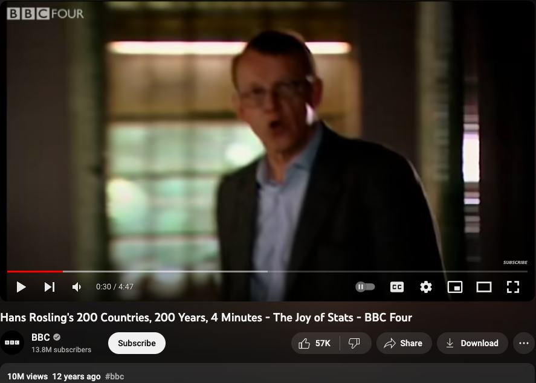
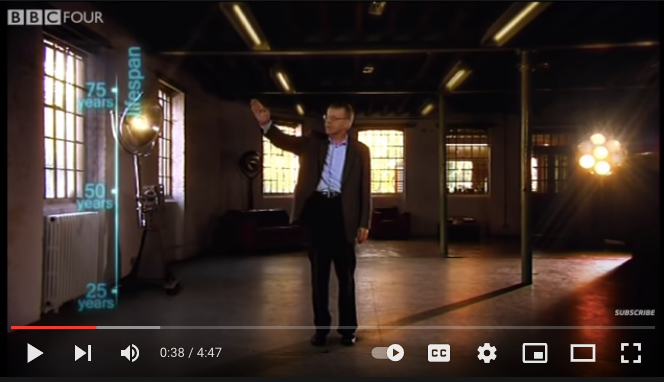
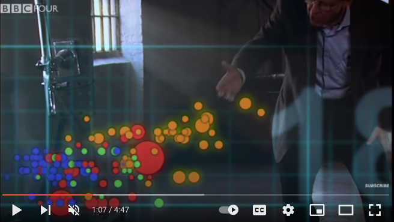
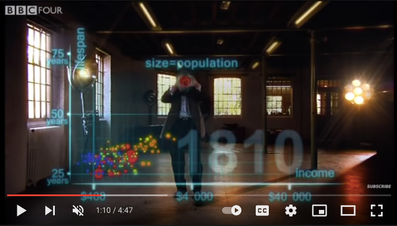

class: inverse, bottom
background-image: url(https://images.unsplash.com/photo-1532012197267-da84d127e765?q=80&w=1587&auto=format&fit=crop&ixlib=rb-4.0.3&ixid=M3wxMjA3fDB8MHxwaG90by1wYWdlfHx8fGVufDB8fHx8fA%3D%3D)
background-size: cover

# .Large[flipbooks]
## .small[past, present, future]
## .small[https://bit.ly/ggextend-cowy]
#### .tiny[Dr. Evangeline Reynolds | 2023-10-13 | Lawrence Livermore National Lab R Users Meetup , Image credit: Jaredd Craig, Upsplash]


???


```{r setup, include=FALSE}
knitr::opts_chunk$set(echo = TRUE)
options(tidyverse.quiet = TRUE)
library(flipbookr)
```

---

# flipbookr: An unfolding tale about empathy...


---

## Chapter 1: Explaining your plot bit by bit is empathetic (Matt Blackwell; Hans Rosling)

--
## Chapter 2: Pair up code and plot components is empathetic (Hadley Wickham)

--
## Chapter 3: *showing* this pairing is gentle and empathetic (Garrick Aden-Bui, others)

---

Automating pairing is self-empathetic (Emi Tanaka; Garrick Aden-Bui; Me)

---

## Next Chapter: chunk_reveal_live()... Making it accessible and relevant is empathetic.  (via Kelly Bodwin; rstudioapi; Me)

---

## Yet another Chapter:  Flipbookr for quarto: Keeping it up-to-date is empathetic (Kieran Healey; Kelly Bodwin; me?)


---


## Origins in presentation and *empathy* for your audience in presentation...


<blockquote class="twitter-tweet"><p lang="en" dir="ltr">My best tip on how to give better quantitative presentations is to (a) use more plots and (b) build up your plots on multiple overlays, as in:<br><br>- Just x-axis (explain it)<br>- Add y-axis (explain it)<br>- Add 1 data point (explain it)<br>- Plot the rest of the data (explain it)</p>&mdash; Matt Blackwell (@matt_blackwell) <a href="https://twitter.com/matt_blackwell/status/991004129198854145?ref_src=twsrc%5Etfw">April 30, 2018</a></blockquote> <script async src="https://platform.twitter.com/widgets.js" charset="utf-8"></script>


---

## you are practicing empathy by using data visualization (it's fast); gonna make seeing patterns in your data feel effortless

--

Visual information channels are "preattentively processed" -- Cleveland and McGill 1984

"preattentively processed" == effortlessness

--

John Tukey quote

--

---

## but you can encode so much in a data viz.  So you really need to talk about *each* encoding (one by one) else the interpretation is lost.


--

```{r}
knitr::include_graphics("https://clauswilke.com/dataviz/aesthetic_mapping_files/figure-html/common-aesthetics-1.png")
```


---

## Not me: 'Wow, that is profoundly empathetic'. 🦉🦉🦉

--

## Me: 'Neat-o! That sounds a lot like the *layered* presentation of graphics.'  🤓🤓🤓

https://twitter.com/EvaMaeRey/status/991576057424867329?ref_src=twsrc%5Etfw%7Ctwcamp%5Etweetembed%7Ctwterm%5E992341968125493248%7Ctwgr%5E6984c963ccc42b1ee417755fdaea0b53199dc51a%7Ctwcon%5Es2_&ref_url=https%3A%2F%2Fevangelinereynolds.netlify.com%2Fpost%2Fflipbooks-and-flipbookr%2F


---

# And when people do, this it is profoundly appreciated... Hans Rosling & BBC in 2010  


<iframe width="767" height="431" src="https://www.youtube.com/embed/jbkSRLYSojo?list=PL6F8D7054D12E7C5A" frameborder="0" allow="accelerometer; autoplay; encrypted-media; gyroscope; picture-in-picture" allowfullscreen></iframe>
https://www.youtube.com/embed/jbkSRLYSojo?list=PL6F8D7054D12E7C5A


---


## ... I know having the data is not enough. I have to show it in ways people both enjoy and understand

```{r, out.width="65%", fig.align='center'}

```


---

# 'Here we go. Life expectancy on the y-axis'


```{r, out.width="80%", echo =FALSE}


```

---

# 'On the x-axis, wealth'


```{r, out.width="80%", echo =FALSE}
knitr::include_graphics("images/hans_x_axis.png")

```

---

# 'Colors represent the different continents'

```{r, out.width="80%", echo =FALSE}


```


---

# 'Size represents population'

```{r, out.width="80%", echo =FALSE}

```

---
class: inverse, center, middle

#  Response to empathic presentation?

--

# 10 million views...

--

(also does animation at the end... which I don't show)


---

# Chapter 2: pairing code with plot element is empathetic...


--

Hadley Wickham, ggplot2 author on it's motivation:

> ### And, you know, I'd get a dataset. And, *in my head I could very clearly kind of picture*, I want to put this on the x-axis. Let's put this on the y-axis, draw a line, put some points here, break it up by this variable.

--
> ### And then, like, getting that vision out of my head, and into reality, it's just really, really hard. Just, like, felt harder than it should be. Like, there's a lot of custom programming involved,

---

> ### where I just felt, like, to me, I just wanted to say, like, you know, *this is what I'm thinking, this is how I'm picturing this plot. Like you're the computer 'Go and do it'.*

--
> ### ... and I'd also been reading about the Grammar of Graphics by Leland Wilkinson, I got to meet him a couple of times and ... I was, like, this book has been, like, written for me.
https://www.trifacta.com/podcast/tidy-data-with-hadley-wickham/


---

# ggplot2 let us "... create graphical 'poems'." - Hadley Wickham (2010) in 'A Layered Grammar of Graphics', *Journal of Computational and Graphical Statistics*

--

# ggplot2...


---

`r chunk_reveal("scatter2", title = "## ggplot2 code is graphical narrative", display_type = "code")`

```{r, echo = F}
library(tidyverse)
gapminder_2002 <- gapminder::gapminder %>% filter(year == 2002)
```

```{r scatter2, include = F}
library(ggplot2)
ggplot(data = gapminder_2002) + 
  aes(y = lifeExp) + 
  aes(x = gdpPercap) + 
  geom_point() + 
  aes(size = pop/1000000000) + 
  aes(color = continent) 
```

---
class: inverse, center, middle

> # "the Grammar of Graphics makes [building plots] easy because you've just got all these, like, little nice *decomposible components*" -- Hadley Wickham


---

## Leland Wilkinson identified orthogonal elements in 'The Grammar of Graphics'. Wilkinson on the Policy Viz Podcast [here](https://policyviz.com/podcast/episode-201-leland-wilkinson/).

```{r, echo = F, eval = T, out.width="75%"}
knitr::include_graphics("https://miro.medium.com/max/1400/1*MMZuYgeC_YjXNC1r4D4sog.png")
```


---

`r chunk_reveal("scatter", title = "## Garrick Aiden-Buie Coordinated code/plot reveal")`

```{r scatter, include = F}
ggplot(data = gapminder_2002) + 
  aes(y = lifeExp) + 
  aes(x = gdpPercap) + 
  geom_point() + 
  aes(size = pop/1000000000) + 
  aes(color = continent) 
```

---

https://pkg.garrickadenbuie.com/gentle-ggplot2/#1

---

#  More true to natural language aquisition... Point to each thing and name it...

--

# and pair coding

---


`r chunk_reveal("pairing", break_type = "replace", replace = '20', replacements = 1:10, display_type = "output", title = "### Unpaired pipeline_steps & graphical_elements")`

```{r pairing, include = F}
tibble(function_name = paste0("ggplot2 func '", LETTERS[1:10],"'"),
  gg_element = paste("gg manipulation", 1:10))[1:20,]
```

---

Usual pairing? 

--

Pipeline

--

Final output

---

### Complete code pipeline

```{r, code = knitr::knit_code$get("scatter"), eval = F}

```

---

### Complete code pipeline

```{r, code = knitr::knit_code$get("scatter"), eval = F}

```

### Complete plot


```{r, code = knitr::knit_code$get("scatter"), eval = T, echo = F, out.height="50%"}

```

---

### Possible pairings of functions and gg graphical moves.

```{r, echo = F}
tibble(function_name = paste0("ggplot2 func '", LETTERS[1:10],"'")) %>% 
         crossing(gg_element = paste("gg manipulation", 1:10)) %>% 
  mutate(combo = function_name %>%  paste(gg_element, sep = "->\n")) %>% 
  ggplot() + 
  aes(x = runif(100), y = runif(100)) + 
  geom_label(aes(label = combo)) 
```

---

# flipbook pairing is tidy, like vectors in a data frame...

---


`r chunk_reveal("babynamesvectors")`

```{r babynamesvectors, include = F}
babynames::babynames$name[1:10]

babynames::babynames$n[1:10]

# better when paired...
babynames::babynames %>% select(name, n) %>% .[1:10,]

```

---

## Empathy Failures... 

```{r}


```


```{r}


```


---

https://github.com/EvaMaeRey/flipbookr/blob/master/docs/draft_jasa_submission.pdf


