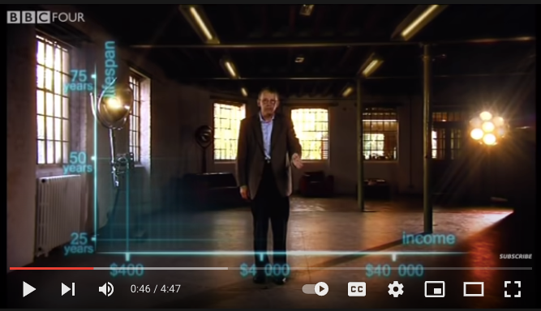

class: inverse, bottom
background-image: url(https://images.unsplash.com/photo-1532012197267-da84d127e765?q=80&w=1587&auto=format&fit=crop&ixlib=rb-4.0.3&ixid=M3wxMjA3fDB8MHxwaG90by1wYWdlfHx8fGVufDB8fHx8fA%3D%3D)
background-size: cover

# .Large[flipbooks]
## .small[past, present, future]
## .small[bit.ly/flipbooks-llnl]
#### .tiny[Dr. Evangeline Reynolds | 2023-11-16 | Lawrence Livermore National Lab R Users Meetup , Image credit: Jaredd Craig, Upsplash]


???


```{r setup, include=FALSE}
knitr::opts_chunk$set(echo = TRUE, message = F)
options(tidyverse.quiet = TRUE)
library(flipbookr)
```

---
class: center, middle, inverse

# flipbooks: An unfolding tale about empathy...


--

draft manuscript:  https://github.com/EvaMaeRey/flipbookr/blob/master/docs/draft_jasa_submission.pdf

---
class: inverse


# Abstract:  
--
Flipbooks reveal code pipe-lines 
--
line-by-line 
--
and side-by-side with output, 
--
which yields an animated experience.


---

`r chunk_reveal("scatter", title = "## A code 'flipbook'")`

```{r scatter, include = F}
library(ggplot2)
gapminder::gapminder %>% 
  dplyr::filter(year == 2002) %>% 
  ggplot() + 
  aes(y = lifeExp) + 
  aes(x = gdpPercap) + 
  geom_point() + 
  aes(size = pop/1000000000) + 
  aes(color = continent) 
```


<!-- --- -->

<!-- ### This movie magic arises, because code and output are revealed in a slide show, and content is aligned from one slide to another, which makes differencing (seeing what's new) a effortless physiological process rather than a cognitive one (the case of visual search), availing more cognitive resources to task of interpretation of how code and output pair. -->

<!-- --- -->

<!-- ### Flipbooks are additionally powerful, because users can move at their own pace, and back and forth to help address their own specific doubts. The implementation allows users to copy and paste code, full pipelines or bits relevant to their problems. Highlighting newest code in a pipeline allows the consumer to focus on what's changing in the output space, rather than th -->

<!-- --- -->

<!-- ### Yet, flipbook *making* has been somewhat cumbersome (does not feel magical), requiring *detailed* know-how about tools like the knitr dynamic document system, YAMLs, and Xaringan. And their use has primarily been by educators creating material for students, in workshops, and presentations. -->

<!-- --- -->

<!-- ### New efforts to create `chunk_reveal_live` might put this tech in the hands of more coding newcomers; including on-the-fly classroom use.  Arguably the people that might find flipbooks the most useful (people who aren't going to be able to 'just-read' a pipeline of code), might find them even more engaging when they are used to review and present on the most interesting pipelines: their own explorations of their own data.  -->

---

# Talk outline

## Chapter 1: Pairing code and independent plot elements is elegant, and *empathetic* (Lelend Wilkinson, Hadley Wickham)

--
## Chapter 2: step-by-step code-output reveal is gentle and *empathetic* (Garrick Aden-Bui, others)

--
## Backstory Chapter 3.0: Explaining your plot bit by bit makes your presentation stronger, because it is *empathetic* (Matt Blackwell; Hans Rosling)

---

## Chapter 3: Sequential reveal allows for automating paired reveal, which is *self-empathetic* (Me; Emi Tanaka; Garrick Aden-Bui)

---

## Chapter 4: {flipbookr} package is born.

---

## Next Chapter: chunk_reveal_live()... Making flipbook making more accessible is *empathetic.*   (via Kelly Bodwin; rstudioapi; Me)

<!-- ### also faster feedback for iterative design process. -->

---

## Yet another Chapter:  Flipbookr for quarto: Keeping it up-to-date is empathetic (Kieran Healey; Kelly Bodwin; me?)


---

# Chapter 1: pairing code with plot element is elegant and empathetic...


---


## Leland Wilkinson's Grammar of Graphics work kind of discover the 'natural language' of chart definition.

--

## different gg implementations (Tableau, spss' etc) allow us great ability to express ourselves!  


---

## Leland Wilkinson identified orthogonal elements in 'The Grammar of Graphics'. Wilkinson on the Policy Viz Podcast [here](https://policyviz.com/podcast/episode-201-leland-wilkinson/).

```{r, echo = F, eval = T, out.width="75%"}
knitr::include_graphics("https://miro.medium.com/max/1400/1*MMZuYgeC_YjXNC1r4D4sog.png")
```


---

## But unlike natural languages, Japanese, English, Dutch... there wasn't anything freely available! 

--

## Hadley Wickam reading the grammar of graphics: 'This is so beautiful, but there's no software."

---

### Hadley Wickham, ggplot2 author on it's motivation:

> ### And, you know, I'd get a dataset. And, *in my head I could very clearly kind of picture*, I want to put this on the x-axis. Let's put this on the y-axis, draw a line, put some points here, break it up by this variable.

--
> ### And then, like, getting that vision out of my head, and into reality, it's just really, really hard. Just, like, felt harder than it should be. Like, there's a lot of custom programming involved,

---

> ### where I just felt, like, to me, I just wanted to say, like, you know, *this is what I'm thinking, this is how I'm picturing this plot. Like you're the computer 'Go and do it'.*

--
> ### ... and I'd also been reading about the Grammar of Graphics by Leland Wilkinson, I got to meet him a couple of times and ... I was, like, this book has been, like, written for me.
https://www.trifacta.com/podcast/tidy-data-with-hadley-wickham/


---

# ggplot2 let us "... create graphical 'poems'." - Hadley Wickham (2010) in 'A Layered Grammar of Graphics', *Journal of Computational and Graphical Statistics*


---

`r chunk_reveal("scatter2", title = "## ggplot2 code is a sussinct graphical narrative, where the orthogonal components may independently declared", display_type = "code")`

```{r, echo = F}
library(tidyverse)
gapminder_2002 <- gapminder::gapminder %>% filter(year == 2002)
```

```{r scatter2, include = F}
library(ggplot2)
ggplot(data = gapminder_2002) + 
  aes(y = lifeExp) + 
  aes(x = gdpPercap) + 
  geom_point() + 
  aes(size = pop/1000000000) + 
  aes(color = continent) 
```

---

# 'Here's what I have in my head, I'm going to translate that to a grammatical representation.'


---
class: inverse, center, middle

> # "the Grammar of Graphics makes [building plots] easy because you've just got all these, like, little nice *decomposible components*" -- Hadley Wickham

### They actually map pretty well to how you might go about describing the sketch of the data visualization as you sketch it out. 

---

# Chapter 2: *showing* pairing by coodinated reveal is gentle and empathetic (Garrick Aden-Bui, others)


---


<blockquote class="twitter-tweet"><p lang="en" dir="ltr">Really dig how <a href="https://twitter.com/grrrck?ref_src=twsrc%5Etfw">@grrrck</a> builds up <a href="https://twitter.com/hashtag/ggplot2?src=hash&amp;ref_src=twsrc%5Etfw">#ggplot2</a> syntax w/ 📊:<br>📽 &quot;A Gentle Guide to the Grammar of Graphics with ggplot2&quot; <a href="https://t.co/2Okhri7Hox">https://t.co/2Okhri7Hox</a> <a href="https://twitter.com/hashtag/rstats?src=hash&amp;ref_src=twsrc%5Etfw">#rstats</a> <a href="https://twitter.com/hashtag/dataviz?src=hash&amp;ref_src=twsrc%5Etfw">#dataviz</a> <a href="https://t.co/qO43IeTtHG">pic.twitter.com/qO43IeTtHG</a></p>&mdash; Mara Averick (@dataandme) <a href="https://twitter.com/dataandme/status/995650384155693061?ref_src=twsrc%5Etfw">May 13, 2018</a></blockquote> <script async src="https://platform.twitter.com/widgets.js" charset="utf-8"></script>


---

# True to natural language aquisition... Point to each thing and name it... (like pair programming too.)


https://pkg.garrickadenbuie.com/gentle-ggplot2/#1

## ggplot2 lets you 'speaking your plot into existence'; write 'graphical poems'

--

## Garrick read the poem out loud (poetry slam!): Bedtime, picture book, where parent is pointing out new vocabulary in the pictures.  


---

# Back Story for Chapter 3.  

### Origins in presentation and *empathy* for your audience in presentation...


<blockquote class="twitter-tweet"><p lang="en" dir="ltr">My best tip on how to give better quantitative presentations is to (a) use more plots and (b) build up your plots on multiple overlays, as in:<br><br>- Just x-axis (explain it)<br>- Add y-axis (explain it)<br>- Add 1 data point (explain it)<br>- Plot the rest of the data (explain it)</p>&mdash; Matt Blackwell (@matt_blackwell) <a href="https://twitter.com/matt_blackwell/status/991004129198854145?ref_src=twsrc%5Etfw">April 30, 2018</a></blockquote> <script async src="https://platform.twitter.com/widgets.js" charset="utf-8"></script>


---

## you are practicing empathy by using data visualization (it's fast); gonna make seeing patterns in your data feel effortless

--

## Visual information channels are "preattentively processed" -- Cleveland and McGill 1984

## "preattentively processed" == effortlessness


---

### but you can encode so much in a data viz...

```{r, echo = F, out.width="80%"}
knitr::include_graphics("https://clauswilke.com/dataviz/aesthetic_mapping_files/figure-html/common-aesthetics-1.png")
```

Wilke's Fundamentals of data visualization


--
### ...So you really need to talk about *each* encoding (one by one) or the interpretation is lost.


---

# And when people do, this it is really appreciated... Hans Rosling & BBC in 2010  


<iframe width="767" height="431" src="https://www.youtube.com/embed/jbkSRLYSojo?list=PL6F8D7054D12E7C5A" frameborder="0" allow="accelerometer; autoplay; encrypted-media; gyroscope; picture-in-picture" allowfullscreen></iframe>
https://www.youtube.com/embed/jbkSRLYSojo?list=PL6F8D7054D12E7C5A


---

# 'Here we go. Life expectancy on the y-axis'


```{r, out.width="80%", echo =FALSE}
knitr::include_graphics("images/hans_y_axis.png")

```

---

# 'On the x-axis, wealth'


```{r, out.width="80%", echo =FALSE}


```

---

# 'Colors represent the different continents'

```{r, out.width="80%", echo =FALSE}
knitr::include_graphics("images/hans_colors.png")

```


---

# 'Size represents population'

```{r, out.width="80%", echo =FALSE}
knitr::include_graphics("images/hans_size.png")
```

---
class: inverse, center, middle

#  Response to empathic presentation?

--

# 10 million views...

--

(also does animation at the end... which I don't show)


---

# Chapter 3. Sequential reveal and automation

## Not me: 'Wow, that is profoundly empathetic'. 🦉🦉🦉

--

## Me: 'Neat-o! That sounds a lot like the *layered* presentation of graphics.'  🤓🤓🤓

---

<blockquote class="twitter-tweet"><p lang="en" dir="ltr">Good ideas! Very <a href="https://twitter.com/hashtag/ggplot?src=hash&amp;ref_src=twsrc%5Etfw">#ggplot</a>. A layered presentation of graphics. <a href="https://t.co/M4tRB9bGS5">https://t.co/M4tRB9bGS5</a></p>&mdash; Gina Reynolds (@EvaMaeRey) <a href="https://twitter.com/EvaMaeRey/status/991269331257487366?ref_src=twsrc%5Etfw">May 1, 2018</a></blockquote> <script async src="https://platform.twitter.com/widgets.js" charset="utf-8"></script>

---


<blockquote class="twitter-tweet"><p lang="en" dir="ltr">Here, building up a <a href="https://twitter.com/hashtag/ggplot2?src=hash&amp;ref_src=twsrc%5Etfw">#ggplot2</a> as slowly as possible, <a href="https://twitter.com/hashtag/rstats?src=hash&amp;ref_src=twsrc%5Etfw">#rstats</a>. Incremental adjustments. <a href="https://twitter.com/hashtag/rstatsteachingideas?src=hash&amp;ref_src=twsrc%5Etfw">#rstatsteachingideas</a> <a href="https://t.co/nUulQl8bPh">pic.twitter.com/nUulQl8bPh</a></p>&mdash; Gina Reynolds (@EvaMaeRey) <a href="https://twitter.com/EvaMaeRey/status/1029104656763572226?ref_src=twsrc%5Etfw">August 13, 2018</a></blockquote> <script async src="https://platform.twitter.com/widgets.js" charset="utf-8"></script>


---

## Emi Tanaka; Semi-automation...

<blockquote class="twitter-tweet"><p lang="en" dir="ltr">Inspired by <a href="https://twitter.com/grrrck?ref_src=twsrc%5Etfw">@grrrck</a> and <a href="https://twitter.com/EvaMaeRey?ref_src=twsrc%5Etfw">@EvaMaeRey</a>, made the kunoichi + ninjutsu (ninja-theme) version of <a href="https://twitter.com/hashtag/ggplot?src=hash&amp;ref_src=twsrc%5Etfw">#ggplot</a> tutorial although Garrick already does explaining this in his excellent blog <a href="https://t.co/msXfg14Ztn">https://t.co/msXfg14Ztn</a>. Gist for ninja-theme here: <a href="https://t.co/soHH4Qvz4F">https://t.co/soHH4Qvz4F</a> <a href="https://twitter.com/hashtag/rstats?src=hash&amp;ref_src=twsrc%5Etfw">#rstats</a> <a href="https://t.co/YlRHAGnaUm">pic.twitter.com/YlRHAGnaUm</a></p>&mdash; Emi Tanaka @emitanaka@fosstodon.org (@statsgen) <a href="https://twitter.com/statsgen/status/1041279648452108289?ref_src=twsrc%5Etfw">September 16, 2018</a></blockquote> <script async src="https://platform.twitter.com/widgets.js" charset="utf-8"></script>


---


`r chunk_reveal("pairing", break_type = "replace", replace = '20', replacements = 1:9, display_type = "output", title = "### Unpaired pipeline_steps & graphical_elements")`

```{r pairing, include = F}
tibble(function_name = paste0("ggplot2 func '", LETTERS[1:9],"'"),
  gg_element = paste("grammar move #", 1:9))[1:20,]
```

---

### Usual pairing? (pairing at all is empathetic! output helps communicat intent of code. Afforeded by dynamic document systems: knitr, quarto, jupytr notebooks.)

--

#### Complete code pipeline

```{r, code = knitr::knit_code$get("scatter"), eval = F}

```


--

#### Complete plot


```{r, code = knitr::knit_code$get("scatter"), eval = T, echo = F, out.height="30%"}

```

---

### Possible pairings of functions and gg graphical moves.

```{r, echo = F}
tibble(function_name = paste0("ggplot2 func '", LETTERS[1:9],"'")) %>% 
         crossing(gg_element = paste("gg manipulation", 1:9)) %>% 
  mutate(combo = function_name %>%  paste(gg_element, sep = "->\n")) %>% 
  ggplot() + 
  aes(x = runif(81), y = runif(81)) + 
  geom_label(aes(label = combo)) 
```

# flipbook pairing is 'tidy', like vectors organized in a data frame...


---

`r chunk_reveal("babynamesvectors", title = "## Pairing is powerful, 'tidy'; e.g. data frames\n### How many Minnies in 1880?")`

```{r babynamesvectors, include = F}
babynames::babynames$name[1:10]

babynames::babynames$n[1:10]

babynames::babynames$year[1:10]

# better when paired...
babynames::babynames %>% select(name, year, n) %>% .[1:10,]

```


---

### {flipbookr} was born


```{r, eval = F}
remotes::install.github("EvaMaeRey/flipbookr")
install.packages("xaringan")
```

RConsortium Grant. Thanks!

---

# Live demo - with flipbookr

```{r, eval = F}
install.packages("xaringan")
remotes::install_github("EvaMaeRey/flipbookr")
```

## RStudio -> File -> New File -> R Markdown -> From Template -> Template: A Minimal Flipbook

---

# In the backgroud flipbookr::chunk_reveal():

--

## grabs code from chunk, 
--
parses it, 
--
explodes it into partial builds, 
--
inserts each partial build into individual slides for presentation in Xaringan


---

# Flipbooks feel magical...

--

# Flipbookr makes, creating a flipbook is manigeable, but not quite magical ...

---

### But it could magical w/ a chunk_reveal() modified behaivior for on-demand mini flipbooks from within live session (rmd/qmd). 

--
### Using Bodwin's live chunk getting strategy as used in {flair}.  https://github.com/EvaMaeRey/knitcodegetlive,  (working) 

--
### and rstudioapi::viewer... (not working) 
--
### and maybe addin... (to be added). 
--
### only getting started with .qmd (He)


---


# Stats 101 classroom goal...

### New efforts to create `chunk_reveal_live` might put this tech in the hands of more coding newcomers; including on-the-fly classroom use.  Arguably the people that might find flipbooks the most useful --- people who aren't going to be able to 'just-read' a pipeline of code --- might find them even more engaging when they are used to review and present on the most interesting pipelines: their own explorations of their own data. 

---

`r chunk_reveal("stats_101")`

```{r stats_101, include = F}
library(ggplot2)
library(ggsmoothfit) # stat fit below

mtcars %>% 
  ggplot() + 
  aes(x = wt) + 
  aes(y = mpg) + 
  geom_point() + 
  geom_smooth(method = lm, se = F) + 
  stat_fit(method = lm, 
           geom = "point",
           color = "blue") + 
  stat_fit(method = lm, 
           geom = "segment",
           color = "red") + 
  geom_smooth(method = lm)
```


---

## Flipbooks and proverb about learning

### Tell me and I forget. 

--

### Show me, I remember. (creating flipbooks for others) 

--

### Let me do and, I understand. (making flipbooks more accessible)

---

### Extending the proverb...

### Let me tell you about what I've done, I expose what I might not fully understand... 

--

(and then ask newcomers to talk you though *their* pipeline)

### Flipbooks I make myself, let me reflect on what I've done, 
--
in a step by step way. 
--
In a workshop or classroom setting, too, I can go through verbalizing with my peers & instructor about what I've done 
--
I understand more profoundly  
--
and my peers & instructor can help straighten out any misunderstandings.

---

## What'd be needed for the paper I want to publish.  

## Data.  
--
Eyetracking data probably about how people are actually use and interact with flipbooks. 


---
