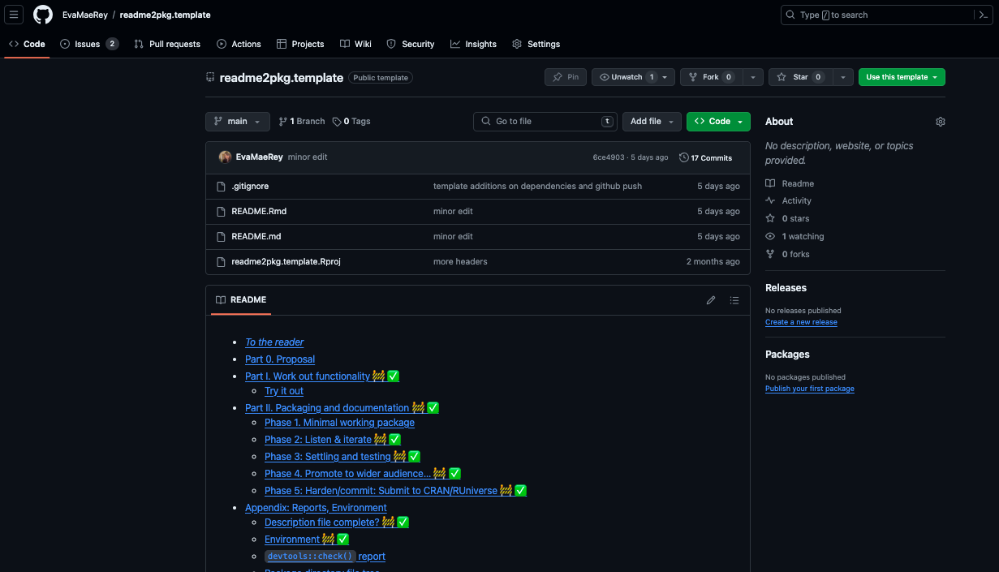

```{r setup, include=FALSE}
knitr::opts_chunk$set(echo = TRUE)
options(tidyverse.quiet = TRUE)
```


class: inverse
background-image: url(https://images.unsplash.com/photo-1509239129736-8c395375220d?q=80&w=1470&auto=format&fit=crop&ixlib=rb-4.0.3&ixid=M3wxMjA3fDB8MHxwaG90by1wYWdlfHx8fGVufDB8fHx8fA%3D%3D)
background-size: cover

# .Large[[{readme2pkg}](https://github.com/EvaMaeRey/readme2pkg): overview and motivations]
<!-- ## .small[Readme as a point of entry for new developers, as a package story board, and centralized contributor meeting place.] -->
#### .small[Dr. Evangeline Reynolds | 2024-03-27 | ASA, COWY, Image credit: Jamie Templeton, Upsplash]


???

Title slide
```{r, include = F}
# This is the recommended set up for flipbooks
# you might think about setting cache to TRUE as you gain practice --- building flipbooks from scratch can be time consuming
knitr::opts_chunk$set(fig.width = 6, fig.height = 4.5, message = FALSE, warning = FALSE, comment = "", cache = F)
library(flipbookr)
```

---


R packages are composed of many files. 

These multiple, un-ordered constituents may yield an unclear big-picture package narrative.

--

Some folks hope to try to provide the possibility of creating 'narrative arc' to packages using a single higher level document to manage constituent files and speak to how all the components relate. (litr; fusen; readme2pkg)

--

readme2pkg proposes the *README.Rmd* to be used as this control file.  

---

Supporting functionality includes:

- `readme2pkg::chunk_to_dir()`

--

```{r, eval = FALSE}
readme2pkg::chunk_to_dir(chunk_name = "my_awesome_function",
                         dir = "./R")
```

--

- readme2pkg::chunk_to_r()
- readme2pkg::chunk_to_tests_testthat()

---

Dependencies:

- knitr (knit)
- rstudioapi (for interactively sending code chunk to directory)
- stringr


---

And template; https://github.com/EvaMaeRey/readme2pkg.template

```{r}
knitr::include_url("https://github.com/EvaMaeRey/readme2pkg.template")
```

---

Readme as:

1. a point of entry for new comers to development (readme template can be used as a getting started template)
2. checklist for more seasoned developers
3. As a package story board, 
4. Centralized contributor meeting place (facilitates pointing potential contributors...)


---


The template breaks down package building into phases:

- Part 1. Goals definition; what package functionality should deliver

- Part 2. Construct functions and a minimal viable package

- Part 3. Listen and iterate; (soliciting feedback)

- Part 4. Refine and make robust

- Part 5. Spread the good news; seek a wider audience

- Part 6. Commit.  Share on CRAN or R-Universe


---

Part of the readme2pkg philosophy is that there are many reasonable pausing, stopping, and even ditch-the-project points along this progression, and the workshop will try to highlight those.  


---


```{r}


```


This is a reference sheet for the readme2pkg part of the RLadies ['Literate packaging' March 2024 meetup](
https://www.meetup.com/rladies-denver/events/299879858/) which will allow for a comparative look at litr, fusen, and readme2pkg.

The packaging journey often goes something like this:

- Step 000.  Do a thing happily with some existing tools 1-20x
- Step 00. Do a thing again 21-1000+x with some existing tools
- Step 0. Decide you've had enough/flash of 'what-if there's another way' insight
- Step 1. Write functionality
- Step 2. Prepare a package to *deliver* functionality

  - Step 2a
  - Step 2b
  - Step 2c...
  - Step 2y
  - Step 2z

- Step 3. Maintain package


The intent of [{readme2pkg}](https://github.com/EvaMaeRey/readme2pkg) is to let you build quick packages right from a README.Rmd. The function readme2pkg::chunk_to_dir (and friends) lets you send code chunk contents to a new file in a subdirectory. This means you don’t have to manage a bunch of function files that constitute a package - at least in the early stages.  Instead you can work with them in your README.Rmd.

Also, the [EvaMaeRey/readme2pkg.template](https://github.com/EvaMaeRey/readme2pkg.template) repo on github is a template repository meant to complement the readme2pkg workflow. Using the README.Rmd in the template, you can populate the sections with your material (introduction and functions, etc). And this README template contains a ‘living’ checklist that will help you get through the steps of creating a package, including building the file architecture, licensing, documentation, and builds. The checklist items are run through {devtools} and {usethis} packages. Code is included that lets you ‘check-off’ the items as you run the code.


Part of the readme2pkg philosophy is that there are many reasonable pausing, stopping, and even scratch-the-project points along this progression, and the workshop will try to highlight those.  

In the Denver R-Ladies meeting, I hope to get through function documentation (adding a roxygen skeleton) in Part 3 of the readme2pkg.template.

# Mini workshop requirements

A. Installed Packages: 

  - on CRAN: `usethis`; `devtools`; `ggplot2` or `stringr` (depending on worked example below)
  - on Github: `remotes::install_github("EvaMaeRey/readme2pkg")`
  
B. Template repo: [EvaMaeRey/readme2pkg.template](https://github.com/EvaMaeRey/readme2pkg.template) 

C. Github account linked to RStudio


### Option 1:  {redhistogram} package

The goal of {redhistogram} is to make ... easier.


Without the package, we live in the effort-ful world that follows 🏋:

```{r}
library(ggplot2)

ggplot(data = cars, aes(x = dist)) + 
  geom_histogram(fill = "red")
```

  
With the {redhistogram} package, we'll live in a different world (🦄 🦄 🦄) where the task is a snap 🫰: 

Proposed API:

```

library(redhistogram)
library(ggplot2)

ggplot(data = cars, aes(x = dist)) + 
  geom_histogram_red()

```


# Part I. Work out functionality  ✅ 

Here is a function that will do some work...


```{r geom_histogram_red}
library(ggplot2)
geom_histogram_red <- function(...){
  
  geom_histogram(fill = "red", ...)
  
}
```


## Try it out

```{r}
ggplot(data = cars, aes(x = dist)) + 
  geom_histogram_red()
```


### Option 2:  {ind.recode} package (based on real-life [{ind2cat}]()). 

The goal of {ind.recode} is to make ... easier.


Without the package, we live in the effort-ful world that follows 🏋:

```{r}
december_grad <- c(1,1,1,0)

cat_december_grad <- ifelse(december_grad, 
                            "december grad",
                            "not december grad")
```

  
With the {ind.recode} package, we'll live in a different world (🦄 🦄 🦄) where the task is a snap 🫰: 

Proposed API:

```

library(ind.recode)

december_grad <- c(1,1,1,0)

cat_december_grad <- ind.recode::ind_recode(x = december_grad)

```


# Part I. Work out functionality  ✅ 

Here is a function that will do some work...


```{r ind_recode}
library(stringr)
ind_recode <- function(x){
  
  cat_true <- deparse(substitute(x)) |> 
      str_replace_all("_", " ")
  
  cat_false <- paste("not", cat_true)
  
  factor(x, labels = c(cat_false, cat_true))
  
}
```


## Try it out

```{r}
december_grad <- c(1,1,1,0)
ind_recode(december_grad)
```

