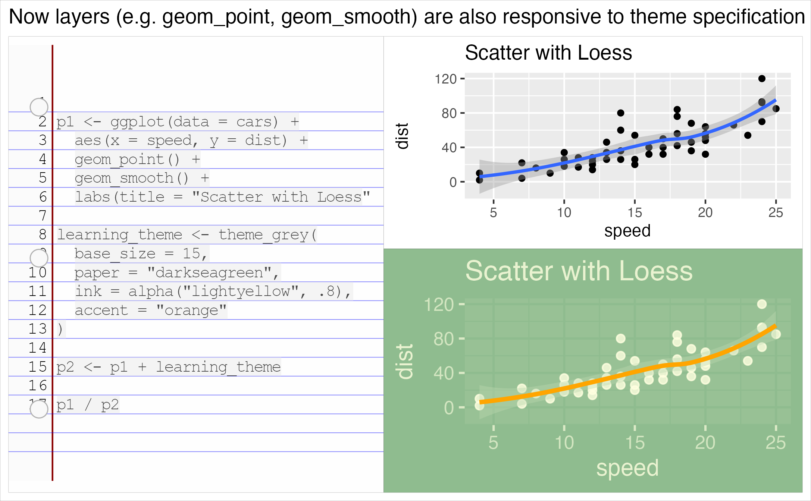

TLDR:  The next release of ggplot2 theming is something to be excited for!

```{r setup, include=FALSE}
knitr::opts_chunk$set(echo = TRUE, message = F, warning = F)
options(tidyverse.quiet = TRUE)
```

A ton of value is delivered to analysts in the form of not needed to worry about fiddly details when it comes to adhering to brand theme -- enabling more focus on analysis and interpretation. 

To that end two major inovations are coming to ggplot2 theming!

1. new arguments to convenience themes...

and 

2. 


, having layers (geom_ and stat_) that are responsive to theme has long been on the agenda of ggplot2 authors and maintainers.

With the creative vision of PR # and release ggplot2_3.5.2.9000 it's nearly here!  

Now, geom_ and stat_ layers should automatically take on the look and feel of your theme! 

And ggplot2 theme convenience functions expose new arguments `paper`, `ink`, and even `accent` (geom_smooth's color) so changing the look and feel of your plot has never been easier. 


```{r, eval = F, echo = F}
library(ggplot2)
library(patchwork)

library(ggram)
ggram:::clearhistory()
#
p1 <- ggplot(data = cars) + 
  aes(x = speed, y = dist) + 
  geom_point() + 
  geom_smooth() + 
  labs(title = "Scatter with Loess")
#
brand_theme1 <- theme_grey(base_size = 15,
         paper = "darkseagreen",
         ink = alpha("lightyellow", .8),
         accent = "orange")

brand_theme2 <- theme_grey(base_size = 10,
         paper = "grey20",
         ink = alpha("whitesmoke", .8),
         accent = "magenta3")
#
p2 <- p1 + learning_theme
#
p1 / p2

ggram("Now layers (e.g. geom_point, geom_smooth) are also responsive to theme specification", widths = c(2.3, 2))

ggsave("new-theme.png")

```

```{r, eval = F, echo = T}

```


```{r}
library(tidyverse)


brand_theme1 <- theme_classic(base_size = 20,
         paper = "darkseagreen",
         ink = alpha("lightyellow", .8),
         accent = "orange")

brand_theme2 <- theme_grey(base_size = 10,
         paper = "grey20",
         ink = alpha("whitesmoke", .8),
         accent = "magenta3")


# setting a theme, and plotting
theme_set(brand_theme1)

ggplot(data = cars) + 
  aes(x = speed, y = dist) + 
  geom_point() + 
  geom_smooth() + 
  labs(title = "Scatter with loess smoothing")

# setting a new theme, and plotting
theme_set(brand_theme2)

ggplot(data = cars) + 
  aes(x = speed, y = dist) + 
  geom_point() + 
  geom_smooth() + 
  labs(title = "Scatter with loess smoothing")
```


# Uh-oh, what if my favorite geom_*() extension isn't up-to-date with geom theming?

One unfortunate downside is that layer extensions that involve the creation of new Geom ggproto objects, with new default_aes defined are likely to fail to shine as brightly amid the glamour that the new changes bring.

```{r}

library(tidyverse)
theme_grey(base_size = 15,
         paper = "darkseagreen",
         ink = alpha("lightyellow", .8),
         accent = "orange") |> 
  theme_set()

gapminder::gapminder |> 
  filter(country %in% c("Netherlands",
                        "Belgium",
                        "Denmark")) |> 
  ggplot() + 
  aes(x = year, 
      y = lifeExp,
      label = country) + 
  geomtextpath::geom_textpath()
```


```{r}
library(tidyverse)

theme_bw(ink = "plum4", 
         paper = "cornsilk") |> 
  theme_set() 

gapminder::gapminder |> 
  filter(country %in% c("Netherlands",
                        "Belgium",
                        "Denmark")) |> 
  ggplot() + 
  aes(x = year, 
      y = lifeExp,
      label = country) + 
  geomtextpath::geom_textpath(
    color = get_theme()$geom$ink, #<< work around
    )
```


```{r}
theme_tiny <- theme_classic(base_size = 7)


gapminder::gapminder |> 
  filter(country %in% c("Netherlands",
                        "Belgium",
                        "Denmark")) |> 
  ggplot() + 
  aes(x = year, 
      y = lifeExp,
      label = country) + 
  geomtextpath::geom_textpath(
    size = theme_tiny$geom$fontsize, #<< work around
    linewidth = theme_tiny$geom$linewidth
    ) +
  theme_tiny

```


Suppose you have created StatChull from the ggplot2 extension vignette, and have also created the modified GeomPolygon

```{r}
library(dplyr)
compute_group_chull <- function(data, scales){
  
  chull_indices <- chull(x = data$x, y = data$y)
  
  data |> 
    slice(chull_indices)
  
}

StatChull <- ggproto(`_class` = "StatChull",
                     `_inherit` = Stat,
                     required_aes = c("x", "y"),
                     compute_group = compute_group_chull)

ggplot(mtcars) +
  aes(x = drat, y = wt) + 
  geom_point() +
  geom_polygon(stat = StatChull)
```


# Inherit default aes for Geoms from base ggplot2 Geoms


```{}


```


# Modified 


