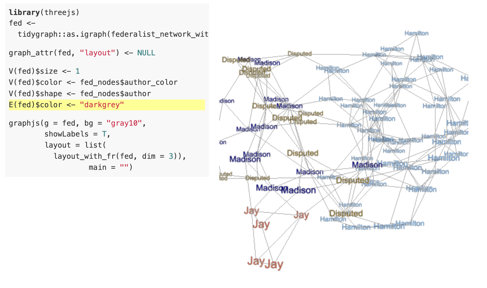

```{r setup, include=FALSE}
knitr::opts_chunk$set(echo = TRUE)
options(tidyverse.quiet = TRUE)
```

## Intro Thoughts

Gonna use this old project, <https://evamaerey.github.io/flipbooks/federalist/federalist#1>, and hope to look at mall llm clasification and pca/tsne/umap!

Connects the documents that are most correlated baseed on 'stop word' usage, and labels them by author...

On slide 44:



## Status Quo

```{r, eval = F}
download.file("https://github.com/patperry/r-corpus/raw/refs/heads/master/data/federalist.rda", destfile = "federalist.rda")
```

```{r}
library(tidyverse)

load("federalist.rda")

federalist |> tibble()
```

## Mall categorization...

```{r, eval = F}
library(mall)
options(.mall_chat = ellmer::chat_google_gemini())

federalist |> 
  # just a demo - let's use fewer tokents
  sample_n(5) |> 
  mutate(text = str_extract(text, ".{50}")) |>
  # and focus on a few 
  select(name, text, author) |>
  llm_classify(col = name, 
               labels = c("Madison", "Hamilton", "Jay", "Publius"), 
               pred_name = "pred_author")

colors() %in% "transparent" |> sum()
```

```{r}
federalist %>%
  mutate(author = replace_na(author, 
                             "Disputed")) %>% 
  mutate(name = paste(author, 
                      str_remove(name, "eralist"), 
                      sep = "-")) %>% 
  -> 
federalist


federalist %>%
  mutate(author = replace_na(author, "disputed")) |>
  select(doc_name = name, author, text, title) %>% 
  tidytext::unnest_tokens(output = word, input = text) %>% 
  # stop word are good for stylometry - keep them only
  inner_join(tidytext::stop_words) %>%
  group_by(doc_name, word, author) %>% 
  count() %>% 
  ungroup() %>% 
  arrange(-n) %>% 
  pivot_wider(values_from = n, names_from = word, values_fill = 0) |> 
  select(-"in", -"as", - "for", - "any", - "with", -"all", -"if", 
         - "while", - "which", -"else", - "each", -"let", -"get") ->
fed

which(names(fed) %in% "whom")

names(fed) 


names(fed)


library(ggdims)
fed |> 
  ggplot() + 
  aes(dims = dims(the:their)) + 
  geom_pca() + 
  aes(fill = author)

fed |> 
  ggplot() + 
  aes(dims = dims(the:their)) + 
  geom_tsne(perplexity = 20) + 
  aes(fill = author)

fed |> 
  ggplot() + 
  aes(dims = dims(the:their)) + 
  geom_umap() + 
  aes(fill = author)

```


```{r}
# federalist %>% 
#   quanteda::corpus(text_field = "text", docid_field = "name") |>
#   quanteda::tokens(remove_numbers = TRUE, remove_punct = TRUE) |>
#   quanteda::dfm() |>
#   quanteda::convert(to = "data.frame") |>
#   select(-"in", -"for", -"or") ->
# federalist_word_count

names(federalist_word_count) |> tail()

library(ggdims)
federalist_word_count |> 
  ggplot() + 
  aes(dims = dims(the:an)) + 
  geom_pca() 

last_plot() + 
  aes(fill = str_extract(doc_id, ".+-"))


library(ggdims)
federalist_word_count |> 
  ggplot() + 
  aes(dims = dims(the:an)) + 
  geom_tsne(perplexity = 25) 

last_plot() + 
  aes(fill = str_extract(doc_id, ".+-"))


library(ggdims)
federalist_word_count |> 
  ggplot() + 
  aes(dims = dims(the:an)) + 
  geom_umap()

last_plot() + 
  aes(fill = str_extract(doc_id, ".+-"))

```

<sup>Created on 2026-01-27 with [reprex v2.1.1](https://reprex.tidyverse.org)</sup> \`\`\`

## Closing remarks, Other Relevant Work, Caveats
