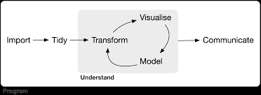

```{r setup, include=FALSE}
knitr::opts_chunk$set(echo = TRUE)
options(tidyverse.quiet = TRUE)
```


I woke up this morning with a vulnerability hangover.  I'd submitted a pitch for Posit Conf 2026 with a talk title 'Epic graphical poems and conversations', in which I'd talk about ggplot2 extensions with bigness as a dimension of them, but I felt concern.  Why hadn't I used the word 'super-size' or at least put 'epic' in quotations. Because 'epic' might sound a little too serious and even self important. I wondered if my word choice would work against me.  

The thing is, I *do* think there is a bigness (epic-ness) to work on ggplot2 and plotnine extension.  and that is why I'm applying for a position to be.  The magnitude of ggplot2's popularity points to the seismic 


"Epic graphical poems and conversations"

When it was formally introduced, ggplot2 was described as a system for composing 'graphical poems' (Wickham 2010). And the system has had a seismic impact on data viz.  This talk will discuss new developments in the extension ecosystem that are making ggplot2-based graphical poems even more epic.  First, we'll look at transcription of *longer* form 'poems'. That is, how ggplot2 extension can been used to write down full statistical, visually explained trains-of-thought.  Second, we'll look at 'poems' for big data --- how new syntax accommodates referencing many features (columns) for dimension reduction visualization.  And finally, we'll talk about how ggplot2 and plotnine extension might allow us to concisely record *entire conversations* with data.


Hi I'm Gina Reynolds.  I organize the ggplot2 extenders meetup and I'm proposing a talk titled "Epic graphical poems and conversations".

So, when ggplot was introduced, it was described as a system for composing 'graphical poems' (Wickham 2010). 

I love that, and am of course playing with the analogy with the talk title.  

Keeping with the 'epic poems' title, I'd talk about projects that have 'bigness' as a component.

So I'd talk about the ggprop.test project.  This is a package that translates a pretty standard, but involved train-of thought to something we can write down in code.  The prop test, is kind of long form, epic in length compared to many ggplots.

Then I'd also talk about the ggdims project, whose bigness comes from the fact that it tackles dimension reduction.

And then finally, I'd hope to impart the bigness of getting into extension in ggplot2 or plotnine.   Since extension often allows us to faithfully and concisely write down the conversations we have with data.


Hi I'm Gina Reynolds and I'm proposing a talk titled "Becoming a better Conversationalist in Data Science"

So, actually I like learning natural languages as much as learning data science.

I've been lucky enough in life, and have gotten to learn not only English, my native language, but also Spanish, Portuguese, and German.

And it is *so cool* when you go from learner to converser: Having words and phrases spill out of you mouth to dialogue with others! Producing 'spontaneous language for conversation'  the technical term via the grammar girl podcast.

In the data science world, I'm also excited about conversation.

And in the new AI era, we're of course doing a lot more 'chatting' to produce data products.

And I love tools that let you succinctly *record* these conversations with data - there are many great frameworks that let us do this. Like ggplot2 is named for being a 'grammar of graphics' and folks like Thomas Lin Pederson have described ggplot as 'speaking plots into existence'. (Hans Rosling)

With natural language, we can pretty faithfully record down conversations with written language. However, with these *much* newer frameworks, (maybe old in code years) - tools sometimes don't exist to let you concisely write down a dialogue. Sometimes the *words* don't exist that would allow greater fluidity (think new geoms), and sometimes the grammatical structures (think patchwork/ggiraph) don't exist or are underdeveloped. (cut to easy recipes recipe cards, ggplyr, ggcirclepack, ggregions).

A framework that dominates is:



Another part of the talk about being a part of the conversation. Knowing where the conversation is and being open to going there. ggprop.test (1900 😅, Karl Pearson), ggdims (2018, Leland McInnes),

'Easy geom recipes' for plotnine (python v. R).
