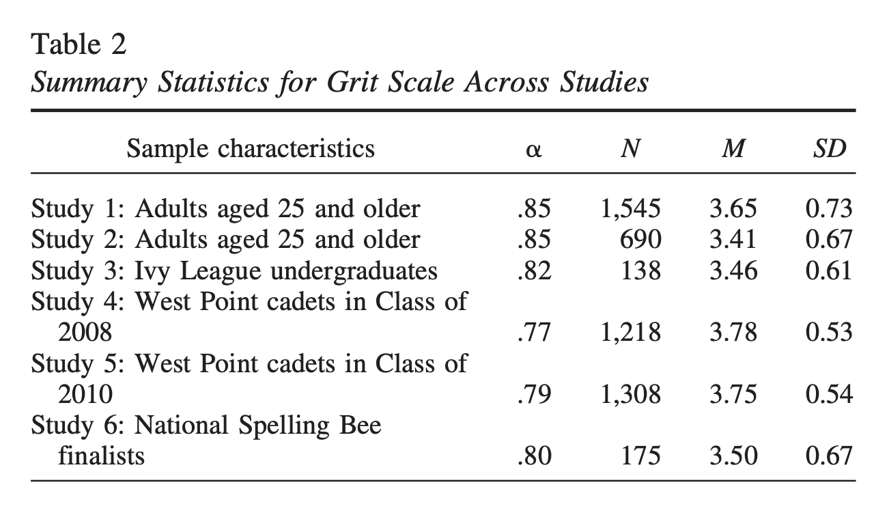

```{r setup, include=FALSE}
knitr::opts_chunk$set(echo = TRUE)
options(tidyverse.quiet = TRUE)
```

## Intro Thoughts

## Status Quo

```{r}
library(tidyverse)
library(distributional)
```

## Experiment

```{r}
distributional::dist_normal(c(1,2,3), sigma = 1:3) |>
  tibble(x = _) |>
  ggplot() + 
  aes(x = )

library(ggdist)
library(ggplot2)

df <- data.frame(
  name = c("Gamma(2,1)", "Normal(5,1)", "Mixture"),
  dist = c(dist_gamma(2,1), dist_normal(5,1),
           dist_mixture(dist_gamma(2,1), dist_normal(5, 1), weights = c(0.5, 0.5)))
)


df |>
  ggplot() +
  aes(dist = dist, 
      y = 0,
      fill = name) +
  # aes(y = factor(name, 
  #                levels = rev(name)),
  #     fill = "hotpink" |> I()) +
  stat_dist_halfeye() + 
  labs(title = "Density function for a mixture of distributions", 
       y = NULL, 
       x = NULL) +
  annotate("text", 
           label = "👶", 
           x = 2.5, y = .5,
           size = 5)
  

df |>
  ggplot() +
  aes(dist = dist,  
      y = 0,
      fill = name) +
  stat_dist_halfeye() + 
  labs(title = "Density function for a mixture of distributions", 
       y = NULL, 
       x = NULL) 
  
stamp_normal <- function(mean = 0, sd = 1){ 
  
  stat_slab(aes(dist = dist_normal(mu = 0, sigma = 1)), inherit.aes = T, ...)  
  
}
```


```{r}
  
df = expand.grid(
    mean = 1:3,
    input = seq(-2, 6, length.out = 100)
  ) %>%
  mutate(
    group = letters[4 - mean],
    density = dnorm(input, mean, 1)
  )

df

# orientation is detected automatically based on
# use of x or y
df %>%
  ggplot(aes(y = group, x = input, thickness = density)) +
  geom_slab()


library(ggt.test)

library(tidyverse)
library(ggdist)
library(distributional)

dist_binomial(prob = .5, size = 10) |>
  data.frame(dist = _) |>
  ggplot() + 
  aes(dist = dist, y = 1) +
  stat_dots()
```

## Closing remarks, Other Relevant Work, Caveats

```{r}
tribble(~n, ~mean, ~sd, ~who, ~who2, 
        1545, 3.65, .73, "Adults, Group 1", "Adults",
        690,  3.41, .67, "Adults, Group 2", "Adults",
        138,  3.46, .61, "Ivy League Undergraduates", "Ivy League",
        1218, 3.78, .53, "West Point Cadets '08", "Cadets",
        1308, 3.75, .54, "West Point Cadets '10", "Cadets",
        175,  3.5,  .67, "Spelling Bee Finalists", "Spelling Bee") |> 
  mutate(dist = dist_normal(mean, sd)) |> 
  ggplot() +
  aes(dist = dist) +
  stat_slab() +
  aes(y = who) +
  aes(fill = who) +
  aes(alpha = after_stat(x < 3.2)) +
  scale_alpha(range = c(.5,.9))


library(ggprop.test)
ggplot(donor_data) + 
  aes(x = decision) + 
  geom_stack()
  

library(tidyverse)
library(ggdist)
library(distributional)

dist_binomial(prob = .5, size = 10) |>
  data.frame(dist = _) |>
  ggplot() + 
  aes(dist = dist, y = 1) +
  stat_spike()

stat_spike
```




https://gwern.net/doc/psychology/personality/conscientiousness/2007-duckworth.pdf
