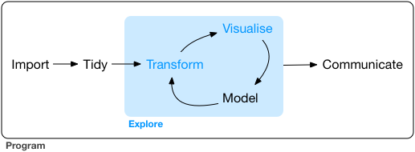

```{r setup, include=FALSE}
knitr::opts_chunk$set(echo = TRUE)
options(tidyverse.quiet = TRUE)
```

- convert papers into podcasts...

- failure as an academic...

- conversation/communication as motivation for language emerging?

- how powerful is conversation, how improbable is it. Encoding meaning into grunts, utterances, and phrases, prose...? Why does a large contingent of the world's population agree that 'balance' looks like ...

"1. horizontal bars 2. colored steel blue and 3. sorted from high to low, 4. with commas for numbers higher than 1,000 on the axis."

```{r}
diamonds |> 
  ggplot() + 
  aes(y = cut) + 
  geom_bar() +
  aes(fill = I("steelblue")) + 
  aes(y = cut |> fct_infreq() |> fct_rev()) + 
  scale_x_continuous(labels = scales::label_comma())
```

- ggplot2 2017.. This is it... last_plot()

- and then + aes()

- *record* convos verbatim. transcription...

-- The visualize, manipulate, model iterative formulation...

-- Do we even have the tools for recording data analysis? Trains-of-thought.



- aes Disputed goodness... In language, convention is very strong...

- ggplot2 already has this *really* conversational dimention (if we can stomach it)

- 'Epic' conversations

- Longform statistical narratives...

- ggplyr

- ggregions... Texas

- ggdims ... dimension reduction

- ggplot2 extenders, stamtisch, bate papo, Johnny's of Newton.

- data science for *everyone*... Pretty literal with this... what if we translate ggplot


- can we faithfully translate conversations to code?

- order matters


