> # 'Schreiben ist wichtig'... Writing is important - A german teacher

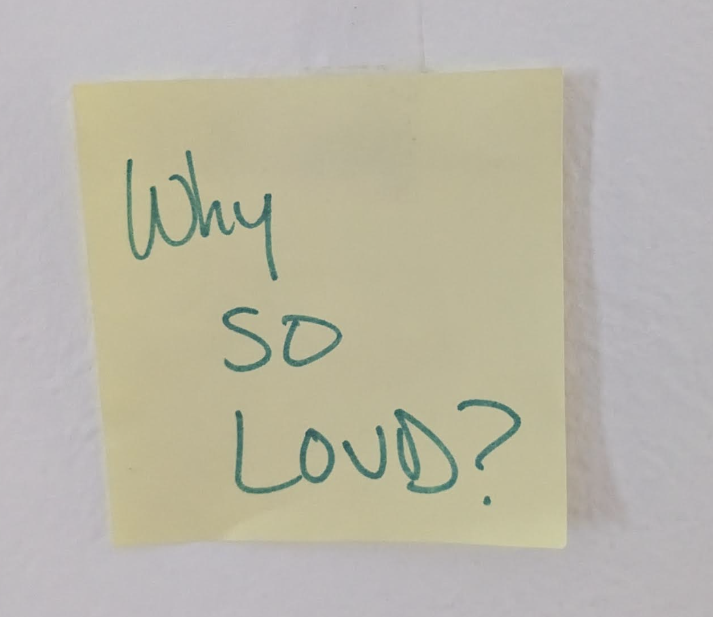

```{r setup, include=FALSE}
knitr::opts_chunk$set(echo = TRUE, warning = F, message = F, dev = "ragg_png", cache = F)
options(tidyverse.quiet = TRUE)
```

## 'ggplot2 extension for everyone'

### Goals

1.  Gentler introduction to layer extension: Easy Geom Recipes, and Easy
    Geom Recipes Python adaptation...

2.  Articulate value of extension, and by extension ... 'Why am I even
    here? Why do other extenders show up? Motivated by conversational
    data viz - being able to write down (transcribe! 📝🤯) visual
    narratives

3.  Extensions targeted at new audiences 🤷‍♀️

    a.  AP High School Stats, Intro College Stats
    b.  Kids data viz
    c.  Dimension Reduction and ML Crowd...

### All the things to prepare for:

1.  Tomorrow, Posit Data Science Lab: 'Easy geom recipes', July 21 👩‍🏫
2.  Debut plotnine's Easy Geom Recipes... 🤸🚀✈️
3.  JSM activities:
    1.  EAPOST Workshop, July 31-Aug 1
        <https://sites.google.com/view/eaapost/project-overview>
        <https://www.nsf.gov/awardsearch/show-award?AWD_ID=2235355>
    2.  Prepare to Teach, Aug 2nd <https://preparingtoteach.org/>
    3.  'Past Present and Future of ggplot2 extensions' with Cory,
        Cynthia, Joyce, James, Heike, Naomi, JSM Boston 2026,
        <https://ww3.aievolution.com/JSMAnnual2026/index.cfm?do=ev.viewEv&ev=5265>
4.  Posit Conf: 'Epic Graphical Poems and Conversations'
5.  Future of the ggplot2 extenders club... 🤷‍♀️

------------------------------------------------------------------------

New tech that supports this

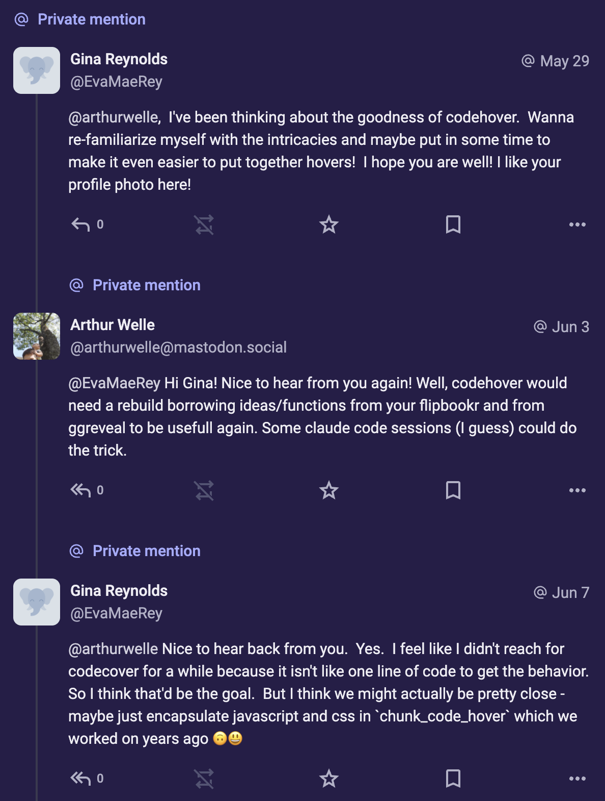

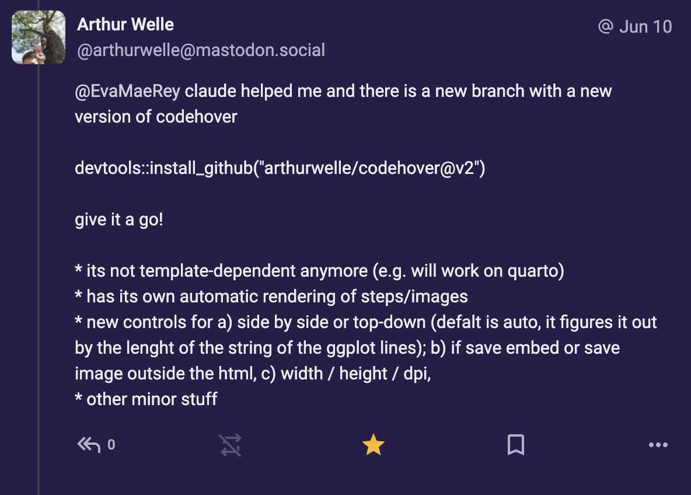

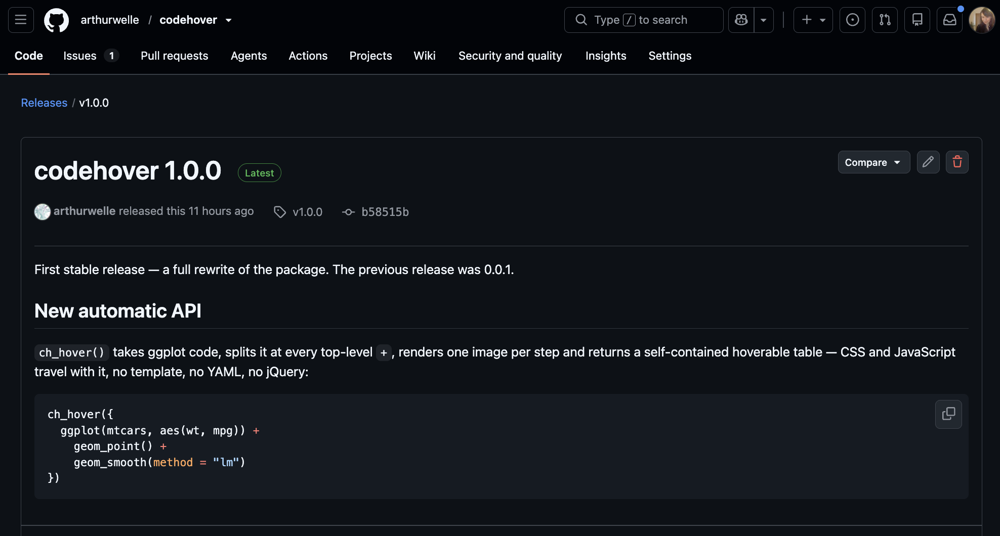

# 2026-07-21 - Posit's Data Science Lab X ggplot2 extenders - keeping it conversational

So tomorrow, Data Science Lab we'll go through an 'easy geom recipes'
thing. And we'll debut a plotnine version!!!!!

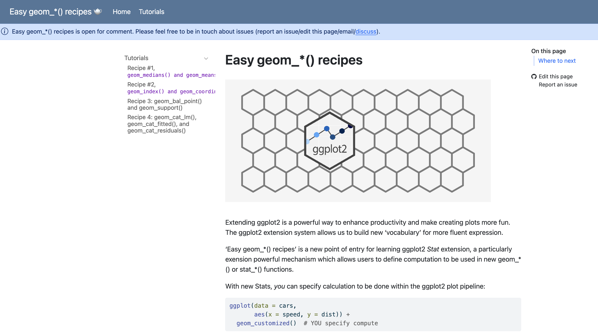

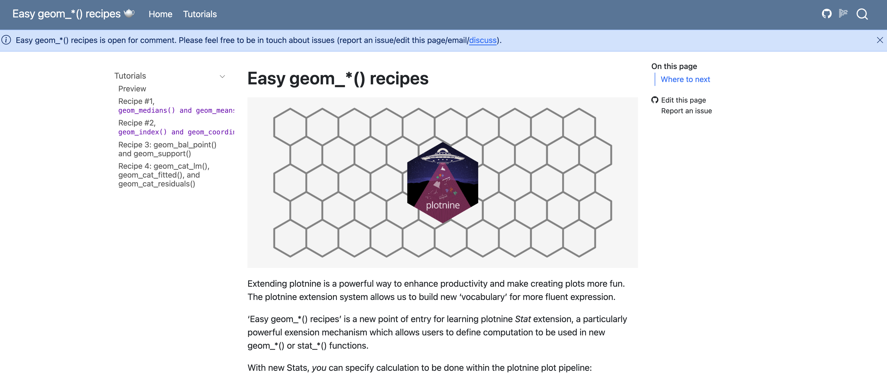

And in preparing for that Isabella, Libby and I met up a few weeks ago,
and I asked, 'could I present a few slides talking about why I think
ggplot2 extension is important'.

But we settled on 'No'. That's not the DS Lab vibe. "DS Lab isn't
monologues, it's conversation."

And I think, this is, like, really a very good practice. And that's
exactly what we are going to do tomorrow. 💯🙌🚀

## Where we are heading

```{r, echo = F, fig.cap="Where we are heading"}
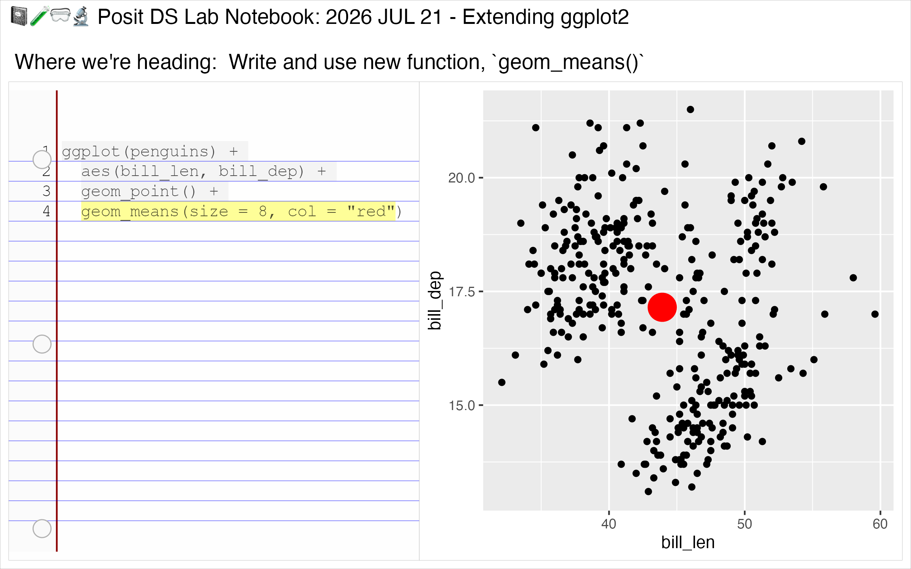
```

## First, A little bit of background: Anatomy of geom\_\*()s 🫁🧠🫀

The anatomy of 'geom\_\*()'s like `geom_point`, `geom_jitter`,
`geom_histogram`

### Every geom\_\*() acutally contains three underlying characters!

And underlying `layer()` function wraps this - **three underlying
'characters'** to work together.\*

-   **Stat** - precompute done prior to drawing (count, bin)

-   **Geom** - a 'mark', the drawn thing... (point, bar, segment)

-   **Position** - 'Makes the marks dance' - Hassan Kibirige ... maybe
    actually a *minor* character... typically helps with overplotting

-   This is also true of stat\_\*() functions!

```{r, echo = F}
library(ggstamp)
library(ggplot2)

inside_out_png <- "images/clipboard-1590828862.png"
three_guys_title <- "Every geom_*() acutally contains three underlying characters!"
three_guys_subtitle <- "... that are wrapped up with the layer() function"

three_guys_caption <- "'layer' refers to geom_*(),stat_*(), and annotate() functions only in extension"

three_guys_conclusing <- "We'll be defining a new *Stat* and combine it with existing Geoms and positions, in turn defining a new user-facing geom_*() function!" |> stringr::str_wrap(width = 28)

{ggplot() + 
  labs(title = three_guys_title) +
  stamp_png(png = inside_out_png) + 
  stamp_label(.2, -.2, "1. Stat") + 
  stamp_label(-.15, -.15, "2. Geom") + 
  stamp_label(.45, -.19, "3. position") + 
  stamp_circle(.18, -.1, fill = NA, color = "red", radius = .18) +
  labs(subtitle = three_guys_subtitle) + 
  labs(caption = three_guys_caption) +
  stamp_label(label = three_guys_conclusing, size = 10)} |> 
  codehover::ch_hover()
```

```{r, eval = F, echo = F}
geom_point_def <- geom_point |> deparse() |> paste(collapse = "\n")
geom_point_title <- "Can you spot 'Stat', 'Geom', 'position' in geom_point's definition?"

# ggdraft <- function (x = 0, y = 0, width = 1, height = width/1.618) 
# {
#     g <- ggplot2::ggplot(data = data.frame(x = c(x, x + width), 
#         y = c(y, y + height)), mapping = aes(x = x, y = y)) + 
#         ggplot2::coord_equal(expand = FALSE, clip = "on", xlim = c(x, 
#             x + width), ylim = c(y, y + height)) + 
#       theme(
#         plot.background = ggplot2::element_rect(fill = "transparent", 
#             color = NA), legend.background = ggplot2::element_rect(fill = "transparent"), 
#         legend.box.background = ggplot2::element_rect(fill = "transparent"), 
#         axis.title = ggplot2::element_blank())
#     if (width == 100) {
#         g <- g + ggplot2::scale_x_continuous(breaks = 0:5 * 20) + 
#             ggplot2::scale_y_continuous(breaks = 0:5 * 20)
#     }
#     g
# }


{ggdraft() + 
    theme(panel.grid = element_blank()) +
    labs(title = geom_point_title) + 
    stamp_text_ljust(label = geom_point_def, 
                     x = 0.1, y = .3, size = 4) + 
    labs(subtitle = "Which can the user modify")} |> 
  codehover::ch_hover()


```

------------------------------------------------------------------------

`geom_point`: 1) StatIdentity, 2) GeomPoint, 3) position_identity()

<details>

```{r}
library(ggplot2)
geom_point
```

</details>

`geom_jitter`: 1) StatIdentity, 2) GeomPoint, 3) position_jitter()

<details>

```{r}
geom_jitter
```

</details>

`geom_histogram`: 1) StatBin, 2) GeomBar, 3) position_stack()

<details>

```{r}
geom_histogram
```

</details>

<!-- 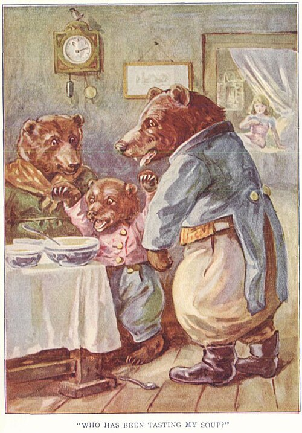{width="363"} -->

<!-- {width="364"} -->


## Okay! Now let's extend!

```{r, message = F, warning=F, echo = F}
library(tidyverse)

'penguins_means <- penguins |> #<<
  summarise( #<<
      mean_bill_len = mean(bill_len, na.rm = T), #<<
      mean_bill_dep = mean(bill_dep, na.rm = T) #<<
      ) #<<
  
penguins |>
  ggplot() + 
  aes(x = bill_len,
      y = bill_dep) + 
  geom_point() + 
  geom_point( #<<
    data = penguins_means, #<<
    mapping = aes( #<<
        x = mean_bill_len, #<< 
        y = mean_bill_dep #<<
        ), #<<
   color = "red", #<< 
   size = 8) #<<' |> 
  ggram::ggram(code = _, subtitle = "Step 0. Get the job done with 'base' ggplot2.", title = "📓🧪🥽🔬 Posit DS Lab Notebook: Extending ggplot2", caption = "2026 JUL 21 Reynolds, Kibirige")

ggram::ggram_save(file = "step0.png", bg = "white")

```

<!-- **Step 1:** Define Compute. Test -->

```{r, echo = F}
compute_group_means <- 
     function(data, scales){
  
  data |> 
    summarise(
      x = mean(x, na.rm = T),
      y = mean(y, na.rm = T)
      )
  
}

'compute_group_means <-  #<<
     function(data, scales){#<<
  
  data |> #<<
    summarise(#<<
      x = mean(x, na.rm = T),#<<
      y = mean(y, na.rm = T)#<<
      )#<<
  
}#<<

penguins |> 
  select(x = bill_len,
         y = bill_dep) |> 
  compute_group_means() #<<' |>
  ggram:::ggram_df_output(code = _, subtitle = "Step 1. Define Compute. Test.", title = "📓🧪🥽🔬 Posit DS Lab Notebook: Extending ggplot2", caption = "2026 JUL 21 Reynolds, Kibirige")

ggram::ggram_save(file = "step1.png", bg = "white")


```

<!-- **Step 2:** Define StatMeans. Test. -->

```{r, echo = F}
StatMeans <-  #<<
  ggproto( #<<
     `_class` = "StatMeans",  #<<
     `_inherit` = Stat,  #<<
     compute_group =  #<<
          compute_group_means, #<<
     required_aes = c("x", "y") #<<
     ) #<<


# we'll inherit from `Stat` - let's look at all the stuff in there!
'StatMeans <-  #<<
  ggproto( #<<
     `_class` = "StatMeans",  #<<
     `_inherit` = Stat,  #<<
     compute_group =  #<<
          compute_group_means, #<<
     required_aes = c("x", "y") #<<
     ) #<<


ggplot(penguins) + 
  aes(x = bill_len, 
      y = bill_dep) + 
  geom_point() + 
  geom_point(
      stat = StatMeans, #<<
      size = 8
      )' |>
  ggram:::ggram(code = _, subtitle = "Step 2. Define StatMeans. Test.", 
                title = "📓🧪🥽🔬 Posit DS Lab Notebook: Extending ggplot2", caption = "2026 JUL 21 Reynolds, Kibirige")

ggram::ggram_save(file = "step2.png", bg = "white")

```

```{r, echo = F}
# new way
stat_means <- make_constructor(StatMeans, geom = "point")
geom_means <- make_constructor(GeomPoint, stat = "means")

'geom_means <- #<<
  make_constructor(GeomPoint, #<<
                   stat = "means") #<<

ggplot(penguins) + 
  aes(bill_len, bill_dep) + 
  geom_point() + 
  geom_means(size = 8) #<<' |>
  ggram:::ggram(code = _, subtitle = "Step 3. Define user-facing function. Enjoy!", title = "📓🧪🥽🔬 Posit DS Lab Notebook: Extending ggplot2", caption = "2026 JUL 21, Reynolds, Kibirige")

ggram::ggram_save(file = "step4.png", bg = "white")

# 'ggplot(penguins) + 
#   aes(bill_len, bill_dep) + 
#   geom_point() + 
#   geom_means(size = 8, col = "red") #<<' |>
#   ggram:::ggram(code = _, #subtitle = "", 
#                 title = "📓🧪🥽🔬 Posit DS Lab Notebook: 2026 JUL 21 - Extending ggplot2 \n\n Where we're heading:  Write and use new function, `geom_means()`")
# 
# ggram::ggram_save(file = "a_where_to.png", bg = "white")


'ggplot(penguins) + 
  aes(bill_len, bill_dep) + 
  geom_point() + 
  geom_means(size = 8) + 
  aes(color = species) #<<' |>
  ggram:::ggram(code = _, 
                subtitle = "Step 3.b Test out group-wise compute (it's for free!)", 
                title = "📓🧪🥽🔬 Posit DS Lab Notebook: Extending ggplot2", caption = "2026 JUL 21 Reynolds, Kibirige", widths = c(1, .7) + 
                  stamp_text(label = "🔬"))

ggram::ggram_save(file = "step4b.png", bg = "white")


# library(magick)
# 
# list.files(pattern = ".png") |> 
#   image_read() |> 
#   image_convert("pdf") |> 
#   image_write("dslabnotes.pdf")

```

<https://evamaerey.github.io/evamaerey/report2_easy_geom_recipes.pdf>
<https://evamaerey.github.io/easy-geom-recipes/>
<https://has2k1.github.io/easy-geom-recipes/recipe1means.html>

------------------------------------------------------------------------

# But, monologues have a special place in sense-making: Why even do the Posit DS Lab? Why ggplot2 extension? Why ggplot2 extenders? And in 2026?

<!-- 'Make something from nothing...' -->

{width="285"}

<!-- Stone soup. Monologue... zhenzhong liu -->

And monologues sometimes compress conversations, right?

> Many of [my New York Times] columns were the products of long
> telephone conversations with my friends - Anna Quindlen in 'Living Out
> Loud'

We do monologues at ggplot2 extenders club (but like they are often
pretty 'hero's journey' stories - speaker talks about motivation and
challenges... My eyes never glaze over during a hero's journey story.)

And anyway, what I'd been thinking about for slides was a celebration of
**visual conversation**, and that as motivation for ggplot2 extension.

So people like Thomas Lin Pedersen have talked about ggplot2 as enabling
you to 'Speak you plots into existence.' And this sounds right, and
powerful and awesome - just like ggplot2 is.

But, what I think is actually even more powerful and motivating for me
is *conversing* with your data and recording that conversation -
verbatim. *transcribing conversations you have with data* and
transcribing the trains-of-thought you have with data.

Is ggplot2 can be kind-of a **transcriber** of human-data
interactions... (if we let loose, and if we extend)

> 'spontaneous language for conversation'

If you've learned a foreign language (or watched a kid learn their
native language...)

<!-- > The Human Data Interaction Lab investigates visualization tools, -->

<!-- > methods, and systems at the intersection of human-centered design and -->

<!-- > data-driven analysis. - <https://www.hdilab.org/> Technical University -->

<!-- > of Applied Sciences Mannheim -->

And I think many of us are thinking more and more about the power of
language and conversation... Like because of LLMS, you may have been
thinking, "like at what point did Natural Language emerge in the history
of the universe, and why does it even work? How did we go from grunts to
meaning" If I utter 'potato' does that conjure up in the mind the
'potato'?

> "I could literally write anything and you'd read it ...Think about
> your belly button. Boom, now you'r thinking about your belly button...
> That's the power of writing. I love the power. I'm drunk on the
> stuff." - Sarah Cooper, 'Foolish' 2023

Language is profoundly powerful.

Grammar is profoundly powerful.

Conversation is profoundly powerful.

I'm personally not so interested in a final, gorgeous plot, (though I'm
often dazzled by them) or the pretty, reorganized ggplot2 syntax that
you get after having arriving at a final viz product.

I *am* crazy about the conversations with data that ggplot2 allows!

<!-- Grammar is insanely, mindbogglingly powerful.  (And a lot of the times we just take it for granted - a luxury that I think we've moved beyond with AI age). -->

It's great that ggplot2 syntax can be concise, but I am a bigger fan of
the fact that 'inconcision' is permitted, that lets us record ideas
*practically verbatim*. (Like the Data Science Lab conversations
transcripts!)

> 'Ums' and 'Uhs' tend to occur when we are doing really hard cognative
> lifting ... to kind of give us a processing moment ... with Valerie
> Fridland, author of 'Like, Literally, Dude.' thinking about
> inconcision as functional.

So... that was a huge monologue for someone who says they are crazy
about conversation. 😂

# Toward (more) conversational ggplot2: Native inconsicion in ggplot2

```{r, message=F, warning=F}
library(tidyverse)
```

Here's the sanctioned way of doing things...

```{r}
gapminder::gapminder |> 
  filter(year == 2002) |> 
  ggplot(aes(x = gdpPercap,
             y = lifeExp, 
             color = continent,
             size = pop)) + 
  geom_point()
```

```{r echo = F}
library(ggstamp) 

hans_png_path_canvas = "../2023-11-14-flipbooks-lawrence-livermore/images/hans_argument.png"
hans_png_path_y_axis = "../2023-11-14-flipbooks-lawrence-livermore/images/hans_y_axis.png"
hans_png_path_x_axis = "../2023-11-14-flipbooks-lawrence-livermore/images/hans_x_axis.png"
hans_png_path_color = "../2023-11-14-flipbooks-lawrence-livermore/images/hans_colors.png"
hans_png_path_size = "../2023-11-14-flipbooks-lawrence-livermore/images/hans_size.png"
lab <- "Rosling gives full voice\nto aesthetic mappings"

{ggplot() + 
  stamp_png(png = hans_png_path_y_axis) +
  stamp_png(png = hans_png_path_x_axis) + 
  stamp_png(png = hans_png_path_color) + 
  stamp_png(png = hans_png_path_size) + 
  stamp_label(label = lab, size = 10)} |> 
  codehover::ch_hover()
```

<https://www.youtube.com/watch?v=jbkSRLYSojo&t=37s>

```{r gapminder, echo = F}
{gapminder::gapminder |> 
  filter(year == 2002) |> 
  ggplot() + 
  ggchalkboard:::theme_rosling() +
  aes(y = lifeExp) + 
  aes(x = gdpPercap) + 
  geom_point() + 
  aes(color = continent) + 
  aes(size = pop)} |> 
  codehover::ch_hover()
```

<!-- 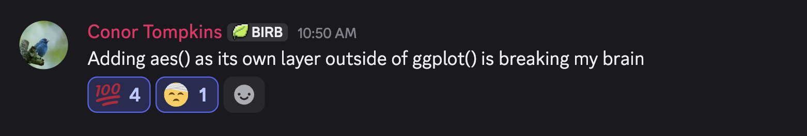 -->

```{r, echo = F}
spears_png <- "images/clipboard-3450567393.png"
cowell_png <- "images/clipboard-2265011233.png"
tompkins_png <- "images/clipboard-1395142094.png"
pooh_png <- "images/clipboard-2829397408.png"

{ggplot() + 
  stamp_png(png = spears_png) +
  stamp_png(png = cowell_png) + 
  stamp_png(png = tompkins_png) + 
  stamp_label(label = "🤷‍♀️", size = 20) + 
  stamp_png(png = pooh_png)} |> 
  codehover::ch_hover()
```

<!--  -->

<!-- {width="336"} -->

<!-- {width="363"} -->

------------------------------------------------------------------------

> # 'Data visualization is right at the heart of my work.' - Hans Rosling's introduction to '200 Countries, 200 Years, 4 Minutes - The Joy of Stats - BBC'

------------------------------------------------------------------------

> # And aesthetic mapping is right at the heart to data visualization - so maybe giving those decisions **full voice** is actually kind of cool?

<!-- 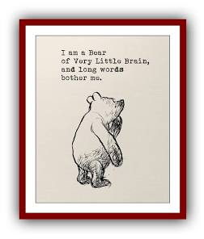 -->

<!-- 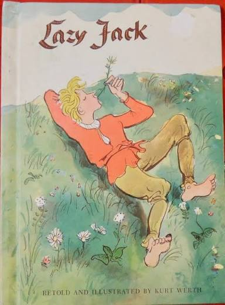{width="298"} -->

## Lightly wrapped inconcision: ggkids (maybe this is okay for kids)

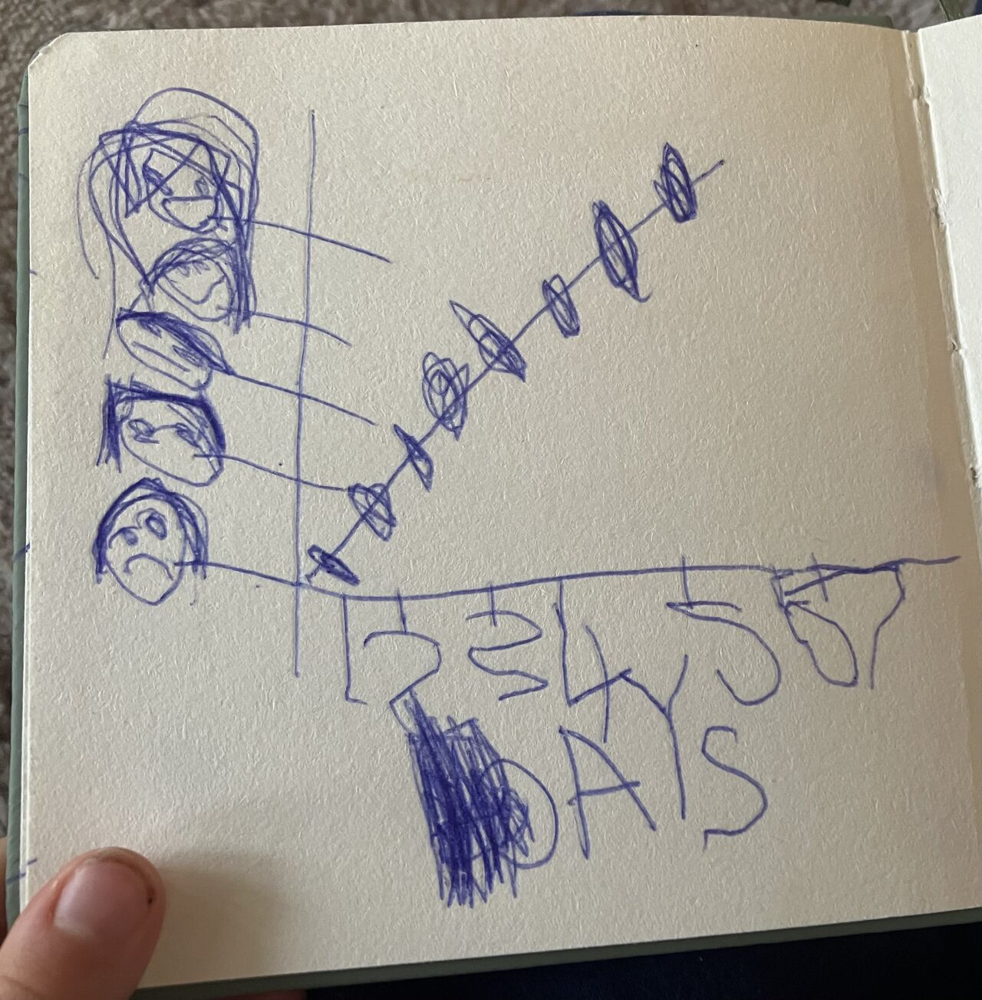

Tim Baller's Daugher...

```{r}
library(ggkids)

repair_data <- 
   write_table(~days, ~feeling,
                1,      "😩",
                2,      "😞",
                3,      "😕",
                4,      "😐",
                5,      "😏",
                6,      "😊",
                7,      "😁")
```

```{r echo = F}
{ggkids(data = repair_data) +
  use_x(days) + 
  use_y(feeling) + 
  chart_point() + 
  chart_line() + 
  scale_x_counting() + 
  theme_kids(ink = "midnightblue")} |> 
  codehover::ch_hover()
```

# Long form poems... Transcribing statistical narratives...

Extension and statistical narratives ...

2020: Stats instructor teaching "Introduction to Statistical
Investigations"

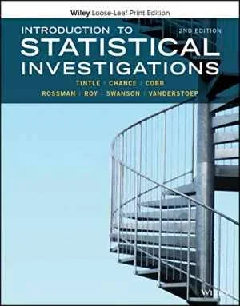

loved,

--

but... missed coded workflow (there was some, but less that I'd have
liked)

There's something really grounding (and powerful? 3400 to 3100 BCE)
about going back to a code narrative, being able to review the steps of
what you did.

(quotes from Winston, Paul)

> You know people were doing their statistics most of the people in my
> department were using SPSS um and I found that very confusing SPSS you
> know quote syntax um where they it provides some code to do your
> analysis, you'd um you know you'd bring in your data and you'd um you
> click some buttons and you'd check some boxes for turning

------------------------------------------------------------------------

> Some instructors may train students in using a specific software
> package, but mastery of advanced programming skills should not be
> allowed to crowd out data analysis skills or statistical thinking.

------------------------------------------------------------------------

Could we have the best of both worlds?

> 'Schreiben ist wichtig'... Writing is important - Herr Heineke

So writing things down in code, with a set of functions crafted for the
task, with just give you just the right amount of friction. Slow you
down just enough to

------------------------------------------------------------------------

Could we do what we were doing on *chalkboards* (love a chalk board!!
analogue gold standard), but also do that w/ code, consistent w/ the
touch of ggplot2 students were learning anyway, and code that would
serve the concepts being learned instead of shoehorning functions around
the statistical narrative.

------------------------------------------------------------------------

Chalkboard version went like this...

```{r, echo = F}
library(tidyverse)

library(codehover)

ggchalkboard::theme_chalkboard() |> theme_set()


{library(ggprop.test)
  
ggplot(donor_data) + 
  labs(title = "🫀🫁Donor Y/N response 50/50?") +
  aes(x = decision) + 
  geom_stack() + 
  geom_stack_label() +
  geom_support() + 
  geom_prop() + 
  geom_prop_label() + 
  stamp_prop(.5) + 
  geom_binomial_null() + 
  geom_normal_prop_null() + 
  geom_normal_prop_null_sds() +
  stamp_eq_norm_prop() + 
  labs(caption = "isi-stats.com")
} |>
  codehover::ch_hover()


{library(ggprop.test)
  
ggplot(dolphin_data) + 
  labs(title = "Can 🐬Doris & 🐬Buzz communicate? 🐟🪣") +
  aes(x = observed) + 
  geom_stack() + 
  geom_stack_label() +
  geom_support() + 
  geom_prop() + 
  geom_prop_label() + 
  stamp_prop(.5) + 
  geom_binomial_null() + 
  labs(caption = "isi-stats.com")
} |>
  codehover::ch_hover()


{library(ggprop.test)
  
ggplot(scissors_data) + 
  labs(title = "🪨📃✂️ Rock Paper Scissors pattern?") +
  aes(x = thrown) + 
  geom_stack() + 
  geom_stack_label() +
  geom_support() + 
  geom_prop() + 
  geom_prop_label() + 
  stamp_prop(.333) + 
  stamp_prop_label(.333) +
  geom_binomial_null(prob = .333) + 
  labs(caption = "isi-stats.com")
} |>
  codehover::ch_hover()


{library(ggt.test)
  
  ggplot(data_grit_undergrad) + 
  labs(title = "🪖😬💪🧗🏽‍♂️ Gritty as West Point Cadets?") +
  aes(x = score) + 
  geom_stacks() + 
  geom_support() + 
  geom_mean() + 
  geom_mean_label() + 
  stamp_mean(3.75) + # Class of 2010 mean
  stamp_mean_label(3.75) +
  geom_tdist_null(value = 3.75) + 
  labs(caption = "Duckworth et al. 2007, Grit...")
} |>
  codehover::ch_hover()


{library(ggxmean)
  
ggplot(cars) + 
  labs(title = "🚙 Cars data - stopping distance") +
  aes(x = speed, y = dist) + 
  geom_point() +
  geom_lm() +
  geom_lm(y ~ 1) + # Null model
  geom_lm_fitted() +
  geom_lm_residuals() + 
  geom_lm_conf_int() +
  geom_lm_pred_int() + 
  geom_lm_intercept() + 
  geom_lm_intercept_label() +
  geom_lm_formula() + 
  labs(caption = "R Core Team, datasets")
} |>
  codehover::ch_hover()


# {ggplot(data_haircuts) + 
#   ggchalkboard::theme_chalkboard() +
#   labs(title = "Haircuts 🪙 differ by sex 💇💇🏽‍♀️") +
#   aes(x = price) + 
#   geom_rug() +
#   geom_stacks() + 
#   geom_support() + 
#   geom_mean() + 
#   geom_mean_label() +
#   facet_align(sex) + 
#   geom_mean_diff() + 
#   geom_mean_diff_label()
#   
#   ggplot(data_haircuts) + 
#     ggchalkboard::theme_chalkboard() +
#     labs(title = "Haircuts 🪙 differ by sex 💇💇🏽‍♀️")+
#     aes(outcome = price, sample = sex) + 
#     geom_tdist_null_two_sample()
# } |>
#   codehover::ch_hover()

```


```{r, child="../2026-04-04-kmeans/kmeans.Rmd", include=F}
```

Code and viz first dimensionality reduction...

ggkmeans in draft stages

```{r, echo = F}
PAIR_code_umap_mammoth_url <- "https://raw.githubusercontent.com/PAIR-code/understanding-umap/refs/heads/master/raw_data/mammoth_3d.json"

library(ggdims)

mammoth_df <- PAIR_code_umap_mammoth_url |>
  jsonlite::fromJSON() |>
  as.data.frame() 

{set_num_centers(4)
  
mammoth_df |> 
  ggplot() + 
  aes(x = V1, y = V2) + 
  geom_point() +
  geom_kmeans() +
  geom_kmeans_lengths(linewidth = .2, 
                      alpha = .2) + 
  geom_kmeans_center()} |>
  codehover::ch_hover()
```


```{r}
{ggdims::two_clusters |>
  ggplot() + 
  aes(dim1, dim2) + 
  geom_point(shape = 21) + 
  aes(fill = type)} |> 
  codehover::ch_hover()


{ggdims::two_clusters |>
  ggplot() + 
  aes(dims = dims(dim1:dim2)) + 
  geom_tsne(perplexity = 2) + 
  aes(fill = type) + 
  ggplyr::layers_wipe() +
  geom_tsne(perplexity = 5) + 
  ggplyr::layers_wipe() +
  geom_tsne(perplexity = 30) + 
  ggplyr::layers_wipe() +
  geom_tsne(perplexity = 50)} |> 
  codehover::ch_hover()
```


```{r, echo = F}
{library(ggdims)
mammoth_df |> 
  ggplot() + 
  aes(dims = dims(V1:V3)) + 
  geom_pca() + 
  ggplyr::layers_wipe() + 
  geom_tsne() +
  ggplyr::layers_wipe() + 
  geom_umap()  
} |> 
  codehover::ch_hover()
```


---

#  And extendersXggcube (html widgit)

```{r, echo = F}
confetti <- sample(colors(), 
                     nrow(mammoth_df),
                     replace = T) |> alpha(.5)
mammoth_title <- "A Muse of ML, Max's Mammoth..."
mammoth_subtitle <- "Max Noichl popularized mammoth data, a 3D scan of a Smithsonian \nMammoth.  ML and AI researchers have turned to it in explorations like \n'Understanding UMAP' and beyond."
mammoth_caption <- "Visualized with {ggplot2} and {ggcube} - new on CRAN!\nData as curated by Coenen and Pearce at github.com/PAIR-code/understanding-umap"

theme_set(theme_grey(paper = "darkseagreen4", ink = "lightyellow"))

{library(tidyverse)
library(ggcube)
ggplot(data = mammoth_df) +
  aes(x = V1) +
  aes(y = V2) +
  geom_point() +
  aes(shape = I(21)) +
  aes(fill = I(confetti)) +
  aes(color = I("white")) +
  aes(stroke = .2) +
  aes(z = V3) +
  coord_3d(ratio = c(2,1.4,1),
           yaw = 0,
           roll = 10,
           pitch = 5) +
  geom_point_3d() + 
  labs(title = mammoth_title,
       subtitle = mammoth_subtitle,
       caption = mammoth_caption
       )} |> 
  codehover::ch_hover()


```

------------------------------------------------------------------------

So the motivation today, is to show you some ggplot2 extension moves -
but also to think about how we can create new vocabulary to *write down*
the statistical narratives that we are telling all the time - be it in
the classroom or elsewhere - with greater precision and using new
bespoke vocabulary (functions) if needed.

------------------------------------------------------------------------

Isn't this like a lot of effort to be able to 'write down a statistical
poem' something down?

Why don't we just have students use base ggplot2, and do the
wrangling/calculations by hand?

> Some instructors may train students in using a specific software
> package, but *mastery of advanced programming skills should not be
> allowed to crowd out data analysis skills or statistical thinking.*

------------------------------------------------------------------------

> Mastry of the minutia of ggplot2 and data manipulation and should not
> be allowed to crowd out statistical thinking.

------------------------------------------------------------------------

Leland McInnes' (UMAP dimentionality reduction technique) red star...

> necessarily particular details of how any given technique works so
> that means I'm going to introduce a little bit of extra notation which
> is gonna be really useful repeatedly and that's the red star. So
> sometimes technical details

really really matter but they're not worth getting into because by the
time you've explained all the technical details you have lost the point
of what you are trying to explain in the first place so if I just want
the big picture idea 1:22 and there are some technical details that make
that statement not technically true but morally it's the right thing

> the goldilocks situation: Write it, and don't loose the train of
> thought by bespoke packages like ggprop.test, ggt.test. ggols...

------------------------------------------------------------------------

Huge audiences:

1000 cadets every year...

EAPOST - network of 600 instructors...

100000 AP stats high school students per year

--

# Epic poems... + aes() + geom\_?() + ggplyr::layers_wipe()

But allowing aesthetic mappings to be expressed independently, and given
some extension, *greater* concision may actually possible. Via a
conversational approach... Beyond 'base' ggplot2... let's you keep the
conversation going where train of thought is just one grammar move
away...

No logical leaps!


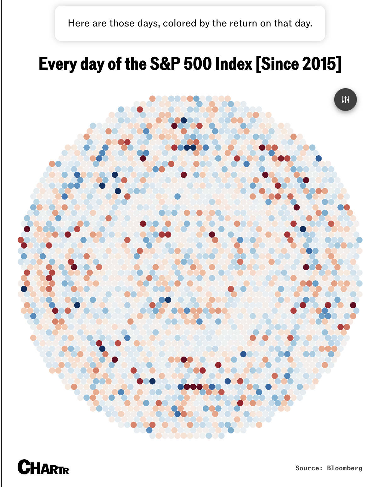{width="347"}

Let's have a look at "Visualizing Why Yesterdays Stock Market Reversal
Was So Weird and Unnerving" by David Crowther. This is an 'epic
graphical poem'. And yet, the fact that it's not making logical leaps
means that we are often just a grammar of graphics 'move' away from the
next plot that he builds.

<https://sherwood.news/markets/visualizing-why-yesterdays-stock-market-reversal-was-so-weird-and-unnerving/>

<details>

```{r}
# remotes::install_github("https://github.com/EvaMaeRey/ggplyr")
# remotes::install_github("https://github.com/EvaMaeRey/ggcirclepack")

# this block from an ellmerXgemini

library(tidyquant)
library(dplyr)
library(lubridate) # For today()

# --- 1. Define Parameters ---
symbol <- "^GSPC" # S&P 500 Yahoo Finance symbol
start_date <- "2015-01-01" # Corrected from 20215
end_date <- "2025-11-21" 

# --- 2. Load Data ---
# tq_get fetches financial data
sp500_data <- tq_get(symbol,
                     get = "stock.prices", # Specify we want stock prices
                     from = start_date,
                     to = end_date)

# this block from an ellmerXgemini

library(tidyverse)
library(ggplyr)
library(ggcirclepack)

# tq_get fetches financial data
sp500_data <- tq_get(symbol,
                     get = "stock.prices", # Specify we want stock prices
                     from = start_date,
                     to = end_date)

sp_500_data_calcs <- 
  sp500_data  |>
  mutate(
    year = year(date), 
    return = (close - lag(close))/lag(close)*100,
    open_pct = (open - lag(close))/lag(close)*100,
    intraday_pct = 100*(close-open)/open,
    ind_yesterday = date == "2025-11-20"
         )

library(RColorBrewer)
library(tidyverse)
library(ggplyr) # hey
library(ggcirclepack)
library(RColorBrewer)

library(tidyverse)
library(ggcirclepack)
(theme_gray() + 
    theme(palette.fill.discrete = brewer.pal(8, "Dark2")[c(1:8, 1:3)],
          palette.color.discrete = c("transparent", "magenta"),
          palette.fill.continuous = "viridis")
  ) |>
  theme_set()
sp_500_data_calcs |> head()

library(RColorBrewer)
```

</details>

```{r, echo = F}
{sp_500_data_calcs |>
  ggplot() + 
  aes(id = date) +
  ggcirclepack::geom_circlepack() +
  aes(color = ind_yesterday) + 
  aes(fill = year |> as_factor()) + 
  coord_equal() + 
  aes(fill = return) + scale_fill_gradient2(mid = "snow", low = "#410000", high = "darkblue") +
  facet_wrap(~ year) + 
  facet_null() +
  ggplyr::data_filter(open_pct > 1) +
  ggplyr::layers_wipe() + aes(y = "All", x = open_pct) +
  ggbeeswarm::geom_beeswarm(shape = 21) +
  coord_cartesian() +
  aes(size = I(5)) +
  scale_color_manual(values = c("whitesmoke",
                                "magenta")) +
  aes(x = return) +
  aes(y = "") + facet_grid(rows = vars(year)) +
  facet_null() + aes(y = intraday_pct, x = open_pct)
  } |> 
  codehover::ch_hover()
```

<https://evamaerey.github.io/mytidytuesday/2025-11-24-s-and-p-since-2015/s-and-p-since-2015.html>

Do we even have the tools for nearly verbatim recording of data
analysis? Concise, *in-sequence*, trains-of-thought. *Transcription...*

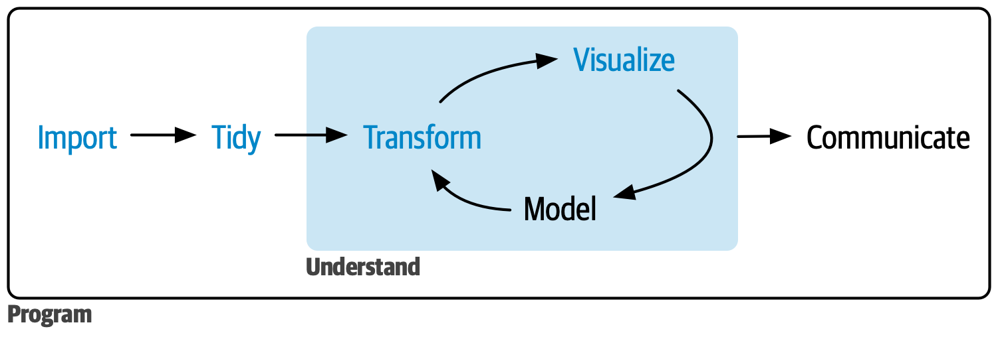

# Who are the ggplot2 extenders (in graphical poems?)

deserve bespoke vocab that allows us to write down statistical narrative
elegantly!


<details>

```{r}
library(tidyverse)
library(ggraph)

ggraph_to_threejs <- function(edgelist = package_author_edgelist, 
                              plot = last_plot()){
    
  g <-  edgelist |> select(1:2) |> as.matrix() |> 
    graph_from_edgelist()
  
  node_data <- layer_data(i = 2, plot = plot)
  
  graph_attr(g, "layout") <- NULL    
    
  node_id <- V(g) |> names()
  
  joined <- tibble(node_id) |> 
    left_join(node_data, by = "node_id")
  
  from_list <- edgelist |> pull(1)
  
  V(g)$size <- joined$size/3.66
  V(g)$shape <- joined$label
  V(g)$color <- joined$colour
   
  graphjs(g = g, bg = "gray10",  
          showLabels = T,  
          layout = list(  
            layout_with_fr(g, dim = 3)),  
                    main = "")

}

vct_packages <- c("dplyr", "ggplot2", "ellmer",
                        "tidyr", "tidymodels", "recipes",
                        "readr", "tibble", "stringr", "forcats",
                        "purrr", "lubridate")

# data cleaning
as_tibble(tools::CRAN_package_db()) |>
  filter(Package %in% vct_packages) |>
  mutate(Author = str_replace_all(Author, ' \\[|\\]', "*" )) |>
  select(Package, Author) |>
  mutate(Author = map(Author, ~ str_split_1(.x,"\n"))) |>
  unnest() |> 
  mutate(Author = Author |> str_remove('\\*.+' )) |>
  mutate(Author = Author |> str_trim()) |>
  filter_out(Author |> str_detect("orcid.org")) |>
  filter_out(Author == "Posit Software, PBC") |>
  filter_out(Author == "Posit, PBC") ->
package_author_edgelist
```

</details>

```{r, echo = F}
theme_set(theme_gray())

{package_author_edgelist |> 
  tidygraph::as_tbl_graph() |>
  mutate(is_package = name %in% vct_packages) |> 
  ggraph(layout = "kk") +
  geom_edge_link() +
  geom_node_label(aes(label = name, 
                      node_id = name, # for conversion to threejs
                      color = is_package))} |> 
  codehover::ch_hover()
```


```{r, eval = F, echo = F}
library(threejs)
library(igraph)

ggraph_to_threejs(package_author_edgelist)


ggplyr::last_plot_wipe_last() + 
  geom_node_text(aes(
    node_id = name, # just for threejs
    label = is_package |> ifelse("📦", "🧠"), 
    color = is_package |> ifelse("tan", "pink") |> I()))
  

ggraph_to_threejs(package_author_edgelist)


ggplyr::last_plot_wipe_last() + 
  geom_node_text(aes(
    size = !is_package,
    node_id = name, # just for threejs
    label = is_package |> ifelse("📦", "🏃🏽"), 
    color = is_package |> ifelse("tan", "tan") |> I())) + 
  scale_size(range = c(3,8))

ggraph_to_threejs(package_author_edgelist)

layer_data() |> head()

last_plot() + 
  geom_point(data = layer_data(), aes(x = x, y = y), shape = "|")

```

```{r, echo = F}
library(tidyverse)
library(ggregions)

us_states_ref <- usmapdata::us_map() |>
  select( 
    state_name = full, # first variable will also be 'id' var, keep and drop
    state_abbr = abbr, 
    state_fips = fips,
    geometry = geom,  # one column 'geometry' is required
         )  

# Step 2. Declare reference data
set_regions(regions = us_states_ref)


{tribble(~place,           ~conf,
        "Texas",          TRUE,
        "North Carolina", FALSE) |>
  ggplot() + 
  stamp_region() +
  aes(region = place) + 
  geom_region() + 
  aes(fill = conf)} |> 
  codehover::ch_hover()
```

```{r, eval = F, echo = F}
library(snedata) # remotes::install_github("jlmelville/snedata")
mammoth <- download_mammoth10k()


library(ggcube)
ggplot(mammoth, aes(X, Y, z = Z)) +
      geom_point_3d() +
      coord_3d(roll = -90, scales = "fixed", 
               panels = "zmin", expand = FALSE) +
      theme(axis.text = element_blank(),
            axis.title = element_blank())

```

```{r, echo = F}
library(ggswitzerland)

{ggswitzerland::muni_income_data |>
  ggplot() + 
  theme_map() + 
  stamp_mountains() + 
  aes(region = municipality) + 
  geom_muni() + 
  aes(fill = mean_quantiles) + 
  stamp_canton_border(color = "grey95") + 
  stamp_lake(fill = "lightblue")} |>
  codehover::ch_hover()
```

```{r, echo = F, fig.height=4, fig.width=6}
library(tidyverse)

to_sf_routine <- function(data){
  
  data |>
  mutate(y = -y) |>
  sf::st_as_sf(coords = c("x", "y"), agr = "constant") |>
  group_by(id, group) |>
  summarize(do_union = F) |> 
  ungroup() |> 
  group_by(id, group) |>
  summarise() |>
  mutate(geometry = geometry |> sf::st_cast("POLYGON")) |> 
  mutate(geometry = geometry |> sf::st_cast("MULTIPOLYGON")) |> 
  ungroup() 
  
}


female_sf <- gganatogram::hgFemale_list[c(1:156, 180:195)] |> 
  bind_rows() |>
  remove_missing() |>
  to_sf_routine()
# Step 1.a Prepare Data
ref_female <- female_sf |> 
  select(organ = id, geometry)

'
library(ggregions)

set_regions(regions = ref_female)

tribble(~ organ,   
        "brain",  
        "heart",  
        "stomach") |> 
  ggplot() + 
  stamp_region(alpha = .001) +
  aes(region = organ,
      fill = organ) +
  geom_region()' |>
  ggram::ggram(code = _, width = c(1, .5),
               title = "ggplot2 extenders club is about hearts and minds...",
               subtitle = "...and occasionally stomachs. 🍔🥙")
```

```{r, eval = T, echo = F, fig.width=10, fig.height=4.5}
library(tidyverse)
library(ggregions)

# Step 1a: Prepare reference data
country_ref <- rnaturalearth::countries110 |> 
  select(country_name = SOVEREIGNT,
         iso3c = ISO_A3, 
         geometry)

'set_regions(country_ref)

places_df <- tribble(~place,
        "France", "Canada", 
        "New Zealand", 
        "United States of America", 
        "Uganda", "Netherlands", 
        "Brazil", "Australia", 
        "South Korea", "United Kingdom", 
        "Germany", "Denmark", 
        "Sweden", "Austria",
        "Argentina")


ggplot(data = places_df) + 
  aes(region = place,
      fill = I("steelblue4")) + 
  stamp_region() + 
  geom_region()' |> ggram::ggram(code = _, 
                                title = "The places we've been:  The ggplot2 extenders meetup's people hail from around the world",
                                subtitle = "Are you an extender whose timezone we neet to think more about?...",
                                widths = c(.8,1.5))
```

```{r}
knitr::knit_exit()
```

```{r}
tribble(~to, ~from,
        "Gina", "June",
        "June", "Teun",
        "Teun", "Allan",
        "Gina", "David S",
        "Gina", "Daniel",
        "Gina", "Joyce",
        "Joyce", "Cory",
        "Cory", "James",
        "Cory", "David K") |> 
  igraph::graph_from_data_frame() ->
g

```

```{r}

knitr::knit_exit()

```

## Posit Community Support Application

*Thank you for your interest in applying for community support from
Posit! Posit is proud to support community-led events and initiatives
that align with our strategic mission to promote reproducible,
open-source data science. While we would love to support every event and
initiative, support is highly competitive and subject to budget
availability.*

*Detailed submissions allow our committee to make informed decisions. We
encourage you to present your most compelling case for how this
partnership is a mutual fit and will drive meaningful impact!*

*Please submit one application for your organization per calendar year.*

*Upcoming submission deadlines*

*We accept applications at any time; however, we review them at
specified periods throughout the year. The further away your event is,
the better. Please keep the following in mind:*

*Submissions received by July 3, 2026 (11:59 PM CT) will hear a decision
by July 17, 2026 (11:59 PM CT)*

# **Initiative type:** Recurring meetup

# **Community initiative name:** ggplot2 extenders club

# **Brief community initiative summary.** Please include any relevant details about your community initiative:

## What it is

It's a community/discussion forum for people who build extensions to the
R package ggplot2 (custom geoms, stats, themes, etc.). The forum exists
to facilitate conversations about extension experiences — motivations,
challenges, design decisions, and extension journeys in general.

## Notable content/topics

Discussions get fairly technical — e.g., one thread dug into a proposed
"layer redefaulting" approach using aes(color = I("chalkcolor")), and
debates over how theme functions like theme_void() should handle "ink"
and "paper" color arguments, and if "accent" (geom_smooth's blue) should
be exposed to users.

Another example is a February 2025 session on the {ggtime} package,
where Mitchell O'Hara-Wild and Cynthia Huang from Monash University
discussed designing ggplot2 extensions for temporal visualization,
including handling calendrical complexity in time-based plots.

## What we seek to accomplish

### 1. Build community among extension developers

The core mission is to give people who create ggplot2 extensions (custom
geoms, stats, themes, scales, etc.) a place to talk to each other —
sharing motivations, challenges, "equivocations," and design decisions
rather than working in isolation. As one member put it, it's fantastic
to hear developers speaking directly to other developers, and another
described it as great to get more involved in the extensions community
and have a place to congregate.

### 2. Lower the barrier to becoming an extender

There's a strong "you can do this too" ethos. The club grew out of the
idea that extending ggplot2 isn't reserved for experts — anyone fluent
in R and ggplot2 can become an extender. Related resources like the
"Easy geom recipes" tutorials and the ggplot2 Extension Cookbook exist
specifically to walk newcomers through creating their first geoms,
stats, and layers step by step.

### 3. Work through shared design problems in public

A lot of the value comes from hashing out genuinely hard design
questions collectively — things like how color/theme arguments should
behave consistently across theme functions, or how to design a coherent
API for a new extension package (as with the {ggtime} discussion, where
the presenters explicitly framed their talk as being more about
designing ggplot2 extensions than temporal visualization itself). The
idea is that design decisions made in isolation are often weaker than
ones stress-tested by other extenders.

### 4. Create durable, findable knowledge

Meetings and GitHub discussions serve as a growing public archive —
since 2022 they've covered more than 25 extension projects, and the
threads (which stay searchable on GitHub) become a reference for future
extenders wrestling with similar problems.

So in short: grassroots peer-support and mentorship network — aimed at
demystifying ggplot2 extension development, sharing hard-won design
knowledge, and making new extenders feel like part of a community rather
than lone contributors.

> I enjoyed the questions and discussion afterwards. It was good to put
> some faces to some names that I have known of for quite a while. -
> Paul Murrell

Home to the first open source project "release party" (for ggplot2 )

# **Community initiative website**

Website: ggplot2-extenders.github.io/ggplot-extension-club/

GitHub org: github.com/ggplot2-extenders/ggplot-extension-club Talks:

# **Community initiative location:** Virtual

# **Current number of members:**

250 expressing interest.. Average attendance per meeting \*15-40 people
in attendance

# **Frequency of meetings**

# **Support request**

Support type request \*Select the items you need to make your initiative
successful. Please note that physical swag support outside of North
America may be limited due to shipping constraints.

-   Monetary support
-   Materials and/or swag
-   Social media promotion
-   Volunteers

Other: Monetary support request If you are requesting monetary support,
please provide an amount in USD.

Feel free to specify a range. ??

# Benefits of sponsorship

List the specific ways you can recognize Posit's contribution. Examples
include logo placement on your website, social media shout-outs,
post-event photos, or mentions in promotional emails.

I'd love to do all of this!

# Posit employee contact

If you have been coordinating with someone at Posit, let us know so we
can sync with them internally.

# Has Posit previously sponsored your event or initiative?

Knowing your history with Posit helps us understand the long-term impact
of our community partnerships.

Yes.

## Will there be a recording?

Yes

Alignment Does your event/community initiative focus on R and/or Python?

*Does your event or initiative involve Posit software?*

## **How is your group’s knowledge shared?** Successful applications often contribute back to the community.

**Detail how you will share resources, such as hosting code on public
GitHub repositories or sharing recorded sessions.**

The club shares knowledge through several channels:

1.  Recurring virtual meetings

Every few months, the club holds a virtual meeting where a "ggextender"
presents on an extension project they've built — walking through
motivation, design choices, and challenges. Since 2022, they've covered
more than 25 extension projects this way, with speakers like Mitchell
O'Hara-Wild and Cynthia Huang presenting on their {ggtime} package's
design in February 2025, or Gina Reynolds organizing sessions and
running related tutorial efforts.

2.  GitHub Discussions (the persistent, asynchronous layer)

The club's discussion happens on GitHub, in the
ggplot2-extenders/ggplot-extension-club repo's Discussions tab. This is
where the deeper, ongoing technical conversations live — for example, a
thread digging into how theme functions like theme_grey() and
theme_void() should handle "ink" and "paper" color arguments, with
multiple contributors iterating over weeks with code examples and
counterexamples. Presenters often seed a discussion thread tied to their
talk (e.g., the {ggtime} talk pointed people to discussions#79) so the
conversation continues after the meeting ends.

3.  Slide decks and talk materials

Speakers publish their own slides externally (e.g.,
slides.mitchelloharawild.com/ggextenders-ggtime) and link them from the
discussion threads, so the content of a talk remains accessible even to
people who couldn't attend live.

4.  A central club website

ggplot2-extenders.github.io/ggplot-extension-club/ acts as the hub — it
lists meeting info, a comprehensive set of extension-building resources,
and links out to talks and discussions. It also has a sign-up form for
people to register interest and get notified of upcoming meetings.

5.  Companion tutorials and reference material built by members

Rather than being purely conversational, knowledge from the club has
been distilled into standalone teaching resources — most notably the
"Easy geom recipes" tutorial series and the ggplot2 Extension Cookbook
(by Gina respectively), which turn patterns discussed informally in the
club into structured, example-driven walk-throughs for building geoms
and stats from scratch.

6.  Individual write-ups and blog posts

Members and observers write up their experience engaging with the club —
for instance, the R Works / R-bloggers post "An Introduction to Writing
Your own ggplot2 geoms" describes attending club meetings and working
through the geom recipes, then republishes that learning as a public
tutorial, effectively re-broadcasting club knowledge to a wider
audience.

7.  Example repos tied to specific discussions

Sometimes knowledge is shared as working code in linked repositories —
e.g., the ggcirclepack package was explicitly built and documented as a
"write-up for [a] ggplot2 extenders meet up," with its README
referencing the specific discussion thread that motivated it.

So the pattern is: live talk -\> linked GitHub discussion thread -\>
(sometimes) a slide deck or example repo -\> occasionally distilled into
a tutorial or blog post — a mix of synchronous presentation and
asynchronous, searchable, public archiving.

```{r}
knitr::knit_exit()
```

## Intro Thoughts

ggplot2 is noted for its ability to create stunning visualizations with
relative ease given its intuitive syntax that allows plotting decisions
to be independently and incrementally declared. Maintainer Thomas Lin
Pedersen has compared the ggplot charting experience as akin to
'speaking your plots into existence' and practitioners often celebrate
that they arrive a final polished plots via incremental adjustments,
i.e. combining snapshots of unfinished plots to help others appreciate
the evolution. *Not* generally discussed is the fact that ggplot2's
incrementalism might assist in taking people through complex
trains-of-thought, again, in a way that is relatively effortless, given
that code can be extraordinarily concise and easy to read and reason
about. The exercise (a replication of a recent visual media article)
below explores this powerful, conversational character of ggplot2 with
the experimental ggplyr package, designed to allow for more fluid
movement between plots. It also uses the ggcirclepack and ggbeeswarm
extensions.

Intro to Data Science Lab - practice for Intro to Data Science Lab - JSM
talk - Posit Conf talk...

------------------------------------------------------------------------
