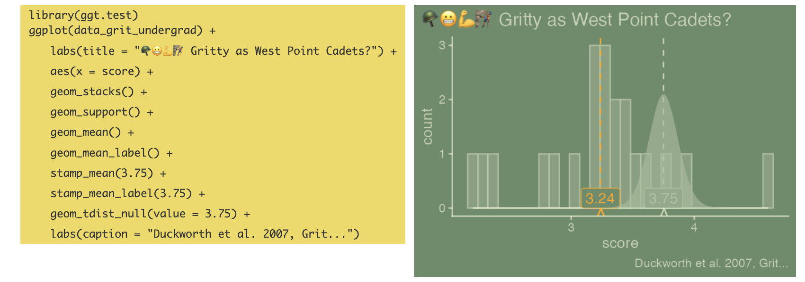

```{r setup, include=FALSE}
knitr::opts_chunk$set(echo = TRUE)
options(tidyverse.quiet = TRUE)
```

Predictions for Duckworth new book 'Situated' to be released to tomorrow, Sept 1!

TLDR

1.  Connection is paramount. I think 'Situated's' connection discussion may look a lot like that of 'Tribal Leadership': Direct connection matters, and direct connections within a densely connected network is when the magic really happens!
2.  Making *space* for figuring out your passions and pursuing them matters (this relates to Duckworth's 'phones in focus' project - I think a big focus will be that using tech unstrategically eats up time and attention. There's a 'situatedness' in *not* being tech- overwhelmed.
3.  And maybe there will be discussion of 'situated learning' - learning that happens in a context and in a community –immersive learning - and the stickiness and profoundness of the learning that happens - the learning is nearly unforgettable.
4.  vis-a-vis grit: being 'situated' (having 1. connections, 2. making space and time, 3. having immersive learning and development experiences) is probably as or more important to success than the individual characteristics of passion and perseverance constituting grit. And if there are not pathways (situation) to succeed, then it may actually be foolish to continue in the same path...

Full narrative:

Recently I've shared this figure, 'Gritty as West Point Cadets?' My interest in sharing the plot has been more about how the code can mirror an intro statistics instructors narrative - especially if they are using the ISI curriculum. The code can follow the conceptual build up of ideas that instructors are likely to go through!!



But the subject area \*itself\*, and not just the analytic technique, is actually pretty interesting too: 'Are you as gritty as some of the grittiest people on earth?' West Point Cadets who go through they trying 'Beast Barracks' summer program upon enrollment and matriculate into a whole-person development program where Academic, Military, and Physical progress is assessed.

So the conclusion for the t-test here isn't that surprising. With the sample shown via the histogram, and knowing that the West Point average is 3.75, you'd conclude, 'my sample doesn't have the same population mean as West Point cadets.' (and more statistically spoken, I can reject the null hypothesis of no difference). And I am interested in the subject matter too. I taught at these gritty cadets at West Point for a few years.

If you read Duckworth's 'Grit', you'll know that the West Point case is at the forefront, the book starts off '
